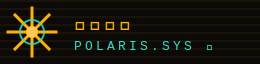

# 北辰琥珀終端・復古終端機（Polaris Amber Terminal）

一套為補習班、線上題庫、知識型產品設計的視覺語言。它把整個網站當成一台單色磷光終端機：介面不是招生海報，而是一個「解題主機」。核心互動是**選一道題→螢幕逐行印出思路**，把「教方法、不是給答案」的主張變成可操作的介面隱喻。插畫全部由 inline SVG 像素方格（8-bit pixel sprite）構成，零外部圖片。

## 設計哲學

1. **介面即主張**：終端機不是裝飾皮膚，而是敘事。把知識產品做成「主機」，使用者「查詢」而非「被推銷」。
2. **逐行揭示勝過大標**：資訊一行一行 typewriter 印出，模擬思考的時間感。速度慢一點，讀者反而看得進去。
3. **單色磷光的克制**：整站幾乎只有一種琥珀色。強調全靠亮度（bright amber）與唯一的青綠互動色，不靠第二種顏色。
4. **像素就是插圖**：星標、師資頭像用 8-bit 像素方格 sprite 拼成。低解析的方格是復古主機的原生語彙，也天然避開 AI 圖味。

## 色彩系統

| 用途 | Hex | 比例 |
|------|-----|------|
| 背景暖黑（void） | `#0B0A08` | 60% |
| 面板 / 卡片底 | `#141009` / `#1B1409` | 15% |
| 琥珀磷光（主文字） | `#FFB000` | 15% |
| 亮琥珀（強調 / 答案 / 數字） | `#FFC94D` | 4% |
| 青綠（互動 / 連結 / prompt） | `#39E0C8` | 4% |
| 印表紙（大標題文字） | `#E9DEC4` | 1% |
| 暗琥珀格線 | `#3A2B10` | 分隔線 |
| 警示紅（極少量） | `#FF5C4D` | <1% |

單色磷光原則：畫面上八成以上是背景暗色，琥珀是唯一主色。青綠只出現在「可互動」的東西上（連結、prompt、游標高亮），當成功能訊號，不當裝飾。

## 字體系統

- **顯示 / 數字**：`VT323`（點陣終端字，用於大標的英文、榜單數字、點陣標語）。字級 clamp(22px→52px)，`text-shadow:0 0 10px rgba(255,176,0,.35)` 製造磷光暈。
- **介面 / 標籤 / 程式碼**：`IBM Plex Mono` 400/500/600，行高 1.7，字距 .04–.1em。
- **中文本文與標題**：`Noto Sans TC` 400/500/700。中文標題用 700、印表紙色；本文用 400、琥珀色。
- 中英混排時，英文與數字交給等寬字，中文交給 Noto Sans TC，`.cjk` class 切換。

## 版面與網格

- **side-rail 主結構**：`grid-template-columns:216px 1fr`。左側 sticky 終端側欄選單（Logo＋`> item` 清單＋校區資訊 footer），右側主內容 `max-width:1000px` 置中。
- **狀態列**：每頁頂端一條 statusbar（系統版本＋分店），閃爍方塊游標。
- 手機（≤820px）side-rail 轉為頂部橫向 flex-wrap，隱藏分組標題與 footer 資訊。
- 一律無圓角、方塊直角、1px 暗琥珀格線分隔；區塊之間用 `border-bottom` 分段。

## 元件配方

- **nav（side-rail）**：`a.item` 前置 `>` 青綠符號；hover／current 反白（琥珀底、暖黑字）。分組標題 `.grp` 用 `/menu`、`/action`。
- **按鈕**：實心琥珀底＋暖黑字（primary）或透明＋琥珀框（ghost）；hover 換亮琥珀。前綴 `▶`。無圓角。
- **卡片**：`background:#141009;border:1px solid #3A2B10`。頂部可放 `.k` 青綠編號標籤（`01 / METHOD`）。
- **終端視窗（solver）**：`.bar` 標題列＋三色方塊燈；`.body` 為 `200px 1fr`（左題號清單、右輸出螢幕）。
- **表單**：input 暖黑底、暗琥珀框、focus 換琥珀框；label 青綠。送出後以 aria-live 區塊 typewriter 回覆。
- **footer**：暗色、12.5px、左資訊右連結，`|` 分隔。

## 動效規則

- **解題 typewriter（招牌）**：點題號 → `typeLines()` 逐字 14ms 印出每一步，行間停 120ms；步驟灰、答案亮琥珀帶暈。方塊游標 `blink 1s steps(2)`。
- **CRT 掃描線**：`body::after` 用 `repeating-linear-gradient` 疊暗線＋`mix-blend-mode:multiply`；`body::before` 疊暈影。
- **榜單數字跳格**：IntersectionObserver 進場後 `requestAnimationFrame` easing（1−(1−k)³）跳到目標值，附單位。
- **課程展開**：`max-height` 0→420px 過場，`[+]/[-]` 切換，可鍵盤（Enter/Space）。
- **降級**：`prefers-reduced-motion` 下移除掃描線、typewriter 直接輸出完整文字、數字直接顯示終值、展開無過場。

## 插畫與圖像風格

- 一律 **8-bit pixel-sprite（inline SVG 方格點陣）**：北極星像素星（`<rect>` 網格＋`shape-rendering:crispEdges`）、師資像素頭像（一人一張 8×8 級別方格臉譜、配色各異）；校區地圖與 Logo 用幾何 SVG 線描輔助。
- 像素 sprite 用 `<rect>` 依字元地圖生成，`shape-rendering="crispEdges"` 保持硬邊；琥珀主色＋亮琥珀＋青綠點綴，配 `drop-shadow` 磷光暈。
- 禁止任何點陣圖／照片／外部 icon。裝飾性字元（如 code snippet）屬排版，非插畫。

## Logo 與 Favicon 設計指南

- **Logo**：暖黑底＋琥珀八芒北極星（strokes 畫成，非 fill 多邊形）＋掃描線＋等寬字標「北辰數理 / POLARIS.SYS ▮」。
- **Favicon**：32×32 inline SVG data URI，暖黑底上一顆四線交叉＋中心亮點的星，省略文字。（Logo 為幾何星標；站內插圖則為像素 sprite。）

## Do & Don't

- ✅ 讓介面隱喻服務產業敘事（補習班＝解題主機；可換成 診所＝診斷主機、書店＝索書終端）。
- ✅ 單色磷光為主、青綠只給互動、插圖一律用 inline SVG 像素 sprite（硬邊方格）。
- ✅ 逐行揭示、方塊游標、CRT 掃描線做出「真的在跑」的時間感。
- ❌ 不要紫藍漸層、不要置中大標＋三卡片、不要 emoji icon、不要圓角模糊陰影卡。
- ❌ 不要把終端機做成純皮膚卻沒有任何「可查詢／可執行」的互動——招牌互動是靈魂。
- ❌ 不要 Lorem ipsum、不要 AI 腔（「在當今快節奏的世界」）。

## 頁面骨架範例

```html
<div class="shell">
  <nav class="rail">
    <a class="brand" href="index.html"></a>
    <div class="grp">/menu</div>
    <a class="item" href="index.html" aria-current="page">home</a>
    <a class="item" href="courses.html">courses</a>
  </nav>
  <main>
    <div class="statusbar"><span>SYS v4.2 就緒 <span class="blink">▮</span></span><span>分店</span></div>
    <section class="hero wrap">
      <p class="termline"><span class="u">user@host</span>:~$ 載入…</p>
      <div class="pixstar"><svg viewBox="0 0 .." shape-rendering="crispEdges"><!-- 像素星 rect 網格 --></svg></div>
      <h1 class="cjk">主標題<em>強調</em></h1>
      <div class="ctas"><a class="cta" href="#solve">▶ 執行</a></div>
    </section>
    <section class="solver"><!-- 題號清單 + 逐行輸出螢幕 --></section>
  </main>
</div>
```

驗收：一個沒看過 Demo 的 AI，只讀本檔即能做出同為「終端機解題主機」語言、但產業不同（例：法律諮詢查詢台、食譜編譯主機）的一致風格新站。
