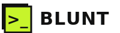

# 新粗獷主義・控制台版（Blunt Brutalism）

> 本 SKILL 定義一整套視覺語言。任何 AI 讀完即可替**任意產業**做出同風格網站——風格不綁定「AI 工具」這個題材。BLUNT 只是一次示範；同一套語言也能做開發者工具、電子報平台、獨立遊戲、活動報名或任何想擺出「直接、不客套」態度的產品。
>
> **核心心法**：硬、直、有態度。用粗黑邊與硬陰影堆出實體感，用三個高飽和訊號色製造張力。首屏是**可操作的介面**（一個真的能看它運作的控制台），不是大標與按鈕。內文用等寬字，像在讀終端機。

---

## 設計哲學

新粗獷主義（Neo-brutalism）反對「柔化」的介面美學——拒絕圓角、柔陰影、漸層與玻璃霧面。它把 HTML 的原始感當成美德：看得見的邊框、明確的方塊、不假裝立體的硬陰影。本版再加一層「控制台」個性：把產品最核心的操作直接搬到首屏當主角，配上等寬字與終端機隱喻，讓整個站散發「我很直接、我不浪費你時間」的態度。情緒來自對比——大面積紙白與純黑，被三顆刺眼的訊號色刺破。

## 色彩系統

- `#F7F5EF` 紙白／頁面背景，佔 ~60%。帶暖的米白，不是純白，避免刺眼。
- `#111111` 墨黑／3px 邊框、文字、硬陰影、topbar 反白區塊、footer，佔 ~26%。
- `#C7F42B` 酸綠／主訊號：CTA、logo 底、高亮 token、hover 反白字，佔 ~7%。
- `#1F1FE0` 鈷藍／次訊號：正向標記、部分高亮 token、團隊方案按鈕，佔 ~4%。
- `#FF5C38` 珊瑚／第三訊號：警示標記、chip、陰影對比色、否定對照，佔 ~3%。
- 輔助：`#efece3` 斜線底紋、`#8a887f` footer 次要文字。

原則：黑白紙為底，三色只當「訊號」點綴，且**各有分工**（綠=行動、藍=正向、珊瑚=警示/強調）。三色可同框但別讓任一色鋪成大面積背景（純黑反白區除外）。

## 字體系統

- 顯示／標題：**Syne**（700／800），字重拉滿、字距 `-.02em`，行高 ~1。有個性的幾何 grotesque，撐起粗獷感。
- 內文／UI／數字：**Space Mono**（400／700）。等寬字是本風格的靈魂——它讓文字像程式碼、像終端機。
- 中文：**Noto Sans TC**（400／500／700）與上述並列。
- 字級：大標 `clamp(30px,5.4vw,58px)`；區塊標題 24–40px；卡片標題 20–24px；內文 14–15px；標籤／按鈕 12–13px（大寫 + `letter-spacing:.05–.14em`）。
- 大寫標籤與 `//`、`>_`、`brief>` 這類終端機符號大量使用，強化控制台語感。

## 版面與網格

- **3px 純黑實邊 + 零圓角**：所有卡片、按鈕、輸入框、區塊用 `border:3px solid #111`，`border-radius:0`。
- **硬陰影**：`box-shadow:6px 6px 0` / `8px 8px 0`（實色，無模糊、無透明），陰影色可用黑或訊號色（`6px 6px 0 var(--lime)`）製造層次。
- 相鄰模組共用粗邊（`border-right:3px`／`border-left:3px`）拼成網格；區塊之間用整條 3px 黑線切分。
- 斜線底紋 `repeating-linear-gradient(45deg,...)` 當首屏／區塊背景，增加工地感。
- 版面不對稱、留白爽快；不要把所有東西置中（CTA 區塊例外可置中）。

## 元件配方

- **nav（topbar）**：sticky，`border-bottom:3px`；連結大寫等寬字，項目間 `border-left:3px`，hover 反黑底酸綠字；右端酸綠 CTA 塊。≤820px 收成全寬漢堡（`MENU` 鈕），展開為直向堆疊、每項 `border-top:3px`。
- **按鈕**：方形粗邊 + 硬陰影；`:active{transform:translate(6px,6px);box-shadow:0 0 0}`——按下去像實體按鈕被壓進去。`aria-pressed` 狀態反黑底酸綠字。
- **卡片**：`border:3px;box-shadow:6-8px 6-8px 0`（陰影色可換訊號色）；hover 不浮起（本風格靠陰影已有實體感）。
- **控制台（核心元件）**：`border:3px;box-shadow:8px 8px 0`；頂條黑底白字 + 三個方形小燈（一顆酸綠）；brief 輸入列 `border-bottom:3px dashed`；輸出區顯示逐字草稿與閃爍區塊游標。
- **表格／對照**：粗邊網格，表頭黑底白字 Syne；否定用珊瑚 `✗`、肯定用鈷藍 `✓`。
- **FAQ**：原生 `<details>`，`summary` 用 Syne，`+/–` 用珊瑚色。
- **footer**：整塊黑底紙白字，連結 hover 轉酸綠。

## 動效規則

動效要「機械、乾脆」，不要柔順緩動。

- **打字機（簽名）**：brief 逐字打出（~26ms/字）→ 停頓 320ms → 草稿逐字串流（~22ms/字），token 高亮段落打完停 140ms 製造節奏。游標是實心方塊 `<span class="cur">`，閒置時 `steps(1)` 閃爍。
- **按壓**：`transition:transform .1s,box-shadow .1s`，`:active` 位移吃掉陰影。
- **切換**：模式／月年切換即時重跑（打字重播或即時改價），無淡入淡出。
- `prefers-reduced-motion`：關閉所有打字動畫，直接顯示完整 brief 與草稿；隱藏游標；`transition/animation:none`。

## 插畫與圖像風格

- **icon**：原創 SVG 線稿，粗筆畫（stroke-width 2–3），裝在 3px 邊框的訊號色方塊裡。造型幾何、直白（三角＝上傳、方格＝字典、圓＝地球）。
- **UI 擬物**：終端機視窗、方形小燈、`>_` 游標——用 CSS/SVG 畫，不用貼圖。
- 一律無照片、無外部圖片；質感來自粗邊、硬陰影與斜線底紋。

## Logo 與 Favicon 設計指南

- **Logo**：一個酸綠方塊（帶黑色位移底塊）內含等寬 `>_` 游標符號，右接 Syne 800 大寫字標。呼應「控制台／直接」意象。
- **Favicon**：酸綠底、黑框方塊、黑色 `>_`，inline SVG data URI 放 `<head>`（記得把 `>` 轉成 `%26gt;`）。
- 命名邏輯：品牌名取「直接、乾脆、無廢話」意象（Blunt、Raw、Curt、Plain…），與態度一致。

## Do & Don't

**Do**
- 首屏放「能看它運作的介面」（控制台／表單／即時 demo），而非置中大標。
- 3px 黑邊 + 硬位移陰影 + 零圓角，貫徹到每個元件。
- 三個訊號色各司其職，其餘交給黑白紙。
- 等寬字當內文，大量使用 `//`、`>_` 等終端機符號。

**Don't（含去AI化禁令）**
- ✗ 紫藍漸層 hero、置中大標＋三張圓角卡片模板。
- ✗ 圓角、模糊柔陰影、玻璃霧面——會瓦解粗獷感。
- ✗ emoji 當 icon（一律粗筆 SVG）。
- ✗ Lorem ipsum 與 AI 腔（「在當今快節奏」「賦能」）；本品牌整個賣點就是反這個。
- ✗ 反射式套跑馬燈——本風格的動效簽名是「控制台打字機」，不需要捲動橫幅。
- ✗ 三色濫用成大面積背景（訊號色一鋪滿就失去「訊號」意義）。

## 頁面骨架範例

```html
<header class="bar"><div class="in">
  <a class="brand"></a>
  <nav><a href="index.html">控制台</a><a href="features.html">功能</a>
    <a class="cta" href="pricing.html">開始試用</a></nav>
</div></header>
<section class="console">              <!-- form-first 開場 -->
  <span class="tag">&gt;_ 控制台</span>
  <h1>把重點，直接變成成品。</h1>
  <div class="term">
    <div class="top"><span class="dot lime"></span> blunt://draft</div>
    <div class="field"><span class="pr">brief&gt;</span><span id="brief"></span></div>
    <div class="out"><div id="draft"></div></div>   <!-- 逐字起草 -->
  </div>
  <div class="modes"><button aria-pressed="true">模式 A</button>...</div>
</section>
```

CSS 關鍵：`--paper:#F7F5EF;--ink:#111;--lime:#C7F42B;--blue:#1F1FE0;--coral:#FF5C38`；
所有框 `border:3px solid var(--ink);border-radius:0`；硬陰影 `box-shadow:8px 8px 0 var(--ink)`；按壓 `:active{transform:translate(8px,8px);box-shadow:0 0 0}`。
