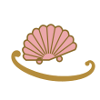

# 洛可可 Rococo・rocaille 卷貝紋（路易十五樣式）

> 範例站：卷貝糖霜室 Coquille（臺中西區的蘭貝斯疊擠花蛋糕工作室）。本 SKILL 定義風格，不綁產業——同一套語言可以用在香水、婚禮、古典音樂節、精品旅館、瓷器、髮廊、書店。

## 1. 設計哲學

洛可可是一七三〇年代巴黎室內裝飾的反叛：路易十四的凡爾賽是對稱、厚重、金與大理石；攝政時期之後的貴族退回小客廳（salon、boudoir），要的是輕、亮、私密、會笑的房間。「rocaille」原指人工石窟裡貼的貝殼與碎石，梅森尼耶（Juste-Aurèle Meissonnier）一七三四年的《Livre d’ornemens》把它變成一套版畫語彙：**卷紋從框裡長出去、左右不照鏡子、貝殼歪向一邊**。屈維利耶（François de Cuvilliés）在慕尼黑阿瑪麗恩堡（1734–39）把它推到極致：淡藍牆板、銀色卷紋、鏡子、沒有一個直角的框。

這套語言長成這樣有三個物質原因：

1. **它是雕刻與灰泥，不是印刷**。木雕鍍金框與白色灰泥浮雕靠光影存在——所以本 SKILL 規定**所有裝飾都是有高度的浮雕**，由同一盞燈照亮，不畫陰影。
2. **它是燭光下的房間**。燭光會晃、會隨人走動——所以燈要有環境擾動（ambient flicker）並跟著游標走（input）。
3. **它的核心是「contraste」——不對稱的均衡**。卷紋的左右份量相等，但形狀絕不鏡像。這是本風格最容易被做錯的地方：做成對稱就變新古典；做成雜亂就變巴洛克或極繁。

一句話：**輕、亮、歪，而且每一條金線都是凸起來的。**

## 2. 色彩系統

塞夫爾瓷窯（Manufacture de Sèvres）的地色是本色盤的來源：bleu céleste（1753）、rose Pompadour（1757）、vert pomme（1757 前後）。

| Token | Hex | 用途 | 面積比例 |
|---|---|---|---|
| `--lait` 牛奶白 | `#F7F2E8` | 頁面底，唯一大面積底 | ~45% |
| `--lait-2` 瓷白 | `#FBF8F1` | 卡片／牆板／按鈕底 | ~10% |
| `--celeste-p` 淡天青 | `#D9ECEB` | 牆板底（主） | ~14% |
| `--rose-p` 淡龐巴度 | `#F6DEDA` | 牆板底、頁尾 | ~12% |
| `--pomme-p` 淡蘋果綠 | `#E5EED6` | 牆板底（次） | ~6% |
| `--celeste` 天青 | `#8CC9CF` | 選取態、強調 | ≤3% |
| `--rose` 龐巴度玫瑰 | `#EBA7AA` | 現用頁、主按鈕 | ≤4% |
| `--pomme` 蘋果綠 | `#B5D19A` | 通過／合格 | ≤2% |
| `--gilt` 金 | `#B48C3C` | **只做線**：框線、卷紋、細框 | ≤6% |
| `--gilt-hi` 淡金 | `#E6CB84` | 雙線框的內圈 | ≤1% |
| `--gilt-lo` 暗金 | `#8A6A2A` | 手寫體標題、連結、肋線 | ≤2% |
| `--ink` 李子墨 | `#4A3940` | 全部正文（對 `--lait` 10.6:1） | — |
| `--ink-2` 灰李 | `#7A6168` | 次級文字、說明 | — |

規則：

- **零黑、零純白、零飽和原色**。最暗是李子墨，最亮是瓷白。
- **金永遠不是面**：金只出現在線、卷紋、珠子與肋線上，而且必須經過 `#gild` 打光濾鏡——平塗的黃色色塊不是金。
- **零彩色漸層、零模糊陰影**。明暗只能來自打光濾鏡（見 §11 ④），或來自 `box-shadow` 的硬邊雙線框。
- 三個粉彩地色在同一屏最多出現兩個，第三個留給下一屏。

## 3. 字體系統

| 角色 | 字體（Google Fonts） | 字重 | 用法 |
|---|---|---|---|
| 手寫名 | Pinyon Script | 400 | 品牌名、頁名、章節序號、印章；**永遠旋轉 −4° 到 −7°** |
| 拉丁襯線 | Cormorant Garamond | 400／500／400 italic | 數字（舊體數字 `oldstyle-nums`）、說明、法文副標 |
| 中文 | Noto Serif TC | 300／400／500 | 標題 300 字距 .3em；正文 400 17px；強調 500 |

字級 scale（桌機）：手寫大標 96–118px／中文 H1 40–46px（300, letter-spacing .3em）／H2 24–28px／正文 17px 行高 1.75／說明 15px italic。

**字重上限 500**。洛可可沒有粗體——強調靠大小、斜體與金色，不靠粗。**不得出現任何無襯線字**（包括按鈕、表單、頁尾）。

## 4. 版面與網格

- **S 曲線動線**：主要內容區塊沿對角 S 形錯落排列（左上→右中→左下），區塊寬度彼此不同（440／400／520px），以一條 SVG S 卷紋串起來。禁止三張等寬卡片並排。
- **首屏 1.25 : 1 不對稱雙欄**，左欄的主物件（框起來的那個東西）比右欄文字高 30px 以上起跳，文字欄 `padding-top:72px` 往下錯位。
- **牆板（boiserie panel）**：所有色塊是四角內凹的面板，內縮 9px 有一條 1px 金線，金線的四角同樣內凹。面板是房間的牆，不是卡片。
- **卷紋框（cartouche）只框焦點**：每屏最多一個主卷紋框＋一個次卷紋框；冠頂貝殼放在 34–40% 或 60–66% 寬度處，絕不置中。
- 留白：區塊之間 70–110px；面板內距 `clamp(22px,4vw,48px)`。
- 旋轉：手寫字 −4° 到 −7°；hover 中的按鈕／獎章 −2° 到 −4°。其餘元素不旋轉。
- RWD：≤900px 單欄、S 曲線攤直；≤560px 導覽改為底部橢圓獎章列。

## 5. 元件配方

**導覽：花綵垂飾（festoon）**——頁首橫掛三到四串不等長的珍珠垂綵，錨點高度不一（18／10／30／8／22px），每串最低點垂一條金絲帶、掛一枚橢圓獎章連結；現用頁的獎章放大成 118×80 並填龐巴度玫瑰。

```css
.med{width:92px;height:62px;border-radius:50%;background:#FBF8F1;
  box-shadow:inset 0 0 0 1.5px #B48C3C,inset 0 0 0 4px #FBF8F1,inset 0 0 0 5px #E6CB84}
.med[aria-current]{width:118px;height:80px;background:#EBA7AA}
.med:hover{transform:translate(-50%,0) rotate(-4deg) scale(1.06);transition:transform .25s cubic-bezier(.3,1.6,.5,1)}
```

**按鈕：橢圓雙金圈**——`border-radius:999px`，三層 inset box-shadow（金 1.5px／底色 4px／淡金 5px）；主按鈕底龐巴度玫瑰；hover `rotate(-2deg)`。沒有模糊陰影、沒有漸層。

**牆板**（見 §11 ③ 完整 CSS）。

**卷紋框**：`[data-cart="seed"]` 元素由 runtime 量自身尺寸、以種子生成不對稱卷紋框 SVG 疊在外側（`pointer-events:none`），ResizeObserver 變形時重長。

**表單**：橢圓膠囊輸入框，1px 金框，底瓷白；選項用小橢圓色票（40×30）或卵形標籤；日曆格是圓。

**頁尾**：淡龐巴度底，第一欄手寫店名＋地址電話時間，第二欄完整頁面連結，第三欄斜體說明。

## 6. 動效規則（四種都必須在）

| 類型 | 本站做法 | 觸發 | 參數 | reduced-motion |
|---|---|---|---|---|
| ① ambient 環境 | **燭光**：全頁共用的 `feDistantLight` 方位角 ±7°、仰角 ±3.5° 以三個不同頻率的正弦疊加持續擾動 | 載入即開始 | 0.83／2.31／5.9 Hz 疊加；屬性寫入 ≥40ms 一次 | 燈固定 235°／52°，不閃 |
| ② input 輸入 | **游標即燈**：游標相對視窗中心的角度成為燈的方位，距離中心越近仰角越高；所有金框與糖霜的高光同步轉向 | pointermove | 每幀 lerp 0.35（<90ms 到位） | 直接跳到目標，不補間 |
| ③ transition 轉場 | **卷紋框開窗**：跨頁 View Transition，新頁從一枚扇貝邊的卷紋框輪廓（mask-image）由 38%/34% 處放大開出 | 點擊站內連結 | .95s `cubic-bezier(.32,.72,.18,1)`；不支援時 body 執行同一段 keyframes | `@view-transition{navigation:none}`，瞬切 |
| ④ signature 簽名 | **轉台擠花**：按住即從固定花嘴擠出糖霜，轉台在手下轉；擠出的浮雕跟著轉，但燈不轉——高光永遠停在同一側 | 按住（指標或空白鍵） | 貝殼 30°/s、C 卷與垂綵 44°/s、單擠上限 80° | 轉台仍隨按住轉動（那是直接操作，不是動畫），無任何補間 |

其他：獎章與按鈕 hover 用 `cubic-bezier(.3,1.6,.5,1)` 的小彈跳；目錄頁蛋糕盤 hover 轉 −24°（1.2s）。**禁止**：淡入整段、數字滾動、跑馬燈、視差。

## 7. 插畫與圖像風格：卷紋浮雕（rocaille relief）

全站沒有一張圖片。所有圖像由五個原語程序生成，再經打光濾鏡變成浮雕：

1. **C 卷**：曲率沿弧長在兩端急升的線（`κ(s) = base + a·u⁶·26 + b·v⁶·26`，u、v 為離兩端的距離），兩端渦眼同側。
2. **S 卷**：同上但兩端渦眼異側，用於把框邊「推出去」。
3. **貝殼**：9–11 道肋、扇面歪 ±0.22 rad、邊緣圓瓣、鉸鏈兩側各一小耳。
4. **垂綵**：二次曲線上的珠串，中間大兩端小。
5. **菱格**：45° 斜格，交點放小花珠，只做襯底。

糖霜（蛋糕面）用同一套：貝殼擠＝前粗後細的淚滴＋五道肋；C 卷＝把 C 卷文法擬合到轉台圓周的弦上；垂綵＝朝圓心下垂的珠串；珍珠＝圓點。

## 8. Logo 與 Favicon

Logo：一枚龐巴度玫瑰色、暗金描邊、11 道肋的扇貝，下方一條金色 C 卷不對稱地托住它（一端大渦眼、一端小渦眼）。Favicon：同一扇貝簡化為 32×32 的五肋版本，inline SVG data URI。不得使用皇冠、鳶尾花、字母花押置中的「精品 logo」公式。

## 9. Do & Don't

**Do**
- 讓每個卷紋框的冠頂貝殼偏心，讓框的一邊用 S 卷破出去。
- 金只做線，而且要打光。
- 左右份量相等、花樣不相等。
- 用手寫體寫名字、用斜體襯線寫數字。

**Don't**
- 對稱的框、置中的冠頂（那是新古典或 Art Deco）。
- 深底＋鎏金（那是 Art Deco 與「奢華精品」公式）。
- 金色漸層、金箔貼圖、模糊陰影、玻璃擬態。
- 任何粗體、任何無襯線字、任何 emoji。
- 紫藍漸層、置中大標＋兩顆按鈕＋三張圓角卡片、Lorem ipsum、「EST. 17xx」徽章。
- 把卷紋畫成等寬單線（那是新藝術的鞭形線；洛可可卷紋必有粗細與渦眼）。

## 10. 頁面骨架範例

```html
<svg class="defs" aria-hidden="true"><defs><!-- #relief 與 #gild 兩個打光濾鏡，見 §11 ④ --></defs></svg>
<header class="fest">
  <a class="brand" href="index.html"><span><i>Coquille</i><b>卷貝糖霜室</b></span></a>
  <svg class="garland" aria-hidden="true"></svg>
  <nav class="navwrap" aria-label="主要頁面">
    <a class="med" href="index.html" aria-current="page"><span><b>轉台</b><br><i>Le Tour</i></span></a>
    <a class="med" href="carte.html"><span><b>目錄</b><br><i>La Carte</i></span></a>
  </nav>
</header>
<main>
  <div class="tour">
    <section><div class="panel" data-cart="stage-crest" data-pad="16"><!-- 焦點物件 --></div></section>
    <section class="intro"><p class="script">Coquille</p><h1>卷貝糖霜室</h1><p class="it">sur commande</p></section>
  </div>
  <section class="flow"><svg class="vine"><!-- 一條 S 卷 --></svg>
    <div class="panel rose p1">…</div><div class="panel pomme p2">…</div><div class="panel p3">…</div></section>
</main>
```

## 11. 本風格的 5 個不可省略特徵

### ① 不對稱卷紋框——C／S 卷＋偏心貝殼冠頂

拿掉它就只剩一個粉彩網站。框由曲率斜坡文法生成，再「擬合」到兩個端點之間，所以可以拼成任何尺寸的框：

```js
function line(x,y,th,L,type,ca,cb,hand,N){ // 中段平緩、兩端曲率以六次方急升 → 渦眼
  N=N||72;var P=[],ds=L/N;
  for(var i=0;i<=N;i++){P.push([x,y,th]);var t=2*i/N-1,u=Math.pow(Math.max(0,-t),6),v=Math.pow(Math.max(0,t),6),
    k=type==='S'?(t-ca*u*26+cb*v*26):type==='F'?(0.12+ca*u*26+cb*v*26):(0.45+ca*u*26+cb*v*26);
    th+=hand*k*Math.PI/L*ds;x+=Math.cos(th)*ds;y+=Math.sin(th)*ds}
  return P}
// scrollAB：在單位框裡長一條，再旋轉縮放讓兩個渦眼剛好落在 A、B 兩點
```

框的組法（順時針、hand=+1 時向外鼓、渦眼向內捲）：冠頂貝殼放 34–40% 或 60–66%；貝殼兩側各一條 C 卷、長度不等；一側用 S 卷、另一側用平 C 卷＋嫩芽；底邊一條長 C 卷＋一角小貝殼。

### ② 塞夫爾粉彩地＋只做線的金

```css
:root{--lait:#F7F2E8;--celeste-p:#D9ECEB;--rose-p:#F6DEDA;--pomme-p:#E5EED6;
      --rose:#EBA7AA;--celeste:#8CC9CF;--gilt:#B48C3C;--gilt-hi:#E6CB84;--ink:#4A3940}
/* 金只能出現在 stroke / 細 fill，而且一定經過 #gild */
.ornament{fill:#BE9545;filter:url(#gild)}
```

### ③ 內凹角牆板（boiserie）＋ S 曲線錯落動線

```css
.panel{--pbg:#D9ECEB;position:relative;isolation:isolate;padding:clamp(22px,4vw,48px)}
.panel::before,.panel::after{content:"";position:absolute;pointer-events:none;z-index:-1}
.panel::before{inset:0;background:var(--pbg);
  mask:radial-gradient(circle at 0 0,#0000 18px,#000 18.5px) 0 0/51% 51% no-repeat,
       radial-gradient(circle at 100% 0,#0000 18px,#000 18.5px) 100% 0/51% 51% no-repeat,
       radial-gradient(circle at 0 100%,#0000 18px,#000 18.5px) 0 100%/51% 51% no-repeat,
       radial-gradient(circle at 100% 100%,#0000 18px,#000 18.5px) 100% 100%/51% 51% no-repeat}
.panel::after{inset:9px;border:1px solid #B48C3C;mask:/* 同上，半徑 12px */}
.flow .p1{margin-left:2%;max-width:440px}.flow .p2{margin:-40px 0 0 auto;max-width:400px}.flow .p3{margin:-10px 0 0 22%;max-width:520px}
```

背景色放在 `::before` 而不是元素本身——否則 mask 會把疊在外側的卷紋框一起裁掉。

### ④ 一盞燈照亮的浮雕（零手繪陰影）

```html
<filter id="relief" x="-6%" y="-6%" width="112%" height="112%" color-interpolation-filters="sRGB">
  <feGaussianBlur in="SourceAlpha" stdDeviation="1.9" result="b"/>
  <feDiffuseLighting in="b" surfaceScale="5" diffuseConstant="1.25" lighting-color="#fff" result="d"><feDistantLight class="lamp" azimuth="235" elevation="52"/></feDiffuseLighting>
  <feSpecularLighting in="b" surfaceScale="5" specularConstant=".75" specularExponent="38" lighting-color="#fffaf0" result="s"><feDistantLight class="lamp" azimuth="235" elevation="52"/></feSpecularLighting>
  <feComposite in="SourceGraphic" in2="d" operator="arithmetic" k1="1.05" result="lit"/>
  <feComposite in="s" in2="SourceAlpha" operator="in" result="s2"/>
  <feComposite in="lit" in2="s2" operator="arithmetic" k2="1" k3=".8"/>
  <feComposite in2="SourceAlpha" operator="in"/>
</filter>
```

高度圖取自 alpha：**要凸起的東西必須自成一個 group**，底板放在另一個 group，否則整片 alpha=1 就沒有高度（本站踩過這個坑）。全頁只有一組 `feDistantLight.lamp`，JS 一次改全部。

### ⑤ 輕的手寫與襯線，字重 ≤500，手寫名一律斜放

```css
.script{font-family:"Pinyon Script",cursive;font-weight:400;transform:rotate(-5deg);transform-origin:left bottom;color:#8A6A2A}
h1,h2{font-family:"Noto Serif TC",serif;font-weight:300;letter-spacing:.3em}
.num{font-family:"Cormorant Garamond",serif;font-variant-numeric:oldstyle-nums proportional-nums}
```

## 12. 技術實作與相容性

### 12.1 SVG 打光濾鏡 `feDiffuseLighting`＋`feSpecularLighting`＋`feDistantLight`（A 渲染層）

- 承載特徵 ①②④：所有金框、糖霜、蛋糕盤的立體感。
- 支援：`feDistantLight` 與其 `azimuth`／`elevation` 屬於 Baseline「widely available」，Chrome 5+、Firefox 3+、Safari 6+、iOS Safari 6+（MDN `SVGFEDistantLightElement`、`<feDistantLight>` 相容性表，2026-10 查證）。
- 效能：濾鏡在 CPU 光柵化，成本與「被濾鏡的面積 × 每秒重算次數」成正比。本站做法：(a) 燭光擾動的屬性寫入節流到 ≥40ms 一次；(b) 轉台上只有糖霜層在轉，底盤與蛋糕面是靜態另一層；(c) 擠花時量測幀時間，前 24 幀若有 15 幀以上超過 24ms，該次擠花期間暫時拿掉糖霜層的濾鏡、放開時裝回（自適應降級）。
- Fallback：濾鏡不支援時 SVG 仍以平塗色顯示，所有資訊不變。

### 12.2 曲率斜坡卷紋文法（E 資料與生成層）

- 承載特徵 ①⑦：全站每一條 C／S 卷、每一個卷紋框、導覽垂綵、logo，以及轉台上 C 卷擠花的形狀。
- 做法：數值積分航向角（72–90 步），曲率 κ(s)=base+a·u⁶·26+b·v⁶·26；`scrollAB` 以相似變換把渦眼擬合到指定兩點；框由 7–9 條卷紋＋2 枚貝殼依種子（FNV-1a → mulberry32）組成，同種子恆得同框。
- 純 JS，無相容性問題。實測（Node 22）：8 個 600×400 卷紋框＋4 串垂綵 10.5ms；一顆 51 擠的蛋糕 2.1ms。
- 建置時以同一份程式在 Node 跑出靜態 SVG（目錄頁蛋糕、noscript 的示範蛋糕），所以無 JS 也看得到完整圖像。

### 12.3 跨文件 View Transitions＋mask-image 卷紋框開窗（B 動效與時間軸層）

- 承載轉場 ③。`@view-transition{navigation:auto}`，`::view-transition-new(root)` 以扇貝邊輪廓 SVG 作 `mask-image`，動畫 `mask-size` 0→460vmax。
- 支援：Chrome／Edge 126+、Safari 18.2+；Firefox 144+ 起為部分支援（caniuse「View Transitions (cross-document)」，2026-10 查證；第三方文章對 Firefox 的描述不一，本站以特徵偵測為準）。
- Fallback：`'onpagereveal' in window` 為 false 時，head 的 inline script 在 `<html>` 加 `.vtfb`，body 執行同一段 keyframes 開窗，1.1s 後移除 class。
- reduced-motion：`@view-transition{navigation:none}`，fallback 也不執行。

### 12.4 預算

| 頁 | 大小（含 inline 全部資源） |
|---|---|
| index.html | ~118KB |
| carte.html | ~237KB（六顆蛋糕的靜態浮雕 SVG，座標已取整數） |
| maison.html | ~43KB |
| visite.html | ~98KB |

首屏 JS（文法＋2 個卷紋框＋垂綵＋轉台初始化）於 Node 量測 <20ms；擠花每幀只重算正在擠的那一擠（<0.1ms）＋濾鏡重繪。
