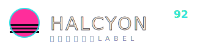

# 蒸氣波・CRT 主控台（Vaporwave / CRT Console）

> 本 SKILL 定義一整套視覺語言。任何 AI 只要讀完，就能替**任意產業**做出風格一致的網站——風格不綁定「唱片廠牌」這個題材。HALCYON 92 只是它的一次示範。

---

## 一、設計哲學

蒸氣波是「對 1990 年代消費科技的懷舊與反諷」：老電視的掃描線、早期 3D 的鉻金屬字、日本泡沫經濟的購物中心廣播、無人商場的空調嗡鳴。它不是霓虹賽博龐克（那個更硬、更暴力），蒸氣波是**慵懶、褪色、帶點憂鬱的午夜感**。

三個不可動搖的原則：

1. **介面即隱喻（os-metaphor）**：整個網站假裝自己是一套老軟體。首頁是一個「視窗」，有標題列、假的紅黃綠控制點、時鐘。導覽是「播放列／工具列」，不是普通的頂端選單。這一招就能立刻跳脫「大標 hero」的 AI 骨架。
2. **鉻與掃描線**：字是鉻金屬的（多層漸層＋硬陰影），背景永遠罩一層 CRT 掃描線與透視格點地平線＋日落半圓。這三樣是蒸氣波的身分證。
3. **慢與褪色**：動效要慢、要飄。顏色飽和但壓在暗底上，像褪色的錄影帶。片假名（半形 ｶﾀｶﾅ）當裝飾，不必有意義，只為那個年代感。

適合題材：唱片廠牌、夜間電台、獨立遊戲、飲料／清酒、潮牌、藝文祭典、任何想要「復古未來、午夜慵懶」情緒的品牌。不適合莊重的金融、醫療、法律。

## 二、色彩系統

暗底霓虹，三個螢光色互相拉扯。**注意去AI化禁令：不要做紫藍漸層置中 hero**——蒸氣波用洋紅×青×日落橘，且以介面視窗開場，天然避開該模板。

| 色票 | Hex | 用途 | 大約比例 |
| --- | --- | --- | --- |
| 午夜黑 Void | `#0E0A1A` | 主背景 | 50% |
| 面板紫 Panel | `#171227` / `#1F1738` | 視窗／卡片底 | 20% |
| 電光洋紅 Magenta | `#FF2D9B` | 主強調、日落、標題漸層 | 10% |
| 青霓 Cyan | `#2DE2E6` | 次強調、格點、UI 標籤 | 9% |
| 日落橘 Sun | `#FF7A45` / `#FFE55A` | 日落漸層、重點數字 | 6% |
| 奶油白 Cream | `#F4E9D8` | 主要文字 | 5% |

規則：

- **暗底、螢光字**。洋紅與青是一對搭檔，日落橘＋鵝黃是暖點綴。
- 強調色以 **HSL 變數**驅動（`--hue`），這樣可以做「拖桿換色」的互動：`--live:hsl(var(--hue),90%,62%)`，全站重點都吃 `--live`。
- 不用純白（用奶油白 `#F4E9D8`），純白太數位、不夠褪色。

## 三、字體系統

外部僅 Google Fonts：

- **標題／立體字**：`Zen Dots`（幾何、有 80 年代電玩感）。搭鉻金屬漸層。
- **UI／內文**：`Space Mono`（等寬，像終端機與規格表）。
- **裝飾片假名**：`Noto Sans JP`，用半形片假名 `ﾋｶﾘ・ﾚｺｰﾄﾞ` 當 kicker。

字級：立體大標 `clamp(2.4rem,8vw,5.6rem)`；內頁標題 `clamp(1.9rem,6vw,3.4rem)`；內文 13–14px；UI 標籤 10.5–12px、`letter-spacing:.14em–.28em`、`text-transform:uppercase`。等寬字全大寫做標籤是本風格的節奏。

## 四、版面與網格

- **視窗容器**：`max-width:1080px` 置中，外框 1px 紫線＋雙層陰影，頂部標題列。內容不置中堆疊，而是分「甲板 / 混音」的不對稱雙欄（`1.15fr .85fr`）。
- **透視地平線**：固定於底部 40–46vh，用兩組線性漸層做格線，`transform:rotateX(74deg)`＋緩慢 `background-position` 捲動。
- **日落半圓**：一個圓，用 `repeating-linear-gradient` 遮罩切成橫條（像老 CRT 掃描），再用線性漸層遮掉下半。
- 留白：視窗內 30px padding；區塊間 34–40px。手機（≤820px）雙欄改單欄，底部 dock 隱藏 now-playing 文字。

## 五、元件配方

- **nav（bottom-dock）**：`position:fixed;bottom:0`，左為 logo、中為「▸ NOW PLAYING …」狀態、右為等寬全大寫連結。當前頁 `aria-current=page` 反白為 `--live`。body 需 `padding-bottom:74px` 留出空間。
- **視窗標題列**：三個 12px 方點（洋紅／橘／青）＋等寬全大寫檔名＋右側即時時鐘（JS `toTimeString().slice(0,8)`）。
- **鉻金屬字**：`background:linear-gradient(#F4E9D8 6%,cyan 34%,#120b26 50%,magenta 64%,sun 96%)`＋`-webkit-background-clip:text;color:transparent`＋`filter:drop-shadow(2px 2px 0 #0e0a1a)`。中間那道深色是「鉻的地平線反光」，不能省。
- **推桿 fader**：`input[type=range]` 直立（`writing-mode:vertical-lr;direction:rtl`），thumb 做成鉻金屬橫桿並發 `box-shadow:0 0 8px var(--live)`。至少一支綁 `--hue` 做即時換色。
- **按鈕／transport**：方形、1px 邊、hover 整顆反白為 `--live`。播放鍵較寬且預設高亮。
- **卡片**：方角、1px 紫線、半透明面板底；hover 邊框轉 `--live` 並微微上移。**不要圓角、不要模糊陰影卡片**。
- **footer**：頂部 1px 分隔、等寬小字、附「本站皆為虛構示意」聲明。

## 六、動效規則

- **格點捲動**：`@keyframes scroll{to{background-position:0 52px}}`，`7s linear infinite`。
- **VU 表**：一排 `span` 高度 `@keyframes vu` 20%↔100%，各自 `animation-delay` 錯開 0.06s。
- **HUE 換色（簽名）**：拖 `input#fHue` → JS 寫 `root.style.setProperty('--hue',value)`，全站 `--live` 即時變。duration 由使用者手速決定，無 transition 才跟手。
- **hover**：卡片 `transform:translateY(-3px)`＋邊框變色，`transition:.18s`。
- **降級**：`@media(prefers-reduced-motion:reduce)` 關閉格點捲動、VU 跳動、hover 位移，`scroll-behavior:auto`。

## 七、插畫與圖像風格

全為原創 inline SVG：卡帶（雙齒輪＋磁帶窗）、黑膠（同心圓＋標籤）、自動販賣機、抽象肖像（單色圓臉＋掃描線）。用品牌四色平塗＋1–2px 描線，構圖簡單、對稱、帶點幾何。**禁止外部圖片、禁止 emoji**。日落半圓與格點地平線是背景母題，可在每頁重複。

## 八、Logo 與 Favicon 設計指南

- **Logo**：左為「日落＋格點」圓形標記（洋紅圓＋黑色橫格＋青色描邊），右為鉻金屬 `Zen Dots` 字標，下方一行片假名副標。存成 `assets/logo.svg`（含 `linearGradient` 鉻漸層）。
- **Favicon**：32×32 inline SVG data URI——午夜底、洋紅半圓太陽、三條青色地平線。寫進每頁 `<head>`。

## 九、Do & Don't

**Do**：用介面視窗當首頁；鉻金屬多層字；CRT 掃描線＋透視格點；洋紅×青×日落橘；等寬全大寫標籤；片假名點綴；HSL 變數換色互動；底部 transport 導覽。

**Don't**：❌ 紫藍漸層置中大 hero；❌ 置中大標＋副標＋兩顆按鈕＋三張圓角卡片；❌ emoji 當 icon；❌ 圓角＋模糊陰影卡片；❌ Lorem ipsum 或「在當今快節奏的世界」AI 腔；❌ 純白背景／純白字；❌ 反射式塞跑馬燈——本風格用「介面隱喻＋換色推桿」承擔識別，不需要橫幅。

## 十、頁面骨架範例

```html
<div class="backdrop"></div><div class="sunset"></div>
<div class="grid3d"><i></i></div><div class="scan"></div>

<main class="win">
  <div class="titlebar">
    <span class="dots"><i></i><i></i><i></i></span>
    <b>SYSTEM v9.2 — home.exe</b><span class="clock">--:--:--</span>
  </div>
  <div class="winbody">
    <p class="kana">ﾎｰﾑ</p>
    <h1 class="chrome">品牌名</h1>
    <section class="console">
      <div class="deck">… transport …</div>
      <div class="mix"><input type="range" id="fHue" min="180" max="330"></div>
    </section>
  </div>
</main>

<div class="dock">
  
  <nav><a aria-current="page">HOME</a><a>PAGE 2</a><a>PAGE 3</a></nav>
</div>
<script>fHue.addEventListener('input',e=>document.documentElement.style.setProperty('--hue',e.target.value));</script>
```
