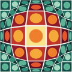

# 歐普藝術・Vasarely〈Vega〉造形單元 Op Art — Vega / unité plastique

> 範例站：方格磁磚 HONG-KEH（苗栗竹南的馬賽克磁磚廠）。本 SKILL 定義風格，不綁產業——同一套語言可以用在游泳池、運動中心、天文館、眼鏡行、地板材、時裝、電子音樂廠牌、兒童科學館。
> 與本館 `op-art-retinal-field`（shidong，黑白視動鼓與圖地反轉）是同一流派的**另一半**：那是 Bridget Riley／早期 Vasarely 的黑白振動；本 SKILL 是 1968 年之後 Vasarely 加入顏色的 **Vega 隆起格網**。兩者不要混用招牌手法：本 SKILL 不做黑白、不做圖地反轉波。

## 1. 設計哲學

Victor Vasarely（1906 匈牙利佩奇 – 1997 巴黎）在布達佩斯的「Műhely」學過包浩斯課程，1930 年到巴黎做廣告圖像（〈斑馬〉1937 就是從廣告稿長出來的）。1950 年代他把繪畫拆成可以交給別人生產的系統：**造形單元 unité plastique**——一個方形色地，裡面放一個對比色的幾何內形；整套圓、方、菱、橢圓、半圓編成「造形字母 alphabet plastique」（1959–63），顏色也編號，於是一幅畫可以寫成「字母＋數字」的配方，由助手、網版印刷廠、陶磚廠照配方生產。1954 年他在卡拉卡斯委內瑞拉中央大學 Carlos Raúl Villanueva 的「藝術綜合」計畫裡做了第一批建築陶磚壁畫（〈向馬列維奇致敬〉）；1965 年 MoMA〈The Responsive Eye〉讓「Op Art」成了名詞；1968 年起的 **Vega** 系列（〈Vega 200〉1968、〈Vega-Nor〉1969，Albright-Knox 藏）讓整齊的格網像被一顆球從背後頂起來——暖色往前、格子在球邊越來越窄。

這套語言長成這樣有三個物質原因：

1. **它是為複製而設計的**。單元、色號、配方——所以本 SKILL 要求所有圖像都由同一個單元＋同一支變形函數生成，不准手畫例外。
2. **體積只能從格子來**。網版與陶磚都沒有漸層、沒有陰影；所以「球」只能靠格子的寬窄與色階的位置表現。這是本風格最容易被做錯的地方：加了 radial-gradient 或陰影，就變成 3D 圖示，不是 Op Art。
3. **色階是印出來的**。一階一張版，所以顏色是**台階**不是坡道。

一句話：**一個單元、一支透鏡、一排台階色；球是格子自己鼓起來的。**

## 2. 色彩系統

兩條色階，一條給「球」（暖，八階），一條給「網」（冷，六階）。同一屏不得出現第三條色階。

| Token | Hex | 用途 | 比例 |
|---|---|---|---|
| `--paper` 版畫紙 | `#F2EEE4` | 頁面底、版畫白邊 | ~40% |
| `--paper-2` | `#E8E2D4` | 次底、空格 | ~6% |
| `--grout` 磚縫 | `#DCD5C4` | 單元之間的縫、格線 | ~4% |
| `--ink` 墨綠黑 | `#14201F` | 全部正文（對紙 14.4:1） | — |
| `--ink-2` | `#4A5753` | 說明文字（對紙 6.5:1） | — |
| `--w0`→`--w7` 珊瑚八階 | `#5E1022 #8E1B2A #C2352B #E2552D #EE7F2C #F4A93A #F6C343 #FAE38A` | 球：外圈最暗 → 球心最亮 | ~25% |
| `--c0`→`--c5` 海松六階 | `#0B2E2D #134A45 #1E6B60 #2E8C78 #5DB396 #A6D9C0` | 網：棋盤交錯兩階＋內形跳三階 | ~25% |

另備兩套可換色階（同一規則）：鈷藍球・赭石網（`#0E1B4D…#E2ECF8`／`#3A1E0C…#EBC787`）、檸檬球・墨綠網（`#2D3A0A…#FAF8B8`／`#141A24…#9DB8A2`）。

規則：

- **單元內兩色相隔三階**（地 n、內形 n±3），保證內形永遠讀得出來；越到球心越亮（凸），或越到井底越暗（凹）。
- **棋盤交錯**：相鄰單元地色差一階，這就是 Vega 表面那層細微的振動。
- **零漸層、零陰影、零透明、零模糊**。漸層只能以「八個平色塊排在一起」的形式存在。
- **禁紫藍漸層**：鈷藍色階是單一色相的明度台階，不得與紫混成 AI 式漸層。

## 3. 字體系統

| 角色 | 字體（Google Fonts） | 字重 | 用法 |
|---|---|---|---|
| 拉丁／數字 | Jost（Futura 血統的幾何無襯線） | 400／500／600 | 作品名、代號 A1–F8、價格、版號；小字一律大寫、字距 .2em |
| 中文 | Noto Sans TC | 400／500／700 | 標題 700 字距 .04–.08em；正文 400 16px 行高 1.75 |

字級 scale：H1 34–52px／H2 28px／H3 18px／正文 16px／說明 14px／大寫標籤 11px（.2em）。字永遠比圖小——**最大的東西必須是格網**，不是字（不做 hero 巨字）。數字用 `tabular-nums`。

## 4. 版面與網格

- **模組 = 一個單元**：桌機 48px，所有間距是 3px（磚縫）或 48 的倍數。
- **版畫白邊（multiple）**：主圖永遠是正方形、置於紙色白邊內，下緣一行大寫小字：左「作品名 · 地點 · 年份」，右「格數 · 版號 37/120」。
- **不對稱雙欄**：左 1.25fr 正方形主圖、右 .9fr 文字欄；手機改單欄、主圖滿寬。
- **錯位台階**：並排區塊（工序、規格）以 0／28／56／28px 的 margin-top 錯開，像一條被球頂歪的格線；手機取消錯位。
- **磚縫即分隔**：區塊之間不用線，用 3px 的 `--grout` 間隙（`gap:3px;background:var(--grout)`）。
- 零圓角（內形除外）、零卡片陰影。

## 5. 元件配方

**導覽：隆起格（vega-row）**——四個方形單元一列，現用頁那格被「頂起來」：`flex-grow:2.3`、地換成暖色、內形放大；鄰格自動被擠窄。hover 時球移到指到的那一格。

```css
.vrow{display:flex;height:76px;gap:3px}
.vc{flex:1 1 0;background:var(--c1);transition:flex-grow .42s cubic-bezier(.3,1.5,.45,1)}
.vc i{position:absolute;left:50%;top:42%;width:46%;aspect-ratio:1;border-radius:50%;background:var(--c4);transform:translate(-50%,-50%)}
.vc[aria-current="page"]{flex-grow:2.3;background:var(--w4)}
.vc[aria-current="page"] i{width:60%;background:var(--w7)}
.vrow:hover .vc[aria-current="page"]:not(:hover){flex-grow:1.2}
.vrow .vc:hover{flex-grow:2.3}
```

**按鈕**：實心冷色地＋左側一個 18px 單元作為圖示；hover 換暖色。不做圓角膠囊。

```html
<a class="btn warm" href="#"><span class="unit" style="--g:var(--w0);--f:var(--w6)"></span>去拼九張背網</a>
```

**卡片 → 不用卡片**：資訊放在磚縫分隔的格子裡（見 §4）。**表格**：上緣 3px 墨線、列間 1px 磚縫色線、價格欄 Jost 600 靠右。

**表單選項（色階）**：每個選項是一條迷你色階（8 個 10px 色條），選中態整格反成墨地。

**對話框**：`<dialog>` 以 `clip-path:circle()` 從中心「鼓」出來（見 §6）。

**頁尾**：深海松底，最下一排是整條色階單元（暖八＋冷六），等寬排滿。

## 6. 動效規則（四種，缺一不可）

| 類型 | 本站做法 | 觸發 | 時間／曲線 | reduced-motion |
|---|---|---|---|---|
| ambient 環境 | 球心沿李薩如軌跡漂移 ±3.5%（週期 7.1 s × 9.3 s），格網每幀重算 | 無 | 連續、線性時間 | 球心固定，圖不動 |
| input 輸入 | 游標是第二顆小透鏡（R=0.2），所在處的格子鼓起；壓感筆／手指 `pressure` 越大鼓越高；導覽格 hover 隆起 | pointermove／pressure | 透鏡強度一階低通 0.35/幀（<16ms 反應） | 立即到位、無緩動 |
| transition 轉場 | 換頁時單元磚沿對角線**分六階**翻面蓋滿（520ms），新頁再翻開；對話框以 `@starting-style` 從 `circle(0%)` 鼓到 `circle(80%)` | 點內部連結／開啟對話框 | 520ms 線性分階；dialog .55s cubic-bezier(.25,1.2,.4,1) | 直接換頁、對話框直接出現 |
| signature 簽名 | **凸凹互換**：按一下，球穿過平面變成井（彈簧 k=.09、阻尼 .78），越過零點的那一幀色階整條倒過來（亮心→暗心） | click／Space／Enter | ~700ms 彈簧 | 立即切換 |

## 7. 插畫與圖像風格

**只有一種圖：被透鏡變形的造形單元格網。** logo、favicon、主圖、預覽、拼片背網、頁尾色條全部是同一支函式在不同參數下的輸出。

變形函數（把格點 p 依到透鏡中心的距離重新映射，邊界不動）：

```js
// s>0 凸起（球）、s<0 凹陷（井）；t=r/R ∈[0,1)
function g(t,s){ return s>=0 ? t + s*((1-Math.pow(1-t,2.4)) - t)
                              : t + (-s)*(Math.pow(t,2.4) - t); }
// p' = c + (p-c) * g(t,s)/t ；同一格點可依序套多個透鏡（主球＋游標）
```

單元的色由**變形後**的格心到球心距離決定：`step = floor((1 - d/Rv) * 8)`，凹時 `step = 7 - step`，棋盤格再減一階。內形取 `step ± 3`。

禁止：照片、手繪線條、等角透視、任何陰影或高光、任何「球」的 radial-gradient。

## 8. Logo 與 Favicon

- Logo：七乘七格、中央隆起的單元格網（同一引擎、`n:7, s:.95, gap:.08`），四周白邊；字標「HONG-KEH」Jost 600 字距 .32em 放在圖形右側，不疊在圖上。
- Favicon：五乘五格版本（inline SVG data URI），在 16px 仍看得出「中間鼓」。
- 不做外框、不做圓形徽章、不做「EST.」年份章。

## 9. Do & Don't

**Do**
- 所有圖從同一個單元長出來；換產業只換色階與內形，不換方法。
- 讓格網佔畫面最大面積；字退到白邊。
- 色彩寫成台階；給每個單元一個代號（A1–F8），讓「配方」成為內容的一部分。
- 凸與凹都要能讀：凸＝亮在中心，凹＝暗在中心。

**Don't（含去AI化禁令）**
- 不用 radial-gradient／box-shadow 假裝球體。
- 不用紫藍漸層、不用玻璃擬態、不用 rounded-2xl 卡片、不用 emoji 當圖示。
- 不做「置中大標＋副標＋兩顆按鈕＋三張卡片」。
- 不做黑白圖地反轉波、不做視動鼓（那是本館另一半 Op Art 的簽名）。
- 不寫「在當今快節奏的世界」之類的話；不寫 Lorem ipsum。
- 不在格網上疊大字——Vasarely 的畫面上沒有字。

## 10. 頁面骨架範例

```html
<header class="mast">
  <a class="brand" href="index.html"><div><b>HONG-KEH</b><span>方格磁磚・竹南 1974</span></div></a>
  <nav class="vrow" aria-label="主要導覽">
    <a class="vc" href="index.html" aria-current="page"><i></i><span>方格</span><em>A1</em></a>
    <a class="vc" href="catalog.html"><i></i><span>型錄</span><em>B4</em></a>
    <a class="vc" href="sheets.html"><i></i><span>拼片</span><em>C7</em></a>
  </nav>
</header>
<main class="top">
  <figure class="print">
    <canvas id="vega" tabindex="0" role="img" aria-label="二十一乘二十一格造形單元，中央隆起成暖色球"></canvas>
    <figcaption class="legend caps"><span><b>VEGA-HK 07</b> · 竹南 · 1981</span><span>21 × 21 · 37/120</span></figcaption>
  </figure>
  <div class="side"><h1>方格磁磚<small>HONG-KEH MOSAIC · CHUNAN 1974</small></h1><p>……</p></div>
</main>
<script>/* HK.draw(ctx,{n:21,k:.74,gap:.06,gk:"coral",lenses:[{x:.5,y:.5,R:.48,Rv:.42,s:.92}]},0,0,size) */</script>
```

## 11. 本風格的 5 個不可省略特徵

拿掉其中任何一項，畫面就不是 Vasarely 的 Vega 了。

**① 形狀語彙——造形單元 unité plastique**：每一個圖像元素都是「方地＋一個內形（圓／方／菱／半圓／四分方／小圓）」，兩色、內形約佔 70%。

```css
.unit{--g:#134A45;--f:#5DB396;position:relative;width:var(--s,22px);aspect-ratio:1;background:var(--g)}
.unit::after{content:"";position:absolute;inset:16%;background:var(--f);border-radius:50%}
.unit.f1::after{border-radius:0}                                   /* 方 */
.unit.f2::after{border-radius:0;inset:10%;clip-path:polygon(50% 0,100% 50%,50% 100%,0 50%)} /* 菱 */
.unit.f3::after{clip-path:inset(0 0 50% 0)}                          /* 半圓 */
```

**② 色彩規則——程式化色階 gamme**：暖八階給球、冷六階給網，每個單元平塗、內形跳三階；連續漸層一律禁止。

```css
:root{--w0:#5E1022;--w1:#8E1B2A;--w2:#C2352B;--w3:#E2552D;--w4:#EE7F2C;--w5:#F4A93A;--w6:#F6C343;--w7:#FAE38A;
      --c0:#0B2E2D;--c1:#134A45;--c2:#1E6B60;--c3:#2E8C78;--c4:#5DB396;--c5:#A6D9C0}
.gamme{display:flex;gap:3px}.gamme>i{flex:1;height:22px}   /* 8 個平色塊 = 唯一允許的「漸層」 */
```

**③ 字體選擇——幾何無襯線小而寬**：Jost（Futura 血統）大寫、字距 .2em、11px 標籤；字永遠比格網小。

```css
.caps{font-family:"Jost",sans-serif;text-transform:uppercase;letter-spacing:.2em;font-weight:500;font-size:11px}
.num{font-family:"Jost",sans-serif;font-variant-numeric:tabular-nums lining-nums}
```

**④ 版面手法——版畫白邊的正方形主圖＋版號**：主圖是正方形、在紙色白邊裡，下緣一行「作品名 · 地點 · 年份｜格數 · 版號」。

```html
<figure class="print" style="background:#F2EEE4;padding:36px 36px 0">
  <canvas style="display:block;width:100%;aspect-ratio:1"></canvas>
  <figcaption class="caps" style="display:flex;justify-content:space-between;padding:10px 0 14px">
    <span><b>VEGA-HK 07</b> · 竹南 · 1981</span><span>21 × 21 · 37/120</span></figcaption>
</figure>
```

**⑤ 裝飾母題——Vega 隆起／凹陷**：格網被一顆看不見的球從背後頂起（或吸進去），體積**只**來自格子寬窄與色階位置。可直接用的靜態 SVG（7×7 示意，邊界格寬 > 中心格寬即為凹，反之為凸）：

```svg
<svg viewBox="0 0 70 70" xmlns="http://www.w3.org/2000/svg">
  <rect width="70" height="70" fill="#DCD5C4"/>
  <!-- 一列示意：寬度 7 · 8 · 11 · 18 · 11 · 8 · 7，中央最寬＝凸 -->
  <g fill="#C2352B"><rect x="0" y="31" width="6.5" height="8"/><rect x="7" y="31" width="7.5" height="8"/><rect x="15" y="31" width="10.5" height="8"/></g>
  <rect x="26" y="29" width="17.5" height="12" fill="#FAE38A"/><ellipse cx="34.75" cy="35" rx="6" ry="4.4" fill="#EE7F2C"/>
  <g fill="#C2352B"><rect x="44" y="31" width="10.5" height="8"/><rect x="55" y="31" width="7.5" height="8"/><rect x="63" y="31" width="6.5" height="8"/></g>
</svg>
```

完整版請用 §7 的 `g(t,s)` 變形函數批次產生（見 §12）。

## 12. 技術實作與相容性

本站三項核心技術，各自承載視覺而不是裝飾：

### A. Canvas 2D 路徑批次繪製＋透鏡位移（A 渲染層）

- **承載**：特徵 ①②⑤ 與全站每一張 Vega 圖（首頁 21×21、型錄預覽 17×17、拼片 18×18 被切成 9 張背網、完成後的整面牆）。
- **做法**：每幀把 (n+1)² 個格點過透鏡函數；每個單元算出地色與內形色後，**依顏色分組**累進同一個 `Path2D`，一個顏色只呼叫一次 `fill()`——21×21 的牆只有約 19–21 次 fill。
- **實測**：Node 22 以 mock context 量測 24×24（576 單元）路徑建構平均 **0.27–0.37 ms／幀**；瀏覽器端 fill 成本隨畫素數，1520² 畫布仍遠低於 16.7ms 幀預算。不在視窗內（IntersectionObserver）或分頁隱藏時停止 rAF。
- **支援**：`CanvasRenderingContext2D.drawImage()` 與 Canvas 2D 為 MDN Baseline Widely available（2015-07 起）；`Path2D` 同為 Widely available。
- **Fallback**：無 JS 時首頁以建置期用同一支引擎在 Node 產出的靜態 SVG（16×16）顯示；型錄字母表在建置期輸出成靜態 HTML，無 JS 仍完整；拼片頁顯示「每張背網背面都寫著座標」的說明。
- 建置期同一份 `engine.js` 也產出 `assets/logo.svg` 與 favicon——圖像只有一個來源。

### B. Pointer Events：pressure＋setPointerCapture＋getCoalescedEvents（D 輸入與感測層）

- **承載**：input 動效。首頁與型錄的游標透鏡強度＝`.45 + .5 × pressure`（筆與觸控有真實壓感；滑鼠按下時規範值 0.5）；拼片拖曳時以 `setPointerCapture` 鎖定目標，並以 `getCoalescedEvents()` 取回同一幀內被合併的子樣本，用首尾樣本算水平速度，讓背網像被人搬著一樣往移動方向擺（±9°）。
- **支援（查證）**：`PointerEvent.pressure` 與 `setPointerCapture` 為 Baseline Widely available。`getCoalescedEvents()` **不是** Baseline——MDN 標示部分主流瀏覽器不支援；Safari 18.2 起才有，且 iOS Safari 18.2 回傳的合併事件缺 `pointerId` 與 `target`（Flutter engine #56719 有記載）。
- **Fallback**：以 `e.getCoalescedEvents && e.getCoalescedEvents()` 偵測，取不到或回傳空陣列時改用「上一個事件→本事件」算速度；只讀 `clientX／timeStamp`，**不讀合併事件的 pointerId／target**，因此 iOS 18.2 的缺欄位不影響。
- 鍵盤替代：拼片頁 Tab 選片、1–9 放格、0 拿回、P 翻背面；Vega 畫布可 focus，Space／Enter 觸發凸凹互換。

### C. `@starting-style`＋`transition-behavior: allow-discrete`（B 動效與時間軸層）

- **承載**：transition 動效的狀態切換——型錄單元詳情與拼片結果的 `<dialog>` 從 `clip-path:circle(0%)` 鼓到 `circle(80%)`，`::backdrop` 同步由透明轉為海松墨；關閉時 `display` 與 `overlay` 以 allow-discrete 延後到動畫結束才切換。
- **支援（查證）**：web.dev〈Now in Baseline: animating entry effects〉：Firefox 129（2024-08）上線後成為 Baseline 2024 Newly available。`@starting-style`：Chrome／Edge 117、Firefox 129、Safari 17.5；`transition-behavior`：Chrome／Edge 117、Firefox 129、Safari 17.4。
- **Fallback**：不支援的瀏覽器忽略 `@starting-style` 規則，對話框直接出現（無動畫、資訊不損失）；`showModal` 不存在時改設 `open` 屬性。

### 其他

- **頁面轉場**：一張固定定位的 canvas 疊層，以 (i+j) 對角順序、量化成 6 階的進度把單元翻面蓋滿，520ms 後換頁；新頁讀 `sessionStorage` 旗標反向翻開。`sessionStorage` 讀寫全部包 try/catch，失敗即無轉場。
- **跨頁狀態**：型錄選的色階（`hk-gk`）寫入 `sessionStorage`，首頁牆與拼片背網同步換色。
- **效能預算**：index 約 67KB、catalog 約 42KB、sheets 約 40KB（含全部 inline CSS／JS／SVG），皆遠低於 350KB；首屏 JS 只建立一個 Vega 面板，路徑建構 <1ms。
- **查證來源**：MDN〈CanvasRenderingContext2D: drawImage()〉、MDN〈PointerEvent: getCoalescedEvents()〉、web.dev〈Now in Baseline: animating entry effects〉、MDN〈transition-behavior〉、Flutter engine PR #56719（iOS Safari 18.2 coalesced events）。
