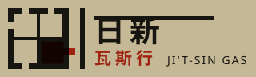

# 蘇聯 ROSTA 窗 Окна РОСТА｜連環型版風格規格書

## 一、設計哲學

一九一九年二月，畫家 Mikhail Cheremnykh 佮記者 Nikolai Ivanov 佇莫斯科一間倒店的糖仔店櫥窗
貼出第一扇「窗」——共當日的電報畫做圖。幾禮拜後詩人 Vladimir Mayakovsky 加入，
到一九二一年為止，這个集體出產了上千扇；Mayakovsky 家己估計伊畫三千張草稿、寫六千條字條。

這个媒介的形狀完全由三个現實條件決定：

1. **速度**：電報到貼上牆，快的時陣四十分鐘到一點鐘。所以形愛簡單到「用刀剪會出來」。
2. **複製方式**：無印刷廠、無紙。用厚紙板型版（pochoir）手工刷色，一个刷版師傅
   第一工做二十五份、第二工五十份，幾工內做完一批約三百份。一色一塊型版——**色數就是成本**。
3. **讀者**：當時大多數人不識字。所以圖必須自己講完整件事，
   而且**同一个記號在整个系列裡永遠是同一个意思**——這是本流派最深的一條規矩，
   它不是美學選擇，它是可讀性的最低要求。

因此：**這不是一張海報，是一串格子。**單獨看任何一格都不完整；
拿掉序號、拿掉順序、拿掉字條，剩下的東西就不是 ROSTA 窗了。

設計網頁時的心法：**先問「這件事分得成幾格」，再問「這格要用哪一塊已經剪過的形」。**
版面不是被構圖出來的，是被剪刀的成本推出來的。

> 歷史脈絡誠實說明：ROSTA 窗是俄國內戰時期布爾什維克的宣傳媒介。本規格書取的是它的
> **媒介語法**（連環格・型版剪形・象形記號系統・押韻字條・雙專色），不是它的政治內容。
> 使用本風格時不應挪用其政治符號（紅星、鐮刀鎚子、領袖像）。

---

## 二、本風格的 5 個不可省略特徵

### 特徵 1・連環格（4–14 格的敘事序列）

一張紙被切成等大的格，編號，左→右、上→下讀。每格**只有一個動作**，格與格之間沒有過渡、
沒有分鏡、沒有運動線。拿掉序列就變成一張單張海報，就不是這個風格。

```css
.win{display:grid;grid-template-columns:repeat(3,1fr);gap:0;
     border:4px solid var(--ink);background:var(--ink)}
.cell{background:var(--paper-new);border:2px solid var(--ink);margin:-1px;
      display:flex;gap:6px;padding:12px 10px 10px;position:relative}
.cell .cno{position:absolute;top:0;left:0;background:var(--ink);color:var(--paper-new);
           font-size:13px;padding:1px 7px 2px}          /* 序號必畫，且切齊格角 */
@media(max-width:900px){.win{grid-template-columns:repeat(2,1fr)}}
@media(max-width:560px){.win{grid-template-columns:1fr}} /* 手機上仍是序列，不是卡片牆 */
```

### 特徵 2・型版剪形，而且每一個孔都有橋

所有形都是**刀剪得出來的閉合塊面**：無漸層、無網點、無立體、無細節、無圓角光暈。
更關鍵的是：形裡面若有一塊底色（counter），那塊底色在厚紙板上就是一座**孤島**，
必須切一條溝連到外面，否則它會掉下來。那條溝叫**橋**，刷出來會留一道白痕——
**白痕不是失手，是這塊版剪得起來的證據。**

```svg
<!-- 一塊有四個孔的窗框：四塊玻璃各切一個缺口通到框外 -->
<svg viewBox="-2 -2 68 68">
  <polygon points="6,8 58,8 58,58 6,58" fill="#17150F"/>
  <g fill="#C4B896"><!-- 四塊玻璃 -->
    <polygon points="13,15 30,15 30,30 13,30"/><polygon points="34,15 51,15 51,30 34,30"/>
    <polygon points="13,34 30,34 30,51 13,51"/><polygon points="34,34 51,34 51,51 34,51"/>
    <!-- 四條橋：切穿框，讓每塊玻璃都連到外面 -->
    <polygon points="19,4 24,4 24,17 19,17"/><polygon points="40,4 45,4 45,17 40,17"/>
    <polygon points="19,49 24,49 24,62 19,62"/><polygon points="40,49 45,49 45,62 40,62"/>
  </g>
</svg>
```
判準：**把顏色拿掉，你還是要看得出「這塊剪下來會不會散」。**

### 特徵 3・兩塊專色版，而且套不準

紅與黑是兩塊分開的型版、刷兩遍。分工是語意的不是裝飾的：
**紅＝你可以做的事、我們的動作、現用態；黑＝出事的東西、不可以、輪廓與正文。**
手工套版一定會偏 1–3mm，而這個偏移**要留著**——它是這個媒介的指紋。

```css
:root{--paper:#C4B896;--paper-new:#D8CFB4;--red:#D0301E;--ink:#17150F;--over:#7A1A12}
.pk,.pr{mix-blend-mode:multiply}          /* 透明油墨疊印：紅壓黑自然生出 --over */
.pr{transform:translate(1.6px,-1.1px);    /* 這 1.6px 就是套印誤差，不要修掉 */
    animation:reg 17s steps(4,jump-none) infinite alternate}
@keyframes reg{from{transform:translate(1.6px,-1.1px)}to{transform:translate(-1.1px,1.4px)}}
@media(prefers-reduced-motion:reduce){.pr{animation:none}}
```

### 特徵 4・象形記號系統：一個記號一個意思

人一律是剪影，手與工具誇大，**臉不畫**（眼睛與鼻子只在「看」與「聞」那兩塊版上出現）。
真正的規則是系統層級的：**同一塊型版在同一組作品裡不能代表兩件不同的事。**
兩格講同一件就用同一塊（重用是美德，也是成本）；兩格講不同的就必須換版。

```css
/* 記號一律 currentColor 上色——因為底色會變，圖要跟著版走 */
.mark svg{width:100%;height:auto;display:block;fill:currentColor}
.mark{color:var(--ink)} .mark.act{color:var(--red)}
```

### 特徵 5・押韻字條，與圖同權

每格底下（或旁邊）一條字條，是口語的韻文，不是圖說。
中文脈絡建議每格兩句七字、句內自押；**中文直排會讓字條像貼在格邊的紙條**，
而且第一句自然落在最右邊，正是傳統讀序。

```css
.strip{writing-mode:vertical-rl;text-orientation:upright;
       font-weight:900;font-size:15px;line-height:1.6;letter-spacing:.14em;
       padding:8px 2px 4px;border-left:3px solid var(--ink)}
.strip b{display:block}                    /* 兩句＝兩個 block，右起排列 */
.tcu{text-combine-upright:all}             /* 直排中的兩位數字要組成一格 */
```

---

## 三、色彩系統

| 角色 | hex | 比例 | 用途 |
|---|---|---|---|
| 包裝紙灰黃 | `#C4B896` | 約 30% | 唯一大面積底色。這是刷版用的粗紙，不是米白 |
| 新紙 | `#D8CFB4` | 約 20% | 剛貼上去那一張比較白；格面、卡片 |
| 舊紙 | `#B3A483` / `#A79769` | 約 10% | 被蓋在下面的紙。越舊越黃越暗 |
| 墨黑（第一塊版） | `#17150F` | 約 24% | 輪廓、格線、正文、「出事的東西」 |
| 朱紅（第二塊版） | `#D0301E` | 約 12% | 「你可以做的」、現用態、拒絕與退件 |
| 套印重疊 | `#7A1A12` | 約 3% | 不手動指定，由 `mix-blend-mode:multiply` 生出來 |
| 瓦斯藍（第三塊版・奢侈品） | `#2C5A7A` | ≤3% | 只給一件事。三塊版就是刷三遍，能不用就不用 |
| 街／頁外底 | `#6E6350`、框 `#4A4133` | 約 15% | 玻璃外面的世界 |

**硬規則**
- 底色不可以是純白，也不可以是米白紙感——它是粗紙，帶灰帶黃。
- 零漸層（除了唯一的環境光帶）。陰影一律是實心位移色塊，不准模糊。
- 紅與黑不是配色，是兩塊版。任何一次「換色」在概念上都等於「多刷一遍」。

## 四、字體系統

- **中文**：`"Noto Sans TC"` 900 給標題、字條、格號；500 給正文。
  字條必須是最粗的字重——它要在玻璃外三公尺看得到。
- **拉丁與編號**：`"Saira Stencil One"`（Google Fonts）。這是型版字體，字身自帶橋，
  用它寫窗號、型版編號、電話、價錢，等於把特徵 2 再說一次。
- 字級 scale：`52 / 26 / 19 / 16 / 15 / 13 / 12`（px）。跳階要大，中間值不要補。
- 行高：正文 1.85、標題 1.25、字條 1.6。字距：標題 `.04em`、字條 `.14em`、拉丁 `.06em`。

```css
body{font-family:"Noto Sans TC","PingFang TC","Microsoft JhengHei",sans-serif;
     font-weight:500;line-height:1.85;letter-spacing:.02em}
.lat{font-family:"Saira Stencil One","Arial Narrow",Impact,sans-serif;letter-spacing:.06em}
h2{font-size:26px;font-weight:900;border-bottom:4px solid var(--ink);
   padding-bottom:6px;display:inline-block}   /* 標題底線＝格線的延伸，不是裝飾 */
```

## 五、版面與網格

- **一個頁面 = 一張貼在玻璃上的紙。**外層是「街」（深色），中層是「玻璃」（有框、有反光），
  內層才是紙。這三層不可省略——省掉玻璃，累貼就沒有地方發生。
- 連環格：桌機 3×2、平板 2×3、手機 1×6。格與格之間**不留空隙**（`gap:0`，靠 `margin:-1px` 合併框線）。
- 每格內部：圖在左、直排字條在右、序號壓在左上角、型版標籤壓在右下角。四個角都要有東西。
- 留白規則：紙的內距 24–26px；格內 10–12px。**紙與紙之間才留白，格與格之間不留。**
- 旋轉角度：貼上去的紙一律帶 `0.5°–2.6°` 的歪斜，且左右交替。零度是印刷品，不是手貼的。

## 六、元件配方

**導覽（疊貼壓層）**：其他頁是壓在這一頁下面的紙，只露出上緣／下緣一條邊。
現用態不是被高亮，而是**它在最上面**。
```css
.stack{position:relative}
.sheet.top{position:relative;z-index:5;padding:26px 24px 30px;background:var(--paper)}
.under{position:absolute;height:100%;background:var(--paper-old);
       transition:transform 90ms steps(2,jump-none)}
.u1{top:-36px;left:4%;right:11%;transform:rotate(-1.3deg);z-index:1}
.u2{top:-20px;left:10%;right:4%;transform:rotate(.9deg);z-index:2}
.u3{bottom:-32px;left:6%;right:9%;transform:rotate(-1.7deg);z-index:1}
.u1:hover{transform:rotate(-2.6deg) translateY(-9px)}   /* 掀角 */
@media(max-width:900px){.under{display:none}.navrow{display:flex}}
```

**按鈕**：3px 實線框、無圓角、hover 往左上位移 2px（`steps(2)`，不是滑順的）。
```css
.btn{background:var(--red);color:var(--paper-new);border:3px solid var(--ink);
     padding:9px 22px;font-weight:900;letter-spacing:.1em;
     transition:transform 80ms steps(2,jump-none)}
.btn:hover,.btn:focus-visible{transform:translate(-2px,-2px)}
```

**表格**：2px 全框線、表頭反白（黑底紙字）、偶數列用舊紙色。無圓角、無 zebra 漸層。

**表單**：3px 框、`background:var(--paper-new)`；錯誤態改成舊紙底＋紅框，
錯誤訊息一律**寫出「哪裡不對、應該長什麼樣」**，不寫「格式錯誤」。

**footer**：深色（街），紙色字，第一個元素是招牌 logo。

## 七、動效規則（四種，全部 steps 量化）

本風格的所有動作都是**逐格**的——刷子是一下一下拉的，紙是啪一下貼上去的。
**全站禁用連續 easing 曲線於狀態變化**（`cubic-bezier` 只准出現在環境動效裡，而本規格連環境也用 steps）。

| 種類 | 內容 | 參數 |
|---|---|---|
| ambient 環境 | 街上的日光斜帶掃過玻璃 | `steps(14,jump-none)`，42s infinite；另有套印錯位漂移 `steps(4)` 17s alternate |
| input 輸入 | 掀角 peel：滑鼠／鍵盤移到被壓住的紙邊，那張紙抬起 8–9px 並轉正 | `90ms steps(2,jump-none)`，延遲 <100ms |
| transition 轉場 | 貼新蓋舊 slap-on：新的紙從 `scale(1.05) rotate(1.1deg)` 啪到定位 | `260ms steps(3,jump-none)` 播一次 |
| signature 簽名 | **累貼 paste-accretion**：狀態不會被取代，只會被蓋住 | 每張紙 `top:i*34px; z-index:10+i`，歪斜左右交替 |

```css
@keyframes glare{from{background-position:130% 0}to{background-position:-40% 0}}
.glass::after{content:"";position:absolute;inset:0;pointer-events:none;z-index:9;
  background:linear-gradient(101deg,transparent 41%,rgba(255,255,255,.22) 46%,
             rgba(255,255,255,.07) 51%,transparent 57%);
  background-size:300% 100%;animation:glare 42s steps(14,jump-none) infinite}
@keyframes slap{from{transform:scale(1.05) rotate(1.1deg)}to{transform:none}}
.pasted{position:absolute;left:0;right:0;transition:transform 90ms steps(2,jump-none)}
.pasted:hover,.pasted:focus-within{z-index:90!important;transform:translateY(-8px) rotate(0)!important}
```

**prefers-reduced-motion 降級（四種都要，且資訊零損失）**
- ambient：光帶停在固定位置（`background-position:52% 0`），套印偏移停在初始值。
- input：`transition:none`——掀角**照常作用**，因為那是控制項不是動畫。
- transition：`animation:none`，紙直接就在最終位置。
- signature：累貼是**結構**不是動畫，完全不受影響；層數、邊緣、可掀開性全部保留。

## 八、插畫與圖像風格

技法名稱：**stencil-bridge 型版橋接剪形**。全站沒有一張外部圖片、沒有一張寫實描繪。
所有圖像（記號、logo、favicon、回執印記）由同一支渲染器輸出，原語只有四種：

1. `["c",cx,cy,r]` 圓　2. `["r",x,y,w,h]` 矩形　3. `["p","x,y x,y …"]` 多邊形　4. `["s","<path d>",w]` 描邊路徑

每塊型版的資料結構是 `{ink:[…], cut:[…], post:[…]}`：`ink` 用色版顏色畫，
`cut` 用**紙色**畫在上面（那就是刀切掉的部分），`post` 再補回色版上的島。
橋就是 `cut` 裡那條**明顯伸出形外**的窄多邊形。

```js
// 渲染器骨架：換一個 fill 就是換一塊版
const prim=(a,f)=> a[0]==="c"?`<circle cx="${a[1]}" cy="${a[2]}" r="${a[3]}" fill="${f}"/>`
 : a[0]==="r"?`<rect x="${a[1]}" y="${a[2]}" width="${a[3]}" height="${a[4]}" fill="${f}"/>`
 : a[0]==="p"?`<polygon points="${a[1]}" fill="${f}"/>`
 : `<path d="${a[1]}" fill="none" stroke="${f}" stroke-width="${a[2]}"
          stroke-linejoin="miter" stroke-linecap="butt"/>`;   // 圓端點是禁止的
```

**明文禁用**：`stroke-linecap:round`、圓角、feTurbulence 手抖濾鏡、半調網點、
細線幾何線描、漸層、模糊陰影、任何寫實描繪、emoji。

## 九、Logo 與 Favicon

Logo = 這個媒介本身的縮影：**一個 2×2 的格，其中一格是紅版，框上有四條可見的橋。**
一眼就把特徵 1（連環格）、2（橋）、3（雙專色）講完。

```svg
<svg viewBox="0 0 96 96"><rect width="96" height="96" fill="#C4B896"/>
 <rect x="10" y="10" width="76" height="76" fill="#17150F"/>
 <g fill="#C4B896">
  <rect x="18" y="18" width="28" height="28"/><rect x="50" y="18" width="28" height="28"/>
  <rect x="18" y="50" width="28" height="28"/>
  <rect x="28" y="6" width="8" height="16"/><rect x="60" y="6" width="8" height="16"/>
  <rect x="28" y="74" width="8" height="16"/><rect x="6" y="28" width="16" height="8"/>
 </g>
 <g fill="#D0301E" style="mix-blend-mode:multiply">
  <rect x="51.5" y="51.5" width="28" height="28"/><rect x="79" y="60" width="15" height="8"/>
 </g></svg>
```

Favicon 用同一張圖縮到 32×32，寫成 inline SVG data URI 放進 `<head>`：
```html
<link rel="icon" href="data:image/svg+xml,%3Csvg xmlns='http://www.w3.org/2000/svg' viewBox='0 0 32 32'%3E…%3C/svg%3E">
```

## 十、Do &amp; Don't

**Do**
- 先把內容拆成 4–14 個**動作**，再開始畫。拆不成序列的內容不適合這個風格。
- 重用形狀。同一個記號出現三次是對的，不是偷懶。
- 每個孔都畫橋，而且讓橋看得見。
- 讓紅黑的分工是語意的，並在頁面上把這條規則**寫出來給讀者看**。
- 字條寫成能念出聲的韻文；長度整齊（如每句七字）。

**Don't**
- ❌ 不要把六格做成「三張圓角卡片 ×2 排」——格是連續敘事，卡片是並列品項。
- ❌ 不要用漸層、模糊陰影、圓角、玻璃擬態、紫藍色。
- ❌ 不要把套印偏移修正掉，也不要把它做成隨機抖動（它是固定方向的機械誤差）。
- ❌ 不要用細線線描或半調網點——那是另外兩個流派。
- ❌ 不要挪用 ROSTA 的政治符號。取語法，不取立場。
- ❌ 不要出現 emoji、Lorem ipsum、「EST. 19xx」徽章、「把 X 變成 Y」式標題。
- ❌ 不要讓字條變成圖說。字條若可以刪掉，代表你把它寫成註解了。

## 十一、頁面骨架範例

```html
<div class="wrap">
 <div class="glass">                        <!-- 玻璃：反光在這一層 -->
  <a class="under u1" href="b.html"><span class="tab">第二頁</span></a>
  <a class="under u2" href="c.html"><span class="tab">第三頁</span></a>
  <div class="stack">
   <main class="sheet top">                 <!-- 最新貼上去的那張紙 -->
    <header class="plate-head">
      <h1 class="shopname">店名<em>紅字</em></h1>
      <div class="shopinfo">地址／電話／時間</div>
    </header>

    <div class="win">
      <figure class="cell">
        <span class="cno">①</span>
        <div class="art"><svg viewBox="-2 -2 68 68"><!-- 型版記號 --></svg></div>
        <div class="strip"><b>七字第一句</b><b>七字第二句</b></div>
        <span class="mtag">K07｜聞到味</span>
      </figure>
      <!-- …共六格… -->
    </div>

    <div class="pile"><!-- 累貼：新的結果一張一張蓋上來，舊的不移除 --></div>
   </main>
  </div>
 </div>
 <footer class="foot"></footer>
</div>
```

## 十二、技術實作與相容性

本風格的三項核心技術，全部在 2026-09-06 查證。

### 1. `steps()` 逐格 easing（動效與時間軸層）

**承載**：全站所有動作。這個媒介的每一個動作都是離散的（刷版、貼紙、掀角），
連續的 `cubic-bezier` 會讓它變成一般的網頁動畫，特徵就消失了。

- **支援**：MDN《`steps()`》標示 **Baseline Widely available**，自 **2015 年 7 月**起跨瀏覽器。
- **語法細節（實作時最容易踩的一點）**：第二參數可用 `jump-start`／`jump-end`／`jump-none`／
  `jump-both`／`start`／`end`。MDN 明載：第一參數必須是**大於 0 的正整數**，
  但**當第二參數是 `jump-none` 時必須大於 1**（因為 `jump-none` 同時包含起點與終點，
  只有一格的話無從跳）。本規格全部用 `jump-none`（起訖兩端都要出現），故所有 n 皆 ≥ 2。
- **查證來源**：MDN `Web/CSS/Reference/Values/easing-function/steps`。
- **fallback**：無支援缺口。`steps()` 不被解析時退回 `ease`，動作仍完成、狀態仍正確，
  只是變滑順——資訊零損失。
- **效能**：純合成層的 `transform`／`background-position`，不觸發 layout。

### 2. `writing-mode: vertical-rl` 直排字條（版面與樣式層）

**承載**：特徵 5。把橫排俄文押韻條移植到中文脈絡時，直排字條是**在地化的差異點**，
而且它自帶正確的讀序——`vertical-rl` 的區塊方向是右到左，所以第一句自然落在最右邊。

- **支援**：`writing-mode` **Widely available，自 2017 年起跨瀏覽器**
  （Chrome 48+、Firefox 41+、Safari 10.1+、Edge 12+，全球覆蓋約 96%）。
- 搭配 `text-orientation:upright`：MDN 標示 **Baseline Widely available，2020 年 9 月**起跨瀏覽器。
- `text-combine-upright`（直排中把兩位數字組成一格）：MDN 標示 **Baseline Widely available，
  2022 年 3 月**起跨瀏覽器；**但規格裡的 `digits <integer>` 值目前沒有任何瀏覽器支援**，
  必須用 `all`，並在每一段要橫排的數字外自己包一層標記（`<span class="tcu">20</span>`）。
  這是本項唯一的真實坑，實作時不要寫 `text-combine-upright: digits 2`。
- **查證來源**：MDN `writing-mode`、`text-orientation`、`text-combine-upright`。
- **fallback**：舊環境退回橫排。字條仍在原位、仍可選取、仍可讀，只是不再像貼在格邊的紙條；
  格的邊框與序號不變，序列語意零損失。

### 3. 二分圖最大匹配作為規則引擎（資料與生成層）

**承載**：特徵 4 的可驗算化。「同一塊版只能有一個意思」這條規矩，
等價於在「意」與「型版」之間找一組**匹配**；那麼「最少要現剪幾塊版」就是

> 最少現剪塊數 ＝ 相異的意的個數 − 最大二分匹配數

所以系統可以誠實地告訴使用者「這扇窗最少要剪 1 塊」，而不是給一個主觀評分。

- **技術**：純 JavaScript 的匈牙利增廣路徑法（Kuhn's algorithm），無瀏覽器 API 依賴，
  故無相容性問題；關掉 JavaScript 時頁面另備一組靜態的已解範例與完整說明。
- **效能實測（Node 22 單執行緒）**：24 塊型版 × 6 格的規模下，
  `minCuts()` 執行 **200,000 次 ≈ 131.9 ms**，即單次約 **0.00066 ms**；
  每次互動只呼叫一次，對 100ms 的輸入延遲預算而言可忽略。
- **窮舉驗證（四份電報，2,124 種組合）**：合格 1,584 種（74.6%）；
  剛好達到最少剪版數的只有 78 種（3.7%）——代表「剪最少」是真的要動腦，不是預設結果。

### 效能預算實測

| 頁 | 大小（含全部 inline 資源） | 預算 350KB |
|---|---|---|
| index.html | 29 KB | ✅ |
| cut.html | 46 KB | ✅ |
| plate.html | 50 KB | ✅ |
| order.html | 36 KB | ✅ |

外部資源只有 Google Fonts 兩支字體，零外部圖片、零外部音檔、零函式庫。
首屏 JavaScript 只做一次 DOM 組裝（無 layout 讀寫交錯）；
累貼每次只讀一次 `offsetTop`／`offsetHeight` 再寫一次高度，無 layout thrashing。
所有動畫只改 `transform`、`opacity`、`background-position`。

---

*本規格書出自範例站 `sites/jitsin`（日新瓦斯行）。風格與內容分離：這裡定義的是連環型版的語法，
拿去做唱片行、疫苗宣導、選舉公報、球隊戰報都成立——只要那件事分得成一串格子。*
