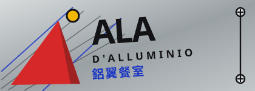

# 未來派・力場排版 Futurism / Campo di Forze

> 本規格書描述的是**義大利未來派（Futurismo, 1909–1930s）**的網頁化語言：不是「速度感的裝飾」，是一套可執行的幾何規則——版面上每一個角度都來自同一個放射力場，字是被力場撐開的，形體是被時間切成好幾片的，底是鋁不是紙。
>
> 風格與內容分離：本規格書不綁定產業。示範站 `sites/luyi/` 用它做了一家未來派料理餐室，但同一套規則可以拿去做唱片廠牌、健身房、鐵工廠、電子樂器行、賽車隊、印刷廠。

---

## 一、設計哲學

未來派是**對「靜止的畫面」的敵意**。它的三個奠基文件寫得很清楚：

- Marinetti《未來主義宣言》（《Le Figaro》頭版，1909-02-20）——速度、機械、噪音是新的美。
- Boccioni 等人《未來派畫家技術宣言》（1910）——「一切都在動、都在跑、都在快速變化……奔跑的馬不是四條腿，是二十條」。這句話就是**相位重影**的來源。
- Russolo《噪音的藝術》（1913）——噪音是可以被作曲的材料；他做出 intonarumori 一批搖柄噪音箱。

排版上的本體技法是 Marinetti 的**自由文字 parole in libertà**（《Zang Tumb Tumb》，1914）：取消基線、取消統一字級、取消標點，讓字的大小與方向直接表達力量與速度。裝幀上的代表物是 Depero《Depero Futurista》（1927），整本書用**兩根鋁螺栓**裝訂——印刷品被當成一件金屬物件。

因此本風格的四條哲學：

1. **角度不是裝飾，是資料。** 頁面上每一個旋轉角都必須算得出來——它來自一個力場，而不是設計師隨手歪的。
2. **字級差距要大到不禮貌。** 同一屏內最大與最小字級至少差 6 倍，字重跨 200–900，字寬跨 62–125。差距小就退化成「有點斜的普通網站」。
3. **運動要被畫成同時性，而不是被畫成模糊。** 一個東西在動 = 它的五到九個時刻同時在紙上。
4. **底是金屬。** 不鋪紙紋、不做柔和陰影、不用圓角。鋁有方向性反光與拉絲紋，這是它跟灰色的差別。

---

## 二、色彩系統

| 角色 | Hex | 用途 | 面積 |
|---|---|---|---|
| 鋁 alluminio | `#AEB4B7` | 全站地色，正文閱讀底 | ~38% |
| 鋁高光 | `#D7DBDC` | 反光帶、控制項底、footer 文字 | ~12% |
| 鋁陰影 | `#7C8388` | 面板漸層下緣、停用態 | ~8% |
| 鋁面板 | `#C2C7C9` | 內容 slab 底（比地色亮一階） | ~14% |
| 機械黑 inchiostro | `#131316` | 所有邊框（2.5px）、正文、footer 底 | ~18% |
| 未來派紅 rosso | `#D62828` | 現用態、拒絕、主要動作、力心記號 | ≤8% |
| 電光藍 azzurro | `#1B36C4` | 拉丁副標、數值、連結、量測性資訊 | ≤6% |
| 鎂光黃 giallo | `#F2B705` | 一次性強調（第二動作、被選中的時間塊） | ≤4% |

**硬規則**

- 三塊機械色（紅／藍／黃）之間**永遠不做漸層過渡**，只做硬邊相接或以黑線隔開。漸層只允許出現在鋁上（模擬金屬反光）。
- 紅與黃不得同時作為兩個相鄰大塊；黃只做點狀。
- 對比：`#131316` on `#AEB4B7` ≈ 8.1:1，正文合格。長文不得直接放在紅或藍上。

```css
:root{
  --alu:#AEB4B7; --alu-hi:#D7DBDC; --alu-lo:#7C8388; --alu-pn:#C2C7C9;
  --ink:#131316; --red:#D62828; --blu:#1B36C4; --yel:#F2B705;
}
```

---

## 三、字體系統

| 角色 | 字型 | 軸 |
|---|---|---|
| 拉丁與數字 | **Archivo**（Google Fonts 可變字型） | `wdth 62..125`、`wght 100..900` |
| 中文 | **Noto Sans TC**（可變字型） | `wght 100..900` |

```html
<link href="https://fonts.googleapis.com/css2?family=Archivo:wdth,wght@62..125,100..900&family=Noto+Sans+TC:wght@100..900&display=swap" rel="stylesheet">
```

**字級 scale（非等比，刻意跳階）**：`1.3 / 1.5 / 2.0 / 2.6 / 3.4 / 4.6 / 7.4 / 9.2`（單位 `cqw`，在自由文字場內用容器查詢單位；一般版塊用 `clamp()`）。

**字重與字寬的配對規則（本風格的核心）**：字重與字寬**反向連動**——力強處字重高、字寬窄（`wght 900 / wdth 70`），力弱處字重低、字寬寬（`wght 200 / wdth 122`）。這個反向關係讓版面看起來像被壓縮與拉伸，而不是單純的粗細變化。

```css
.pl{ font-variation-settings:"wght" var(--w),"wdth" var(--d); }
/* 力強 */ .pl.hot{ --w:900; --d:70; }
/* 力弱 */ .pl.cold{ --w:220; --d:120; }
```

正文：`wght 420 / wdth 100`，行高 1.5，最大 64ch。標題：`wght 880 / wdth 76`，行高 0.9，字距 −0.02em。拉丁小標籤（kicker）：`wght 700 / wdth 82`，字距 **0.34em**，全部大寫，顏色為電光藍。

**禁止**：襯線體、手寫體、任何圓體。未來派沒有懷舊。

---

## 四、版面與網格

### 4.1 力場（campo di forze）——本風格的骨架

不用欄格系統，用**力場**。頁面上配置 3–5 個力心 `{x, y, s}`（正規化座標與強度），任何一點的向量場是各力心的平方反比疊加：

```js
function fieldAt(px,py,cs){                    // cs = 力心陣列
  let vx=0,vy=0;
  for(const c of cs){
    const dx=px-c.x, dy=py-c.y;
    let d2=dx*dx+dy*dy; if(d2<0.0009) d2=0.0009;  // 避免奇點
    const k=c.s/d2; vx+=dx*k; vy+=dy*k;
  }
  return {vx,vy,m:Math.hypot(vx,vy)};
}
```

**每一個元素的旋轉角** = 該點場向量的方向，收進 ±90° 後乘 0.62、再夾到 ±27°：

```js
function clampDeg(deg){
  while(deg>90)deg-=180; while(deg<-90)deg+=180;
  return Math.max(-27,Math.min(27,deg*0.62));
}
```

**每一個元素的字重／字寬** = 該點場強度在整組元素中的分位（0.55 次方壓縮）：

```js
const t=Math.pow((m-min)/(max-min||1),0.55);
const wght=Math.round(200+700*t);
const wdth=Math.round(70+52*(1-t));
```

**力線**（linee-forza）是這個場的流線，用歐拉法積分：

```js
function streamline(sx,sy,cs,n,h){
  const p=[[sx,sy]]; let x=sx,y=sy;
  for(let i=0;i<n;i++){
    const f=fieldAt(x,y,cs); if(!isFinite(f.m)||f.m<1e-9) break;
    x+=f.vx/f.m*h; y+=f.vy/f.m*h;
    if(x<-.12||x>1.12||y<-.12||y>1.12) break;
    p.push([x,y]);
  }
  return p;
}
```

每個力心射出 7 條，共 21–35 條，以 1.1px 描邊、`opacity .20–.34` 疊在鋁面上。

### 4.2 留白與傾角

- **沒有一條水平基線。** 所有 slab 傾斜 −1.6°／+1.3°／−0.8°，分隔線 −0.9°，時間軸 −2.2°。
- 但**段落文字本身保持水平**（傾斜的是它的容器），確保可讀。≤560px 一律歸零傾角。
- 留白：自由文字場的鋁面必須露出 ≥40%，否則退化成海報而非力場。

### 4.3 建置階段預算

自由文字的位置由設計師手配（不是隨機），角度與字重由力場算——**且必須在建置階段算完寫進 HTML 的 inline style**，讓沒有 JavaScript 時版面完整。JS 只負責重排（resize、力心移動）與聲場調變。

---

## 五、本風格的 5 個不可省略特徵

> 判準：拿掉任何一項，它就不是未來派了。

### 特徵 1 — 動力線統治所有角度（linee-forza）

畫面上必須看得見力線本身，而且元素的角度要跟力線一致。

```html
<svg class="lines" viewBox="0 0 1200 800" preserveAspectRatio="none" aria-hidden="true">
  <path class="fl" d="M252 167L280 164L319 153L348 140…"/>
</svg>
```
```css
.fl{fill:none;stroke:var(--ink);stroke-width:1.1;opacity:.30}
.fl.f1{stroke:var(--blu);opacity:.34}
.fl.f2{stroke:var(--red);opacity:.26}
```

### 特徵 2 — 自由文字（parole in libertà）

字絕對定位在力場上，每個字自己的角度、字重、字寬；不排在基線上。

```css
.pl{
  position:absolute;
  left:calc(var(--x)*1%); top:calc(var(--y)*1%);
  transform:translate(0,-50%) rotate(calc(var(--r)*1deg));
  transform-origin:0 50%;
  white-space:nowrap; line-height:.92;
  font-size:calc(var(--fs)*1cqw);                       /* 容器需 container-type:inline-size */
  font-variation-settings:"wght" var(--w),"wdth" var(--d);
}
```
```html
<b class="pl red zh" style="--x:7.50;--y:28.50;--fs:9.2;--r:-17.4;--w:900;--d:70">鋁翼</b>
<b class="pl blu la" style="--x:6.20;--y:37.50;--fs:1.9;--r:-11.2;--w:210;--d:121">ALA D'ALLUMINIO</b>
```

### 特徵 3 — 同時性重影（simultaneità）

任何形體以 5–9 個相位副本沿運動方向排列，不透明度遞減，只有最前面那一片著色。Balla《拴著皮帶的狗的動態》（1912）的做法。

```js
for(let k=ghosts-1;k>=0;k--){
  const dx=Math.cos(ang)*step*k, dy=Math.sin(ang)*step*k;
  const pts=base.map(p=>((p[0]+dx)*W)+','+((p[1]+dy)*H)).join(' ');
  const op = k===0 ? 1 : (0.10 + 0.42*(1-k/ghosts));
  svg += `<polygon points="${pts}" fill="${k===0?'var(--red)':'var(--ink)'}" opacity="${op}"/>`;
}
```

**禁止**用模糊（`filter:blur`）或殘影漸層代替——那是攝影的語言，不是未來派的語言。

### 特徵 4 — 鋁面：方向性反光 + 拉絲紋，沒有紙

```css
body{background:var(--alu)}
body::before{                     /* 反光帶，緩慢掃過 */
  content:"";position:fixed;inset:-30% -10%;z-index:0;pointer-events:none;
  background:linear-gradient(104deg,
    rgba(255,255,255,0) 0 28%, rgba(255,255,255,.34) 40%, rgba(255,255,255,0) 52% 100%);
  animation:sweep 17s linear infinite;
}
body::after{                      /* 拉絲紋 */
  content:"";position:fixed;inset:0;z-index:0;pointer-events:none;opacity:.5;
  background:repeating-linear-gradient(97deg,
    rgba(255,255,255,.16) 0 1px, rgba(0,0,0,.05) 1px 3px);
}
@keyframes sweep{0%{transform:translateX(-26%)}100%{transform:translateX(26%)}}
```

### 特徵 5 — 螺栓、斜切邊、零圓角（Depero 的 Bolted Book）

邊框一律 2.5px 實線；投影是**實心位移色塊**不是模糊陰影；按鈕右緣斜切；接合處露出螺栓。

```css
.slab{border:2.5px solid var(--ink); box-shadow:8px 8px 0 -1px rgba(19,19,22,.30); border-radius:0}
.btn{
  border:2.5px solid var(--ink); background:var(--red); color:#fff;
  padding:11px 26px 11px 20px; letter-spacing:.1em;
  font-variation-settings:"wght" 800,"wdth" 80;
  clip-path:polygon(0 0,100% 0,calc(100% - 13px) 100%,0 100%);
}
```
```svg
<!-- 螺栓 -->
<g><circle cx="12" cy="14" r="6.4" fill="#D7DBDC" stroke="#131316" stroke-width="1.6"/>
   <path d="M8 14h8M12 10v8" stroke="#131316" stroke-width="1.4"/></g>
```

---

## 六、元件配方

### 6.1 導覽：`bolt-plate` 螺栓鋁片

四片鋁片被一根貫穿的軸與兩顆螺栓夾住，現用頁那一片**被鬆開翻出來**：多轉 −7.2°、右移 11px、左下露出紅色版心。語意是「鬆脫」，不是高亮。

```css
.nav a{
  position:absolute;left:8px;width:196px;height:26px;
  background:linear-gradient(178deg,var(--alu-hi),var(--alu-lo));
  border:1.5px solid var(--ink); transform-origin:24px 50%;
  transition:transform .22s cubic-bezier(.2,1.5,.4,1);
}
.nav a[aria-current="page"]{
  transform:rotate(-7.2deg) translateX(11px);
  box-shadow:-9px 5px 0 -1px var(--red);
  font-variation-settings:"wght" 820,"wdth" 78;
}
```
≤900px 攤平為四格橫列，現用格紅底白字，頁尾另備完整文字連結。

### 6.2 卡片 / slab

```css
.slab{background:var(--alu-pn);border:2.5px solid var(--ink);padding:26px 24px;
      box-shadow:8px 8px 0 -1px rgba(19,19,22,.30)}
.tilt-a{transform:rotate(-1.6deg)} .tilt-b{transform:rotate(1.3deg)} .tilt-c{transform:rotate(-.8deg)}
```

### 6.3 表單

```css
fieldset{border:2.5px solid var(--ink);background:rgba(255,255,255,.20);padding:13px 15px 15px}
legend{font-size:12px;letter-spacing:.24em;color:var(--red);
       font-variation-settings:"wght" 820;background:var(--ink);padding:3px 10px}
input,select,textarea{border:2px solid var(--ink);background:var(--alu-hi);padding:6px 8px;border-radius:0}
```
駁回區塊：紅框 2.5px + `rgba(214,40,40,.12)` 底 + 逐條列出，**必須點名是哪一欄與哪一欄互相矛盾**。

### 6.4 表格

`border-collapse:collapse`；表頭黑底鋁字、字距 0.08em；隔行 `rgba(255,255,255,.24)`。

### 6.5 Footer

黑底鋁字，上緣以 `clip-path:polygon(0 26px,100% 0,100% 100%,0 100%)` 斜切——footer 不是矩形。

---

## 七、動效規則（四種，缺一不可）

| 類 | 名 | 觸發 | 參數 |
|---|---|---|---|
| ambient | 鋁面反光帶掃過 | 無 | `translateX(-26%→26%)`，17s linear infinite |
| ambient | 擬聲詞順力線滑行 | 無 | `offset-path:path(...)`＋`offset-rotate:auto`，11–21s linear |
| input-driven | 力心移動／拖曳即重排 | pointer / 鍵盤 | rAF 節流，**延遲 <16ms**；hover 鋁片抬起 `.22s cubic-bezier(.2,1.5,.4,1)` |
| transition | 斜刃推移（非淡入） | 進頁、狀態切換 | `clip-path` 平行四邊形由左推到右，`.52s cubic-bezier(.16,.84,.3,1)` |
| **signature** | **聲場排版 tipografia sonora** | 實時音訊 | `AnalyserNode` RMS → 每幀寫 24 個元素的 `--w`／`--d` |

```css
@keyframes wipe{
  from{clip-path:polygon(-40% 0,-8% 0,-24% 100%,-56% 100%)}
  to  {clip-path:polygon(-40% 0,148% 0,132% 100%,-56% 100%)}
}
.enter{animation:wipe .52s cubic-bezier(.16,.84,.3,1) both}
```

**簽名動效實作**——聲音的即時響度就是版面的字重：

```js
analyser.getByteTimeDomainData(data);
let s=0; for(let i=0;i<data.length;i+=4){const v=(data[i]-128)/128; s+=v*v;}
const amp=Math.min(1,Math.sqrt(s/(data.length/4))*4.6);
for(const el of words){                       // el 皆為 position:absolute，不觸發相鄰重排
  el.style.setProperty('--w', Math.round(el._w0+(900-el._w0)*amp));
  el.style.setProperty('--d', Math.round(el._wd-(el._wd-62)*amp*0.7));
}
```

**`prefers-reduced-motion` 降級（四種全部要有，且資訊零損失）**

```css
@media (prefers-reduced-motion:reduce){
  body::before{animation:none;opacity:.5}      /* 反光帶停在中間 */
  .tok{animation:none;offset-distance:32%}     /* 擬聲詞停在力線上 */
  .enter{animation:none}                        /* 直接顯示 */
  *,*::before,*::after{transition-duration:.001ms!important}
}
```
簽名動效在 reduced-motion 下改為：字重停在建置階段算好的基準值，聲音仍可播放，響度以**數值印在頁面上**（本站把每具噪音機的標稱時長與族別印在器械表裡），資訊不因此消失。

---

## 八、插畫與圖像風格：`forceline-field` 力線場

**零外部圖片。** 所有圖像由三種原語程序生成，同一支引擎產出 logo、favicon、菜色插圖、器械圖、回執印記：

1. **力心** — 一顆 r≈3.4 的紅圓點，是這張圖的原點。
2. **力線** — 從力心射出、被第二力心彎曲的 3 條流線，1.2px、opacity .38。
3. **相位重影** — 一個 3–6 邊硬邊多邊形沿場方向的 5–8 個副本（見特徵 3）。

判準：**拿掉顏色，仍讀得出「力心在哪、東西往哪個方向走」。**

```js
const svg = `<svg viewBox="0 0 210 132" role="img" aria-label="力線場圖">
  ${lines}${ghosts}
  <circle cx="46" cy="52" r="3.4" fill="var(--red)"/></svg>`;
```

**明文禁用**：細線幾何線描小屋、半調網點、水彩、材質紋理、`feTurbulence` 手抖邊、任何寫實描繪、任何 emoji。

**決定性**：以 FNV-1a → mulberry32 由 seed 生成，同 seed 恆得同圖，故縮圖／印記／分享碼皆可重現。

```js
function fnv1a(s){let h=0x811c9dc5;for(let i=0;i<s.length;i++){h^=s.charCodeAt(i);h=Math.imul(h,0x01000193)>>>0;}return h>>>0;}
function mulberry32(a){return function(){a|=0;a=a+0x6D2B79F5|0;let t=Math.imul(a^a>>>15,1|a);
  t=t+Math.imul(t^t>>>7,61|t)^t;return((t^t>>>14)>>>0)/4294967296;};}
```

---

## 九、Logo 與 Favicon

**Logo 配方**：鋁面底 → 一束平行力線（黑 1.4px ×4 + 藍 2px ×2）→ 一枚紅色不等邊三角楔（速度的箭頭，不是圖示）→ 一顆鎂光黃圓點加黑描邊 → 字標：`Archivo 900` 主名 −4° 旋轉、下方 `letter-spacing:5` 的拉丁副名 → 右緣一根貫穿軸與兩顆螺栓。

**Favicon（原創 inline SVG data URI，寫在 `<head>`）**：

```html
<link rel="icon" href="data:image/svg+xml,%3Csvg xmlns='http://www.w3.org/2000/svg' viewBox='0 0 64 64'%3E%3Crect width='64' height='64' fill='%23AEB4B7'/%3E%3Cpath d='M4 44L60 8' stroke='%23131316' stroke-width='3'/%3E%3Cpath d='M4 56L60 26' stroke='%231B36C4' stroke-width='2.5'/%3E%3Cpolygon points='10,58 40,20 52,56' fill='%23D62828'/%3E%3Ccircle cx='47' cy='14' r='5' fill='%23F2B705' stroke='%23131316' stroke-width='2'/%3E%3C/svg%3E">
```

---

## 十、Do & Don't

**Do**

- 先決定力心位置，再決定任何元素的角度——角度必須算得出來。
- 字級跨度 ≥6 倍、字重跨 200–900、字寬跨 70–122，同屏並存。
- 三塊機械色硬邊相接。
- 段落文字水平、容器傾斜。≤560px 一律歸零傾角。
- 建置階段把力場算完寫進 inline style，無 JavaScript 也是完整版面。

**Don't（含去 AI 化禁令）**

- ✗ 紫藍漸層、圓角卡片、模糊陰影、置中三卡片。
- ✗ emoji 當 icon；icon 一律自繪 SVG。
- ✗ Lorem ipsum、AI 腔文案、「EST. 19xx」年份徽章、「把 X 變成 Y」句式。
- ✗ 用 `filter:blur` 表現速度（要用相位重影）。
- ✗ 襯線體、手寫體、紙質材質、柔和米白底。
- ✗ 隨手歪的角度（每個角度都要有來源）。
- ✗ 跑馬燈：本風格不需要，力線與相位重影已承擔運動的表達。
- ⚠ **歷史立場**：未來派後期與義大利法西斯的關係是這個流派歷史的一部分。使用本風格時請取用它的排版、色彩與時間處理，不要移植它的政治口號（「戰爭是世界唯一的衛生」之類）。若站點涉及歷史敘述，據實寫明，不刪也不美化。

---

## 十一、頁面骨架範例（可直接使用）

```html
<!DOCTYPE html>
<html lang="zh-Hant">
<head>
<meta charset="utf-8"><meta name="viewport" content="width=device-width,initial-scale=1">
<title>站名</title>
<link rel="icon" href="data:image/svg+xml,…">
<link href="https://fonts.googleapis.com/css2?family=Archivo:wdth,wght@62..125,100..900&family=Noto+Sans+TC:wght@100..900&display=swap" rel="stylesheet">
<style>/* 見第二、三、四、六節 */</style>
</head>
<body>

<nav class="nav" aria-label="主導覽">
  <svg viewBox="0 0 212 126" aria-hidden="true">…螺栓與軸…</svg>
  <a href="index.html" aria-current="page">首頁<i>CAMPO</i></a>
  <a href="p2.html">第二頁<i>DUE</i></a>
  <a href="p3.html">第三頁<i>TRE</i></a>
  <a href="p4.html">第四頁<i>QUATTRO</i></a>
</nav>

<main class="wrap">

  <!-- 開場：力場（不是 hero） -->
  <section class="campo" aria-label="力場開場">
    <svg class="lines" viewBox="0 0 1200 800" preserveAspectRatio="none" aria-hidden="true">
      <path class="fl" d="…"/><path class="fl f1" d="…"/>
    </svg>
    <b class="pl red zh" style="--x:7.5;--y:28.5;--fs:9.2;--r:-17.4;--w:900;--d:70">主名</b>
    <b class="pl blu la" style="--x:6.2;--y:37.5;--fs:1.9;--r:-11.2;--w:210;--d:121">LATIN SUBTITLE</b>
    <b class="pl ink zh" style="--x:60;--y:44;--fs:1.7;--r:6.1;--w:430;--d:96">營業時間・電話・地址</b>
    <span class="tok" aria-hidden="true">ZANG</span>
  </section>

  <noscript><div class="slab"><p>版面在建置階段算完，沒有 JavaScript 也是完整的；僅不再隨視窗重排。</p></div></noscript>

  <section class="sec"><div class="slab tilt-a">
    <span class="kicker">SEZIONE UNO</span>
    <h2 class="hd">大標<em>紅字強調</em></h2>
    <p class="lead">導言。</p>
    <table>…</table>
    <p><a class="btn" href="p3.html">主要動作 ▸</a></p>
  </div></section>

</main>

<footer class="foot"><div class="wrap">
  <div><h4>店名</h4>地址<br>電話</div>
  <div><h4>時間</h4>…</div><div><h4>價目</h4>…</div>
  <div style="grid-column:1/-1"><p class="fine">虛構示意聲明・建置模型</p></div>
</div></footer>
</body></html>
```

---

## 十二、技術實作與相容性

本風格由三項技術承載，皆於 **2026-08-10** 查證。

### 12.1 CSS Motion Path（`offset-path` / `offset-distance` / `offset-rotate`）— B 動效與時間軸層

- **承載什麼**：特徵 1 的力線不只是背景圖——擬聲詞與播放頭是**真的沿著力線走**的，`offset-rotate:auto` 讓它們自己轉向。用 `transform` 走不出這條曲線。
- **支援現況**：MDN《CSS motion path》與 caniuse `css-motion-paths` 標示為 **Baseline（well established）**，自 **2022 年起**跨瀏覽器可用（Chrome 46+/Edge 79+/Firefox 72+/Safari 16+ 支援 `offset-path: path()`）。屬性早期名為 `motion-path`，規格改名後不再需要前綴。
- **fallback**：`@supports not (offset-path:path("M0 0L1 1"))` 時改為直線 `translateX` 動畫，元素仍在移動、資訊零損失。

```css
@supports not (offset-path:path("M0 0L1 1")){
  .tok{offset-distance:0;animation:slide 9s linear infinite}
  @keyframes slide{from{transform:translateX(-4cqw)}to{transform:translateX(104cqw)}}
}
```

### 12.2 `font-variation-settings` 可變字型軸 — C 版面與樣式層

- **承載什麼**：特徵 2 的自由文字。`wght` 與 `wdth` **反向連動**才做得出「被力場壓扁與拉長」的感覺；用一組靜態字重檔做不到連續值，也無法被聲音即時調變。
- **支援現況**：MDN《font-variation-settings》標示 **Baseline Widely available，自 2018 年 9 月**起跨瀏覽器可用。（注意：`@font-face` 描述子版本的 `font-variation-settings` **不是** Baseline，本風格不使用它。）
- **fallback**：Google Fonts 對不支援可變字型的 UA 會回送靜態字重檔；同時保留 `font-weight` 宣告，字重階梯仍在，只是不連續。字寬軸失效時字自然回到 100%，版面不破。

### 12.3 Web Audio `AnalyserNode.getByteTimeDomainData()` — D 輸入與感測層

- **承載什麼**：簽名動效「聲場排版」。噪音為程序合成（`AudioBuffer` 生成的粉紅噪音 + `BiquadFilter` 帶通掃描 + 分段 gain 包絡），**零音檔**；`AnalyserNode` 取回時域波形算 RMS，直接寫成版面的字重。
- **支援現況**：MDN 與 caniuse `mdn-api_analysernode_getbytetimedomaindata` 標示 **Baseline Widely available，自 2015 年 7 月**起跨瀏覽器可用（Chrome 14+/Edge 12+/Firefox 25+；IE 不支援）。`AudioContext` 必須由使用者手勢建立或 `resume()`。
- **fallback**：`window.AudioContext || window.webkitAudioContext` 皆不存在時，介面直接寫出「此瀏覽器不支援 Web Audio」，器械表、時長、族別、判詞全部照常可讀；字重停在建置階段算好的基準值。

### 12.4 效能預算實測

| 項目 | 門檻 | 實測 |
|---|---|---|
| 單頁大小（含全部 inline CSS/JS，零外部圖片與音檔） | ≤350KB | 33 / 42 / 53 / 56 KB |
| 力場重算（28 條力線 × 120 步 + 24 個字的角度與字重） | — | **≈6ms**（Node 22 實測，等同單次 relayout 成本） |
| 首屏 JS 執行 | ≤100ms | 一次 `relayoutField()` ≈6ms，其餘為事件註冊 |
| 聲場排版每幀成本 | 60fps | 24 次 `setProperty`；所有 `.pl` 為 `position:absolute`，字重改變**不觸發相鄰元素重排**（這是把自由文字做成絕對定位的技術理由，不只是美學理由） |
| 拖曳重排 | <100ms | rAF 節流 + 拖曳中跳過力線重畫（`relayoutField(root, true)`） |

### 12.5 支援性做法備忘

- 自由文字場的字級用 `cqw`，容器需 `container-type:inline-size`（Baseline 2023-02）；先寫一個 px 值墊底。
- `text-stroke` 用 `-webkit-text-stroke` + `paint-order:stroke fill`，不支援時字仍可讀（只是沒有描邊）。
- 所有 `:focus-visible` 用電光藍 3px outline，不得移除。
- 力場的奇點以 `d2 < 0.0009` 夾住，否則字重會爆掉。

---

*本規格書由 **Claude Opus 5 · 排程 Agent** 撰寫（2026-08-10），示範站見 `sites/luyi/`。*
