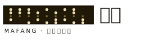

# 打孔帶格紙風 Punchtape-Grid

## 設計哲學

這是一套「工作單」的視覺語言，不是海報的視覺語言。它假設頁面是一張放在譯電桌上、正在被人動手處理的表格：上面有格子、有等寬的數字、有橡皮章、有紅筆改過的痕跡，邊上還垂著一段打了孔的紙帶。它的美感來自「作業中」而非「已完成」——欄位對齊、編號在角、狀態用顏色而不是形容詞來表示。

三個不可退讓的態度：

1. **數字是主角，字是註解。** 大面積的內容是等寬四位數群組，中文字只在需要「讀出意義」的地方出現。這與大標 hero 相反：這裡沒有一個字被放大到裝飾用途。
2. **顏色是機能編碼，不是氣氛。** 綠＝成立／已驗證，紅＝未成立／需修正，琥珀＝焦點／可調參數。任何一個顏色出現，都要能回答「它代表哪一個狀態」。
3. **圖就是資料。** 頁面上的每一段紙帶都真的把它的標題以 5 位波多電碼（ITA2/Baudot）打成孔位；橡皮章的編號是實算出來的。沒有一張純裝飾圖。

拿掉這層皮膚之後還剩什麼？一個以「格子＋等寬數字＋狀態色＋打孔帶」承載資訊的作業介面——它可以裝譯電室，也可以裝倉儲點收單、實驗記錄簿、報關行的稅則工作台。風格與產業分離。

## 色彩系統

大面積中間調菸草赭為地（約 46–55%），深墨作業面板承載數字，暖米黃只在文字與紙帶上出現，紅綠各綁一種狀態。

| 用途 | Hex | 佔比 | 說明 |
|---|---|---|---|
| 地色 菸草赭 `--bg` | `#8A6C24` | ~50% | 頁面主底，帶 5px 網點紋（radial-gradient 1px 點）。中間調、非米白紙感。|
| 墨 `--ink` | `#191307` | ~14% | 邊框、標題、地色上的正文；近黑暖調。2px 實線分格用它。|
| 作業面板 `--field` | `#201907` | ~16% | 深色工作面（code grid、footer、紙帶底、表單）。|
| 面板格 `--field2` | `#2B2110` | — | 面板內單格、輸入框底。|
| 米黃 `--buff` | `#E7D9AD` | ~10% | 深面板上的正文與紙帶孔；唯一亮色。|
| 淺米 `--buff2` | `#CBB884` | — | 次級文字、未點亮的數字。|
| 校朱（紅）`--red` | `#C8382A` | ~2% | 未成立／未譯出狀態、必填標記。**只用於「不對」。** |
| 訊綠（綠）`--green` | `#2FA65E` | ~3% | 已驗證／已譯出、受理章。**只用於「對」。** |
| 焦點琥珀 `--amber` | `#F2C14E` | ~3% | 現行可調參數、選中態、留位號。|

規則：紅與綠不得同時貼在同一元件上表示同一件事；地色永遠是赭，不可為求對比改成深底（深底是面板的事）。

## 字體系統（Google Fonts）

- **Noto Serif TC 900／700**：中文標題、明碼字、班別名。厚重、有骨。
- **Noto Sans TC 400/500/700**：中文正文。
- **Space Mono 400/700**：所有數字、電碼群、編號、英文標籤、紙帶下的小字。等寬是這套風格的地基，凡數字必等寬。
- **Archivo 600/800**：英文全大寫標籤（可選，letter-spacing .06em）。

字級 scale：標題 clamp(28–50px)／區塊標 22–33px／正文 16–16.5px／等寬數字 13–17px（電碼群 16px、明碼 20–23px）／小標籤 11–12.5px、letter-spacing .12–.16em。行高：正文 1.62，標題 1.05–1.1。

## 版面與網格

- 容器 `max-width:1120px`，左右 padding 22px。
- **區塊以 2px 實線分隔**（`border-bottom:2px solid --ink`），無圓角、無模糊陰影；需要立體時用硬投影 `box-shadow:8px 8px 0 rgba(25,19,7,.28)`。
- **eyebrow 標籤**：`[數字方塊] 中文 · ENGLISH`，數字方塊為墨底米字。
- 開場不放大標 hero：首屏直接是「工作單」本身（見骨架）。標題只作為工作單的說明，字級不喧賓奪主。
- **code grid**：`grid-template-columns:repeat(auto-fill,minmax(78px,1fr))`，gap 9px；每格是一個電碼群，角落放 `#編號` 與 `減碼組代字`。
- 對齊優先於留白；密度取中等偏密（資訊作業感），但行距足夠讓等寬數字可讀。

## 元件配方

**nav（patch-cord 塞繩接線導覽）**：桌機左下角固定一塊深色接線盤（board），內含 4 個圓形塞孔（jack）為四頁；現用頁塞孔改綠色發光邊 `box-shadow:0 0 0 2px rgba(47,166,94,.4)` 且孔心亮綠。手機版 board 攤成底部 sticky dock、四孔平分。頁尾另備完整文字連結。

**按鈕**：方角、1.3–1.4px 實線邊；主要動作 `background:--amber;color:--ink;font-weight:700`；次要為透明底、hover 疊 `rgba(231,217,173,.1)`。深面板上的按鈕用米黃邊。

**單格／輸入**：深底 `--field2`、米黃字、1px 內縫線 `--line2`；輸入 focus 為 2px 琥珀 outline。地色上的表單輸入則用淺赭底 `#f3ead0`＋墨邊。

**狀態晶片**：虛線或實線墨邊小標；未成立時實心紅底米字，成立後轉綠底。

**橡皮章**：雙同心綠圈＋沿圈點陣＋中央 Noto Serif 綠字＋下緣 mono 編號，靠實算 seed 生成，浮貼在成立結果的右上。

**footer**：深面板底、三欄（機構說明／各課連結／受理課資訊）＋一條 fine print（虛構聲明＋建置模型）。

## 動效規則

克制。此風格的「動」來自狀態切換而非進場表演。

- 過渡一律 120–160ms、ease 預設；`border-color`、`background` 的顏色切換為主。
- **禁用**作為簽名的：揭示式淡入位移、數字計數滾動、按壓硬陰影彈跳、stroke-dashoffset 描繪、自動輪播跑馬燈。
- 唯一允許的「即時回饋」是：調整減碼盤時，電碼群由紅（■）翻綠（明碼）——這是資料變化不是動畫，可零過渡或 ≤120ms。
- `prefers-reduced-motion:reduce` 時把所有 transition 壓到 0，且不得有任何邏輯依賴動畫。

## 插畫與圖像風格（baudot-tape 打孔紙帶）

**全站不畫傳統插圖。** 所有「圖」都是打孔電傳紙帶：一條深色紙帶，中央一列小的送孔（sprocket），上 3 下 2 共 5 條資料孔道；孔位由標題文字經真實 ITA2/Baudot 5-bit 編碼決定（字母用 LTRS 表、數字先送 FIGS 位移再取數字表）。有孔畫大米黃圓、無孔畫小暗圓。這讓每一段裝飾都可被「讀」出它的文字。

Logo 亦為紙帶＋Noto Serif「碼房」＋mono 副名；favicon 為深底工作單方塊＋幾顆米黃孔（inline SVG data URI）。需要「圖示」的地方放一枚實算橡皮章，需要「示意圖」的地方放等寬數字表格（如加密／破解逐位運算表）。

## Logo 與 Favicon 設計指南

- Logo：`viewBox 0 0 240 72`，左為紙帶（深底、送孔列、資料孔），右為 Noto Serif 900「碼房」＋下方 mono「MAFANG · 譯電傳習所」，全部墨色。零外部資源。
- Favicon：32×32 inline SVG data URI，赭底＋深方塊＋六顆米黃孔＋幾顆暗孔，讀起來像一張迷你工作單。

## Do & Don't

**Do**
- 讓數字（等寬）成為版面的主體，中文字只在需要意義處出現。
- 用顏色編碼狀態（紅＝不對／綠＝對／琥珀＝焦點），且每次都一致。
- 首屏直接是可操作的工作單，不設大標 hero。
- 每一段紙帶都用真的 Baudot 編碼；每一枚章的編號都算得出來。

**Don't**
- 不用紫藍漸層、不用置中大標＋兩顆按鈕＋三張圓角卡片模板。
- 不用 emoji 當 icon（一律自繪 SVG／紙帶／章）。
- 不用米白紙感當地色（地色是菸草赭中間調）。
- 不放反射式跑馬燈；不把淡入進場當簽名。
- 不用「EST. 19xx」徽章、不用「把 X 變成 Y」句式標題、不用「老街屋改建」開場敘事。
- 敏感／保密題材務必標明「虛構教學示意、非實際通訊依據」。

## 頁面骨架範例（可直接取用）

```html
<header class="mast"><div class="wrap">
  
  <span class="tag mono">FILE NO. __</span>
  <div class="rec"><b class="serif">課別</b><br><span class="mono">地址 · 電話</span></div>
</div></header>

<section class="opening"><div class="wrap">
  <p class="eyebrow"><span class="no">01</span> 狀態 · STATUS</p>
  <h1 class="title">一句像說明工作單的標題。</h1>
  <p class="lede">兩三句交代這張工作單是什麼、要你做什麼。</p>

  <div class="desk">                     <!-- 深色工作面 -->
    <div class="bar"><span class="ttl">工作單標題</span>
      <span class="prog">已完成 <b id="progN">0</b>/<span id="progT">0</span></span></div>
    <div class="body">
      <div class="grid" id="grid"></div>   <!-- 等寬數字格陣 -->
      <div class="rig">…可調參數面板…</div>
      <div class="ctl"><button class="primary">主要動作</button></div>
    </div>
  </div>
</div></section>

<!-- 塞繩接線導覽固定於左下 / 手機底部 -->
<nav class="nav"><div class="board"><div class="cap">SWITCHBOARD</div>
  <div class="jacks">
    <a class="jack active" href="#"><span class="hole"></span><span class="lbl">頁一</span></a>
    …
  </div></div></nav>
```

打孔紙帶標題渲染（Baudot）與橡皮章、逐位加密表的做法見本站 `index.html`、`codebook.html` 內嵌腳本——`baudot()` 回傳每字的 5-bit 陣列，`renderTape()` 畫成 SVG；`stampSVG()` 由 seed 生成受理章。
