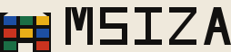

# 恩德貝勒彩繪屋 Ndebele Wall Painting

> 一句話：**沒有那圈黑，它就不是這個風格。**
>
> 這份規格書描述南非 amaNdebele 婦女在住屋正面上畫的那套幾何語言。
> 它不是「非洲風」也不是「部落圖案」——它是一套有明確規矩、可逐條檢查的視覺系統：
> 有限的幾罐搪瓷漆、絕對平塗、每一塊顏色被等寬的黑完整關住、以門為中軸左右鏡射、
> 而且圖案必須繞過牆上真正存在的開口。
>
> 這份 SKILL 不綁定產業。範例站是一間外牆粉光工事所，但同一套語言可以做學校、市場、
> 兒童診所、運動品牌、音樂祭、食品包裝——只要你守得住下面五條。

## 血緣與參照（style_lineage）

- **named**：恩德貝勒彩繪屋 Ndebele Wall Painting（amaNdebele house painting）
- **origin**：南非 Mpumalanga／舊 KwaNdebele 一帶。地色與土質顏料（石灰、紅土、灶灰、牛糞）的裝飾傳統在十九世紀自珠飾幾何延伸到牆面；**1940 年代村裡買得到現成的搪瓷／乳膠漆之後，高彩度的平塗色與粗黑輪廓才定型成今天認得出來的樣子**。全程由婦女繪製，母傳女；徒手，不打底稿、不彈線、不用尺、不用型版。
- **refs**：
  1. **Esther Mahlangu**（1935-11-11 生於 Mpumalanga 省 Middelburg）— 現存最著名的實踐者。1989 年受邀參加巴黎龐畢度中心〈Magiciens de la Terre〉；**1991 年為 BMW 525i 繪製第 12 號 Art Car，是第一位設計 BMW Art Car 的女性**。她明言徒手作畫、不先量不先畫草稿。
  2. **amaNdebele 的珠飾幾何**（jocolo 圍裙、linga koba 頭飾等）— 牆上的階梯、菱、框與牆面構圖，與珠飾上的幾何是同一套語彙的兩種載體。
  3. **1960 年代以後進入母題的現代物件** — 電桿、燈泡、刮鬍刀片、飛機。新東西進得來，但它得先被壓成矩形、三角與一個半圓才進得來。
  4. **材料史**：土質顏料（石灰／紅土／灶灰／牛糞）→ 1940 年代的商用搪瓷漆 → 當代的高彩度乳膠與 vinyl 漆。**「顏色是買來的，不是調出來的」這件事決定了整個風格沒有明度階。**
- **invented**：`false`。本條目為既有的文化視覺傳統，非自創風格。

**與鄰近條目的分界**

| 鄰近 | 差別 |
|---|---|
| 非洲 Adinkra 印布 | 那是把刻好的葫蘆印模沾樹皮墨蓋在整幅染布上（加法、二值、單一印色）；本條目的每一塊都是平塗的色面，而且被黑關住 |
| 阿散蒂 Kente 條幅織 | 那的物理單位是一條 11 公分的織帶，面與面直接相鄰；本條目明文禁止兩塊顏色相接 |
| 荷蘭風格派 De Stijl | 那也是黑線＋平塗原色，但那的黑線是**格線**（線先存在，顏色填進格子），而且不要求對稱、不繞開任何東西；本條目的黑線是**每一塊顏色自己的周長**，而且構圖由建築的開口與中軸決定 |
| Memphis／普普 | 那是設計師的撞色遊戲；本條目的色票是五金行架上有什麼，而且每一塊必須封線 |

---

## 一 · 設計哲學

1. **牆先於圖。** 圖案不是貼在牆上的裝飾，是這面牆的一部分。門在哪裡、窗多高、落水管拆不拆得掉，決定圖長什麼樣。先量洞，再配圖。
2. **黑是結構不是線條。** 黑帶的工作是「把這塊顏色定義成一個獨立的塊」。因此黑的面積不是設計者決定的，是「有幾塊顏色」決定的——黑通常是畫面上面積第二大的顏色。
3. **顏色不做深淺。** 一罐漆只有一個值，沒有淡一點的版本。所以畫面上零漸層、零陰影、零明度階、零透明度。要更亮的地方，換一塊顏色，不是調亮同一塊。
4. **對稱是紀律不是效果。** 以門的中軸左右鏡射。但洞不對稱時**不硬拉對稱**——兩側各自照洞的形狀收邊。這條「例外」比對稱本身更是這個風格的特徵。
5. **手的限制就是形的限制。** 徒手畫得準的只有直線、四十五度、以及繞著一個中心轉的弧。所以形只有矩形、等腰直角三角、菱、階梯折線，加上兩處例外的半圓。
6. **重畫是常態。** 雨季會沖掉外牆，所以牆是每年重畫的。這套語言預設「東西會被蓋掉再來一次」，不預設永久。

## 二 · 色彩系統

架上只有八個色碼。沒有第九個，也沒有任何一個色碼的「淡版」。

| 色 | hex | 用途 | 面積 |
|---|---|---|---|
| 石灰白牆 | `#EFE9DC` | 唯一大面積底，**同時是一個可以用來上的顏色**（用白的那塊也要封線） | ~30% |
| 黑 | `#121110` | 全部的封線、全部的正文、頁尾滿版 | ~26% |
| 鈷藍 | `#1D4FA3` | 色面 | ≤14% |
| 翠綠 | `#1B6E45` | 色面 | ≤12% |
| 桃紅 | `#D24E7B` | 色面 | ≤10% |
| 鉻黃 | `#E8AE18` | 色面、連結 hover、focus | ≤10% |
| 朱紅 | `#C9331F` | 色面、不可逆動作 | ≤8% |
| 土紅 | `#8A4A2C` | **只上牆腳**。語意是「地」，不是一個可選的顏色 | ≤8% |

**硬規則**

- 零漸層（`linear-gradient`／`radial-gradient`／`conic-gradient` 一律不得出現）
- 零透明度（`opacity` 只准 0 或 1；`rgba` 第四位不得小於 1）
- 零中間色、零明度階（不准出現任何不在上表裡的色碼）
- 零陰影、零模糊（`box-shadow`／`filter:blur`／`drop-shadow` 一律不得出現）
- 零發光、零金屬、零玻璃擬態、零紋理、零噪聲、零光源
- 圓角上限 3px
- **任何兩塊顏色不得直接相接**——中間必定隔著黑帶，或隔著石灰白牆

**可讀性（實測對比）**

| 組合 | 對比 | 判定 |
|---|---|---|
| 黑 `#121110` on 石灰白 `#EFE9DC` | 15.8:1 | 長文一律坐這裡 |
| 石灰白 on 鈷藍 | 6.6:1 | 可放白字 |
| 石灰白 on 翠綠 | 6.3:1 | 可放白字 |
| 石灰白 on 朱紅 | 5.1:1 | 可放白字 |
| 石灰白 on 桃紅 | 4.7:1 | 只放大字，不放長文 |
| 黑 on 鉻黃 | 10.3:1 | 黃上只放黑字 |
| 石灰白 on 鉻黃 | 1.5:1 | **明文禁止** |
| 黑 on 鈷藍／翠綠／朱紅／土紅 | <4.5:1 | **明文禁止** |

## 三 · 字體系統

- 正文與標題：`"Noto Sans TC", "Archivo", system-ui, sans-serif`
- 編號、拉丁標籤、色碼：`"Archivo Black", "Noto Sans TC", sans-serif`
- **零襯線體。零等寬體。** 牆上的字是刷子刷的，沒有襯線，也沒有等寬的理由。
- **零細字重。** 字重只用 500（正文）／700（次級與標籤）／900（標題）。這個流派沒有「細」。
- 字級 scale（base 16px）：`.74 / .82 / .88 / 1 / 1.06 / 1.32 / 1.9rem`
- **標題上限 1.9rem。本流派沒有 hero 大標**——畫面上最大的東西永遠是牆，不是字。
- 行高：正文 1.62、標題 1.14。字距：標題 `.01em`，小標籤 `.06–.14em`。
- 數字一律 `font-variant-numeric: tabular-nums`（價目與格數要對得起來）。

## 四 · 版面與網格

**模組 M ＝ 牆上 30 公分 ＝ 手臂一次拉直的長度。**

```css
:root{
  /* 一面牆恆為 25 格寬，故 M 由視窗寬反推（25 格＋24 條黑帶 ≒ 30M）：
     牆永遠整面看得完，格永遠是正方，不需要 media query 改模組。 */
  --M: clamp(9px, calc((100vw - 56px) / 30), 30px);
  --bw: max(2px, calc(var(--M) / 5));   /* 牆上的黑帶寬＝格短邊的 1/5 */
  --rule: 6px;                          /* 版面規線寬（與牆的黑帶是兩件事，不要混用） */
}
```

- **牆恆為 25 格寬**，格數不隨視窗改變；改變的是格有多大。
- **中軸恆為一條黑帶**（第 13 欄不上色）。這是為了讓鏡射的兩格永不相鄰——沒有這條軸，「相鄰不得同色」與「左右鏡射」在數學上不可能同時成立。
- **橫向規線切版。** 區塊之間沒有留白，只有 `--rule` 粗的黑帶。表格只有橫線，沒有縱線。
- **零旋轉。** 這個流派的東西不斜放（斜的只有 45° 的三角形本身）。
- 內容欄寬上限 `64ch`；`.wrap` 上限 1180px，左右 20px。
- RWD：≤900px 兩欄併一欄；≤560px `--rule:5px`、導覽英文副標隱藏、開口標籤字隱藏。**版面不破的保證來自 `--M` 是 viewport 的函數**，不是來自斷點。

## 五 · 本風格的 5 個不可省略特徵

拿掉任何一條，它就不是這個風格了。每一條都附可直接複製的片段與可機械檢查的判準。

### 特徵 1 · 黑輪廓是結構：每一塊顏色都被一圈等寬的黑完整包住

黑帶不是 `stroke`，是一個**實心的形**——所以它處處同寬、轉角是尖的、縮放時不會變細。
最省的做法是讓底就是黑，顏色內縮：

```css
/* 做法 A：格陣。底是黑的，gap 就是黑帶，顏色從不相接。 */
.wall{
  display:grid;
  grid-template-columns:repeat(25, var(--M));
  grid-auto-rows:var(--M);
  gap:var(--bw);
  background:#121110;      /* 黑不是邊框，黑是底 */
}
.wall > i{ background:var(--fc); }

/* 做法 B：單一塊面。黑底＋內縮的顏色。 */
.plate{ background:#121110; padding:var(--bw); }
.plate > .face{ background:var(--fc); }

/* 做法 C：素牆上的單格（底是牆白時），用 outline —— 它不參與 layout */
.bwall{ background:#EFE9DC; }
.bwall > i[data-painted]{ outline:var(--bw) solid #121110; }
```

SVG 裡不要用 `stroke` 描外形，改用「黑形 ＋ 內縮的色形」：

```xml
<!-- 一格：先黑，再內縮 B 上色 -->
<rect x="0"  y="0"  width="30" height="30" fill="#121110"/>
<rect x="6"  y="6"  width="18" height="18" fill="#1D4FA3"/>
<!-- 三角同理：外三角黑，內三角沿角平分線內縮 -->
<polygon points="0,30 15,0 30,30" fill="#121110"/>
<polygon points="7,24 15,10 23,24" fill="#C9331F"/>
```

**判準（可逐圖檢查）**
(a) 放大任何一張圖，找不到任何兩塊顏色直接相接的邊；
(b) 每一條黑帶的寬度處處相同，且它是一個填滿的形，不是 `stroke`；
(c) 每一塊顏色都指得出它周長上的那一圈黑。

### 特徵 2 · 白是牆，不是留白

石灰白是**一個可以用的顏色**，不是「沒有東西的地方」。用白的那一塊也要封線。
所以這個風格裡不存在「留白」這個操作——空的地方也是一塊被框起來的白。

```css
/* 白是色票的第一個成員，不是 background 的預設值 */
.wall > i[data-c="white"]{ --fc:#EFE9DC; }   /* 一樣被 gap 的黑關住 */
```

```xml
<!-- 方框紋：框住一塊「什麼都沒有的牆」——那塊白也有它自己的黑帶 -->
<rect x="0"  y="0"  width="120" height="90" fill="#121110"/>
<rect x="6"  y="6"  width="108" height="78" fill="#EFE9DC"/>
<rect x="30" y="24" width="60"  height="42" fill="#121110"/>
<rect x="36" y="30" width="48"  height="30" fill="#E8AE18"/>
```

**判準**：畫面上每一塊比黑亮的區域，都指得出它是「哪一罐漆」——包括白。找不到任何一塊「沒上漆所以是白的」區域。

### 特徵 3 · 建築決定構圖：以門的中軸鏡射，並繞過所有開口

構圖的分區來自門、窗、簷、柱、階、山牆。**圖案不得蓋住任何真實的開口，而且要把開口框起來。**
左右以門的中軸鏡射；**洞不對稱的地方不硬拉對稱，兩側各自照洞的形狀收邊。**

```css
/* 開口是洞，不是留白：它自己帶一圈黑，裡面是牆 */
.wall > .opening{
  background:#121110;              /* 框 */
  position:relative;
}
.wall > .opening::after{
  content:attr(data-k);            /* 門／窗／電表／落水管 */
  position:absolute; inset:var(--bw);
  background:#EFE9DC; color:#121110;
  display:flex; align-items:flex-end; justify-content:center;
}
```

```js
// 鏡射與避讓，兩行就寫得完（AX = 中軸欄）
const mirror  = x => 2*AX - x;
const blocked = (x,y) => OPENINGS.some(o => x>=o.x && x<o.x+o.w && y>=o.y && y<o.y+o.h);
// 上漆：同時上鏡射的那一格；鏡射格若落在洞裡，就只上這一格（各自收邊）
function paint(x,y,c){
  if (blocked(x,y) || x === AX) return;
  set(x,y,c);
  const mx = mirror(x);
  if (!blocked(mx,y) && mx !== AX) set(mx,y,c);
}
```

**判準**
(a) 每一個開口的四周都有一圈黑，而且沒有任何色面壓在開口上；
(b) 任取一列，它與 `2·AX − x` 那一列同色，除非其中一邊落在開口裡；
(c) 中軸那一欄永遠是黑的。

### 特徵 4 · 直線與階梯，幾乎零曲線

形只有五種：**矩形、等腰直角三角、菱（兩個三角對頂）、階梯折線（只走水平與垂直，每階等高等寬）**。
曲線只有兩個例外：**燈泡與門拱**，而且半徑必為模組的整數倍、必須落在中軸上。

```xml
<!-- 等腰直角三角（唯一合法的斜邊角度是 45°） -->
<polygon points="0,30 30,30 30,0" fill="#1B6E45"/>
<!-- 菱：兩個三角對頂 -->
<polygon points="15,0 30,15 15,30 0,15" fill="#D24E7B"/>
<!-- 階梯折線：每階等高等寬，只走水平與垂直 -->
<path d="M0 90 L0 60 L30 60 L30 30 L60 30 L60 0 L90 0 L90 90 Z" fill="#1D4FA3"/>
<!-- 唯一合法的曲線：半徑＝2M 的半圓（燈泡），圓心在中軸上 -->
<path d="M75 120 A60 60 0 0 1 195 120 Z" fill="#E8AE18"/>
```

```css
/* 絕不用 border-radius 做圓：圓只能是半徑為整數倍模組的半圓，且只准出現在燈泡與門拱 */
* { border-radius:0; }            /* 全站預設 */
.corner { border-radius:3px; }    /* 上限，只給實體轉角 */
```

**判準**
(a) 除了燈泡與門拱，找不到任何一段曲線；
(b) 找不到任何非 0°／45°／90° 的邊；
(c) 每一段階梯的踏面高度與寬度都相同，階梯數得出來。

### 特徵 5 · 有限的高彩度平塗色，一戶一組漆，零明度階

一面牆只准一組四色（外加白、黑與牆腳的土紅）。**同一個顏色沒有深淺版本。**
相鄰不得同色這件事不要靠「挑顏色」達成，靠公式擋住：

```js
// c = 1 + ((a·x + b·y + k) mod 4)，a,b ∈ {1,2,3}
// 水平相鄰差 a、垂直相鄰差 b，皆不為 4 的倍數 ⇒ 相鄰永不同色，與遮罩無關。
const colourOf = (x,y,{a,b,k}) => 1 + ((a*x + b*y + k) % 4);
```

```css
/* 一戶一組漆：用 @scope 讓一面牆的四色走到嵌在裡面的另一面牆就停 */
.house{ --c1:#1D4FA3; --c2:#1B6E45; --c3:#E8AE18; --c4:#C9331F; }
@scope (.house) to (.inset){
  :scope .wall > i[data-c="1"]{ --fc:var(--c1); }
  :scope .wall > i[data-c="2"]{ --fc:var(--c2); }
  :scope .wall > i[data-c="3"]{ --fc:var(--c3); }
  :scope .wall > i[data-c="4"]{ --fc:var(--c4); }
}
```

**判準**
(a) 數得出樣式表裡恰好八個色碼，一個也不多；
(b) 找不到任何一個色碼的「淺一階／深一階」版本；
(c) 任兩個相鄰的色面顏色不同，而且這件事在任何遮罩下都成立。

---

## 六 · 元件配方

### 刊頭（不是 hero）

一行商號、一行英文副標、一行地址電話，坐在一條 `--rule` 粗的黑帶上。畫面上最大的東西是牆，不是商號。

```css
.head{ border-bottom:var(--rule) solid #121110; background:#EFE9DC; }
.head .wrap{ display:flex; flex-wrap:wrap; align-items:flex-end; gap:14px 22px; padding:14px 20px; }
.head .who{ font-size:1.02rem; font-weight:900; }
.head .fact{ margin-left:auto; font-size:.76rem; font-weight:700; text-align:right; }
```

### 導覽：四塊牆上的色面，現用頁那一塊「已封線」

**語意**：現用頁那一塊已經封上黑線了——顏色被關住、邊界乾淨；其餘三塊還是裸露的色塊，
邊緣是刷子收不齊的毛邊。沒有任何東西被移除、沒有相變、沒有外加的緊固件；
加上去的是一條**界線**，而它的作用是讓這塊顏色從此是一個獨立的塊。

```css
nav{ background:#121110; padding:var(--rule); }
nav ul{ list-style:none; display:grid; grid-template-columns:repeat(4,1fr); gap:var(--rule); }
nav a{
  display:block; border:0; padding:12px 14px 13px; font-weight:900;
  color:#EFE9DC; background:var(--nc);
  /* 未封線：毛邊 */
  clip-path:polygon(0 2px,4px 0,calc(100% - 3px) 1px,100% 4px,calc(100% - 1px) calc(100% - 3px),
    calc(100% - 5px) 100%,3px calc(100% - 1px),1px calc(100% - 5px));
}
nav a[aria-current="page"]{                 /* 已封線 */
  clip-path:none;
  border:var(--rule) solid #121110;
  outline:var(--rule) solid #EFE9DC;
  outline-offset:calc(var(--rule) * -2);
}
nav li:nth-child(1){ --nc:#1D4FA3; }
nav li:nth-child(2){ --nc:#1B6E45; }
nav li:nth-child(3){ --nc:#C9331F; }
nav li:nth-child(4){ --nc:#D24E7B; }
```

**無障礙**：「封沒封線」對輔助科技不可見，所以現用項必須同時帶 `aria-current="page"`。
導覽為靜態 HTML ＋ 純 CSS，關掉 JavaScript 完整可用。

### 按鈕

```css
button{
  font:inherit; font-weight:900; cursor:pointer; border-radius:0;
  background:#EFE9DC; color:#121110; border:3px solid #121110; padding:5px 9px;
}
button[aria-pressed="true"]{ background:#121110; color:#EFE9DC; }  /* 整塊黑白對調，不用陰影 */
.danger{ background:#C9331F; color:#EFE9DC; }
```

### 連結

```css
a{ color:#121110; text-decoration:none; border-bottom:3px solid #121110; }
a:hover, a:focus-visible{ background:#E8AE18; }   /* 換一塊漆，不用底線動畫 */
:focus-visible{ outline:4px solid #121110; outline-offset:2px; }
```

### 表格與卡片

```css
table{ width:100%; border-collapse:collapse; }
th,td{ text-align:left; padding:7px 10px 7px 0; border-bottom:3px solid #121110; }
thead th{ border-bottom:var(--rule) solid #121110; font-size:.74rem; letter-spacing:.08em; }
/* 卡片＝一塊封了線的色面。不要圓角，不要陰影。 */
.plate{ background:#121110; padding:var(--rule); }
.plate > .face{ background:var(--fc,#EFE9DC); padding:12px 14px; }
```

### 頁尾

黑滿版，三欄；上方一條 `--rule` 粗的牆白帶隔開註記。

```css
footer{ background:#121110; color:#EFE9DC; }
footer a{ color:#EFE9DC; border-bottom-color:#EFE9DC; }
footer a:hover{ background:#E8AE18; color:#121110; }
.note{ border-top:var(--rule) solid #EFE9DC; margin-top:20px; padding-top:12px; }
```

## 七 · 動效規則

四種都要有，四種都要降級，降級後資訊零損失。**本風格禁用淡入、捲動揭示與視差**——
牆不會淡入，牆是刷上去的。

| 類 | 觸發 | duration | easing | 做什麼 |
|---|---|---|---|---|
| 環境 | 無（時間） | 7.6s 循環 | `steps(1,end)` | 一格大的補漆塊每 1.9s 跳位並硬切換色 |
| 輸入 | hover／focus | 80ms | `steps(1,end)` | 該塊與其鏡射塊同時加寬黑帶並互換顏色 |
| 轉場 | 載入（換頁） | 380ms | `steps(6,end)` | 六級階梯邊界的黑覆蓋層往右上推出 |
| 簽名 | 載入 ＋ 200ms | 逐格 26ms 遞延 | `steps(1,end)` | 黑帶從中軸向兩側逐格「畫」出來 |

```css
/* 環境：補漆格。只走裝飾帶，永不壓到文字。 */
@keyframes patch-repaint{
  0%,24.99%  { transform:translate(0,0);                                   background:#E8AE18 }
  25%,49.99% { transform:translate(calc(var(--M)*5 + var(--bw)*5),0);        background:#D24E7B }
  50%,74.99% { transform:translate(calc(var(--M)*2 + var(--bw)*2),
                                   calc(var(--M) + var(--bw)));             background:#1D4FA3 }
  75%,100%   { transform:translate(calc(var(--M)*7 + var(--bw)*7),
                                   calc(var(--M) + var(--bw)));             background:#1B6E45 }
}
.patch{ position:absolute; left:var(--bw); top:var(--bw);
        width:var(--M); height:var(--M);
        animation:patch-repaint 7.6s steps(1,end) infinite; pointer-events:none; }

/* 輸入：鏡射互換。border-width 在 border-box 下不改變格位，只重繪。 */
.wall > i{ border:0 solid #121110; transition:border-width 80ms steps(1,end); }
.wall > i:hover, .wall > i.mirrored{ border-width:var(--bw); }

/* 轉場：階梯推移。只動 transform，不觸發 layout。 */
@keyframes step-wipe{ to{ transform:translate(105vw,-105vh) } }
.wipe{
  position:fixed; inset:-6vh -6vw; z-index:9; background:#121110; pointer-events:none;
  clip-path:polygon(0 0,100% 0,100% 20%,80% 20%,80% 40%,60% 40%,60% 60%,
                    40% 60%,40% 80%,20% 80%,20% 100%,0 100%);
  animation:step-wipe 380ms steps(6,end) both;
}

/* 簽名：黑線最後上。先讓每塊顏色用自己的顏色漲滿格縫（很髒），
   200ms 後由中軸向兩側逐格把 outline 變透明 —— 黑底露出來，畫面就乾淨了。
   outline 不參與 layout，全程零 reflow。 */
.wall.sig > i{
  outline:var(--bw) solid currentColor;    /* color 與 background 同色 ⇒ 顏色相接 */
  animation:outline-last 1ms steps(1,end) both;
  animation-delay:var(--d,0ms);            /* --d = 200ms + |x − AX| × 26ms */
}
@keyframes outline-last{ to{ outline-color:transparent } }

@media (prefers-reduced-motion:reduce){
  .patch{ animation:none; background:#E8AE18 }
  .wipe{ display:none }
  .wall > i{ transition:none }
  .wall.sig > i{ animation:none; outline-color:transparent }  /* 直接是最終的乾淨狀態 */
}
```

`--d` 由建置期寫進 inline style，所以**關掉 JavaScript 時 `--d` 取預設 0ms，牆一開始就是封好線的乾淨狀態**——動效缺席，資訊完整。

## 八 · 插畫與圖像風格（`outlined-flat` 封線平塗構成）

零外部圖片、零照片、零 ``（logo 除外）。全部圖像由三條原語產生，**明文不允許第四條**：

1. **每一塊顏色都必須被一條等寬黑帶完整包住**，黑帶寬度＝該塊短邊的 1/5（下限 2px），
   而且**黑帶是一個實心的形不是 `stroke`**——所以轉角是尖的、寬度處處相同、縮放時不會變細。
2. **形只有五種**：矩形、等腰直角三角、菱、階梯折線，以及**同心半圓**（唯一合法的曲線，
   只准出現在燈泡與門拱，半徑必為模組整數倍）。零貝茲、零橢圓、零任意角度。
3. **構圖以門的中軸鏡射**；帶被開口切斷時，兩側各自保持鏡射並照洞的形狀收邊。

**明文禁用**：照片、半調網點、細線幾何線描、`feTurbulence` 假質感、任何做舊濾鏡、
扁平化單色圖示庫、金屬漸層、任何發光、任何模糊陰影、任何漸層、任何透明度、任何出血。

**與其他技法的分界**

| 技法 | 差別 |
|---|---|
| 剪影與框線（線只准當東西本身，不准當東西的邊） | **完全相反**：本技法裡線的唯一用途就是當邊，而且每一塊顏色都必須被包住 |
| 帶與塊（貫穿的等寬帶 ＋ 軸對齊矩形，面與面直接相鄰） | 本技法有 45° 三角、菱與兩處半圓，而且明文禁止面與面直接相鄰 |
| 注塑浮雕（每形宣告凸凹、一盞固定的光、捲積核算皮紋） | 本技法零光源、零厚度、零朝向，每一塊顏色絕對均勻 |
| 模組格陣圖記（等寬筆畫接成的符號，線是骨） | 本技法零筆畫，線是邊；且本技法的每一塊都是填滿的面 |
| 細線幾何線描 | 那是描外形的裝飾線；本技法的黑是材料的界線，寬到與字同階 |

## 九 · Logo 與 Favicon 設計指南

**Logo**：`assets/logo.svg`。兩部分——左邊一個「帶門的門面牆」標記（黑底、內縮色面、白色山牆三角、
一塊土紅牆腳、正中一個牆白的門洞），右邊字標。

**字標一律由矩形與等腰直角三角組成，不用 `<text>`、不用任何字型**：
每個字母畫在 5×7 的單位格上，筆畫寬恆為 1 單位（6px），垂直與水平筆畫用 `<rect>`，
斜筆畫用 `<polygon>`（四點平行四邊形，兩側斜邊同斜率）。字距 8px。

```xml
<!-- 例：字母 Z，全部由矩形與一個平行四邊形組成 -->
<rect x="0" y="8"  width="30" height="6" fill="#121110"/>
<polygon points="24,14 30,14 6,44 0,44" fill="#121110"/>
<rect x="0" y="44" width="30" height="6" fill="#121110"/>
```

**Favicon**：原創 inline SVG data URI 寫在 `<head>`。24×24 viewBox，
四塊被黑關住的色面（上兩塊藍、下兩塊黃、黃塊上各一個朱紅三角）＋ 正中一條 2px 的黑色中軸帶。
在 16px 下仍讀得出「被黑分隔的色塊＋一條中軸」這件事。

```html
<link rel="icon" href="data:image/svg+xml,%3Csvg xmlns='http://www.w3.org/2000/svg' viewBox='0 0 24 24'%3E...%3C/svg%3E">
```

## 十 · Do &amp; Don't

**Do**

- 先決定牆上有哪些洞，再配圖。洞是骨，不是缺點。
- 黑帶寬度用同一個算式算出來（短邊 ÷ 5），不要逐處手調。
- 相鄰不同色用公式擋住（`1 + ((a·x + b·y + k) mod 4)`），不要靠眼睛挑。
- 白當一個顏色用，白塊也封線。
- 母題用「遮罩 ＋ 色階公式」描述，不要逐格硬寫顏色——它才搬得動、縮得小、換得色。
- 狀態一律用整塊黑白對調或換一塊漆表示，並且同時帶 `aria-current` / `aria-pressed` / 文字。

**Don't**

- 不要用 `stroke` 描外形當黑帶（縮放會變細、轉角會變圓）。
- 不要讓兩塊顏色直接相接。這是這個風格唯一不能破的規矩。
- 不要做同一個顏色的深淺版本，也不要用 `opacity` 調色。
- 不要用漸層、模糊、陰影、發光、金屬、玻璃擬態、紋理、噪聲。
- 不要用圓角（上限 3px）、不要用橢圓、不要用任意角度的斜線。
- 不要為了對稱而硬拉對稱：洞不對稱的地方就各自收邊。
- 不要做 hero 大標。畫面上最大的東西是牆。
- **去 AI 化禁令**：紫藍漸層 hero、置中大標＋副標＋兩顆按鈕＋三張圓角卡片、
  emoji 當 icon、rounded-2xl ＋ 模糊陰影卡片、Lorem ipsum、AI 腔文案、
  「EST. 19xx」徽章、反射式套用跑馬燈 —— 全部禁止。
- 不要把這套語言當成「非洲風裝飾」隨手貼在任何東西上。它是別人家的門面，用之前先讀懂它的規矩。

## 十一 · 頁面骨架範例（可直接使用）

```html
<!DOCTYPE html>
<html lang="zh-Hant">
<head>
<meta charset="utf-8">
<meta name="viewport" content="width=device-width,initial-scale=1">
<title>頁名｜商號</title>
<link rel="icon" href="data:image/svg+xml,...">
<link rel="stylesheet"
 href="https://fonts.googleapis.com/css2?family=Noto+Sans+TC:wght@500;700;900&family=Archivo+Black&display=swap">
<style>/* 全部 CSS inline */</style>
</head>
<body>
<div class="wipe" aria-hidden="true"></div>

<header class="head"><div class="wrap">
  <a class="mark" href="index.html"></a>
  <p class="who">商號<b>LATIN SUBLINE</b></p>
  <p class="fact">地址<br>電話<br>營業時間</p>
</div></header>

<nav aria-label="主導覽"><ul>
  <li><a href="a.html" aria-current="page">頁一<span>PAGE ONE</span></a></li>
  <li><a href="b.html">頁二<span>PAGE TWO</span></a></li>
  <li><a href="c.html">頁三<span>PAGE THREE</span></a></li>
  <li><a href="d.html">頁四<span>PAGE FOUR</span></a></li>
</ul></nav>

<main>
  <section><div class="wrap">
    <p class="kick">開場標籤</p>

    <!-- 牆：25 格寬，開口是洞，中軸不上色 -->
    <div class="wallbox">
      <div class="patch" aria-hidden="true"></div>
      <div class="wall sig" role="img" aria-label="一面門面牆：五個開口把圖案帶切成數段">
        <i data-c="1" style="grid-column:1;grid-row:1;--d:200ms"></i>
        <!-- … -->
        <b class="opening" data-k="門" style="grid-column:11/span 5;grid-row:5/span 6"></b>
      </div>
      <div class="plinth" aria-hidden="true"></div>
    </div>

    <!-- 開口切出來的字段：第一層資訊住這裡，每段印出自己的格數與字數上限 -->
    <div class="segs">
      <p class="seg"><b>簷下通長帶 · 18 格 ≒ 108 字</b><span>……</span></p>
    </div>

    <h2>一句下定義的話。</h2>
    <p class="sm">師傅的口氣：短句，講規矩與代價，不解釋美。</p>
  </div></section>

  <section><div class="wrap"><div class="two">
    <div><p class="kick">標籤</p><h2>標題</h2><p>正文坐在石灰白上。</p></div>
    <div class="plate"><table><caption>價目</caption>…</table></div>
  </div></div></section>
</main>

<footer><div class="wrap">
  <div><h4>商號</h4><p class="sm">……</p></div>
  <div><h4>價目</h4><p class="sm">……</p></div>
  <div><h4>頁</h4><p class="sm"><a href="a.html">頁一</a></p></div>
  <p class="note">虛構示意聲明 ＋ 對該文化傳統的致意。</p>
</div></footer>
<script>/* 只做增強：鏡射互換、簽名延遲。關掉 JS 一個字也不會少。 */</script>
</body>
</html>
```

---

## 十二 · 技術實作與相容性

三項核心技術，分屬三層（A 渲染／C 版面樣式／E 資料生成），不集中在同一層。

### 1 · CSS `@scope`（C 版面與樣式層）

**它在這裡承載什麼**：特徵 5「一戶一組漆」。一個頁面上同時攤十四個母題＝十四組四色，
而每張母題卡裡還嵌著同一個母題「換到圍牆上」的小樣，小樣照的是標準四色、不是這一戶的四色。
`@scope (.motif) to (.inset)` 讓一張卡的四色只在這張卡的主圖上生效、走到 `.inset` 就停。
這是那條流派規矩的樣式表直譯——不必為十四戶造十四組 class，也不必用 `!important` 互相蓋。

**支援現況（2026-09 查證）**
Chrome／Edge 118+、Safari 17.4+（macOS 與 iOS）原生支援；**Firefox 146（2025-12）補上支援後成為
Baseline「Newly Available」**。查證來源：caniuse `css-cascade-scope` 與 `mdn-css_at-rules_scope`、
MDN《`@scope`》、以及 Firefox 146 的釋出說明（見文末來源）。

**不支援時的具體行為**：`@scope` 區塊整塊被解析器丟棄。主圖與小樣都退回基礎的
`[data-c]` 規則，也就是本所的標準四色。**十四張卡會長得像同一組漆**——顏色不對，
但每一個字、每一塊形、每一條黑帶、每一格的位置都在。資訊零損失。
（作法上的紀律：`@scope` 區塊裡**只准放覆寫**，任何必要的宣告一律寫在區塊外。）

### 2 · SVG `<pattern patternUnits="userSpaceOnUse">`（A 渲染層）

**它在這裡承載什麼**：特徵 3「牆的格是牆的格，不是圖的格」。格陣的原點在牆的座標系上、
不在元件的邊界框上，所以把同一個母題搬到牆的另一個位置、放進另一個大小的框裡，
格都不會重新起算——兩處的格縫一定對得起來。

```xml
<defs>
  <pattern id="lat" patternUnits="userSpaceOnUse" x="0" y="0" width="30" height="30">
    <rect width="30" height="30" fill="#121110"/>
    <rect x="6" y="6" width="24" height="24" fill="#EFE9DC"/>
  </pattern>
</defs>
<!-- 兩個不同大小、不同位置的區域，共用同一張以牆座標起算的格陣 -->
<rect x="0"   y="0"   width="210" height="90" fill="url(#lat)"/>
<rect x="270" y="120" width="210" height="90" fill="url(#lat)"/>
```

**支援現況**：`<pattern>`／`patternUnits`／`patternTransform` 是 SVG 1.1 的一部分，
所有現行瀏覽器（含 IE11）都支援；`patternUnits` 與 `patternTransform` 依規格皆為 animatable。
查證來源：MDN《`<pattern>`》《`patternUnits`》《`patternTransform`》。

**不支援時的具體行為**：無此情況。若刻意改回預設的 `objectBoundingBox`，格會跟著每個元件
各自伸縮，兩處的格縫不再對齊——那就是本技術要擋住的失敗模式，而不是相容性問題。

### 3 · 自寫的「鏡射＋避讓＋鄰色」三規約束檢查器（E 資料與生成層）

**它在這裡承載什麼**：特徵 3 與特徵 5，以及核心功能「配牆檯」的全部裁定。
同一份邏輯跑兩次——**建置期**驗算站上每一面牆與每一個母題（不通過就中止出稿，
所以線上站沒有一張違規的圖），**執行期**裁定使用者在配牆檯上的作品。

```js
const W = 25, H = 10, AX = 12;               // 25 格寬，中軸恆為黑
const mir     = x => 2*AX - x;
const blocked = (x,y) => OPEN.some(o => x>=o.x && x<o.x+o.w && y>=o.y && y<o.y+o.h);

function check(get){
  const e = [];
  for (let y=0;y<H;y++) for (let x=0;x<W;x++){
    const c = get(x,y); if (!c) continue;
    if (blocked(x,y)) e.push({r:1,x,y});                             // ① 蓋到洞
    if (x === AX)     e.push({r:0,x,y});                             // 中軸不得上色
    const mx = mir(x);
    if (!blocked(mx,y) && get(mx,y) !== c) e.push({r:2,x,y,mx});      // ② 鏡射對不上
    if (get(x+1,y) === c) e.push({r:3,x,y,d:'→'});                    // ③ 相鄰同色
    if (get(x,y+1) === c) e.push({r:3,x,y,d:'↓'});
  }
  return e;
}
```

為什麼是自寫而不是現成的：這三條約束的形狀很特別——②「鏡射，但落在洞裡的那一側豁免」
不是一個對稱群作用（它會被禁區破壞），③ 是一個圖著色條件，而 ① 是一個覆蓋判定。
三者要同時裁定並**指出是哪一格出問題**（回饋必須可操作），寫一支 30 行的檢查器比套任何求解器都直接。

**效能實測（於本站四頁）**

| 項 | 值 | 門檻 |
|---|---|---|
| 單頁大小（含 inline 全部 CSS 與 JS） | index 35.6 KB／paints 26.2 KB／motifs 62.8 KB／bench 42.1 KB | ≤350 KB |
| 外部請求 | 僅 Google Fonts 一支 CSS；零外部圖片、零外部音檔 | — |
| 首屏 JS | 共用腳本 28 行，只綁兩個事件委派；`check()` 對 250 格為 O(W·H)，實測 <1 ms | ≤100 ms |
| 動畫 | 四種動效只動 `transform`／`border-width`／`outline-color`，零 reflow、零 layout thrashing | 60 fps |
| 建置期驗算 | 門面牆 148 格、配牆檯範例 158 格、十二個母題共 676 格，全數通過三規 | 不通過即中止 |

**無障礙**

- 配牆檯的牆是 `role="grid"`、可聚焦，方向鍵移動、Enter／空白鍵上漆；游標格以桃紅外框標示，
  且每一格帶 `aria-label`（第幾列第幾行、什麼色或素牆）。
- 「封沒封線」「上沒上漆」對輔助科技不可見，所以狀態一律同時以 `aria-current`／`aria-pressed`／文字承擔。
- 配牆檯在建置期就上好了一面合規的範例牆與它真的算出來的裁示、工料單與牆號，
  **關掉 JavaScript 時牆停在那一面，一個字也不會少**，只是不能自己點。

---

## 來源（技術支援度查證，2026-09）

- MDN《`@scope`》、caniuse `css-cascade-scope` 與 `mdn-css_at-rules_scope`；Firefox 146（2025-12）補齊支援後 `@scope` 成為 Baseline Newly Available（Chrome/Edge 118+、Safari 17.4+）。
- MDN《`<pattern>`》《`patternUnits`》《`patternTransform`》：`patternUnits` 取 `userSpaceOnUse | objectBoundingBox`，預設 `objectBoundingBox`；`patternTransform` 為 `<transform-list>`，依規格 animatable。
- 風格史實查證：Esther Mahlangu 的生年與地（1935-11-11，Mpumalanga 省 Middelburg）、1989 年龐畢度〈Magiciens de la Terre〉、1991 年 BMW 525i 第 12 號 Art Car（首位女性）、徒手不打草稿的作畫方式、1940 年代商用漆擴充色票、土質顏料（石灰／紅土／灶灰／牛糞）、婦女母傳女的傳承。
