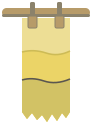

# 草木染 Kusaki-zome —— 風格規格書

> 範例站：蘗紙補書室（臺南信義街的古籍紙本修復室，補紙自己用植物染）。本規格書與產業無關：茶行、手作服飾、民宿、書店、香氛、農產品牌、展覽、慢食餐廳、任何「顏色是時間做出來的」品牌都能套用。

## 設計哲學

**年代與地域。** 「草木染」這個詞是作家山崎斌（1892–1972）在昭和初年造的。當時化學染料普及，他回到長野松本、看見養蠶農家在昭和恐慌裡的困境，開設手織學校，用「草木染」三個字把傳統植物染和化學染分開——所以這個流派從命名的第一天起，就是一種**對抗合成色**的立場。之後山崎青樹、吉岡幸雄（染司よしおか）、志村ふくみ把它推到工藝與文學的高度；臺灣則有三峽藍染、客家薯榔、原住民植物染的傳統，戰後由工藝研究所整理。

**製作限制決定了長相。**
1. **色不是調的，是浸的。** 植物染沒有色票可挑，同一缸每多浸一回就深一階；要更深只能再浸，**深了回不去**。所以畫面上的色是一組「階」，不是任意 hex。
2. **媒染決定色系。** 單一染材本身多半不上色或易褪，要靠金屬鹽媒染：明礬（鋁）讓色清亮、鐵漿讓含單寧的染材沉成灰黑（和鐵膽墨同一反應）、銅讓黃轉綠紅轉褐。**同一味染材，換媒染＝換一個家族**。
3. **布和紙會吃色不勻。** 纖維密度、織目、浸的時間差都會留下斑駁；色液從水線往上爬，乾掉時在最高處留下一道略深的**潮線**。
4. **染好要晾。** 竹竿、晾夾、垂掛的布條是工房的日常風景；布邊抽絲、紙邊手撕。
5. **工房留帳。** 染色見本帳把剪下的樣片貼在帳頁上，旁邊墨書染材、媒染、回數、日期——這是植物染唯一的「色票」。

**三條紀律：**
1. **每一個色都要能說出它是怎麼來的**——染材、媒染、幾回。說不出來的色不准出現。
2. **沒有平塗。** 任何色面都帶織目或纖維與斑駁。
3. **色從下往上長。** 任何「填色」都是從底部爬上來的，而且會留下潮線。

## 本風格的 5 個不可省略特徵

拿掉任何一項，就不是草木染了。

### 1. 色彩規則：每個色＝dye(染材, 媒染, 回數)，底色是「生成」

全站只有一個最亮值：未染的楮紙／生成布 `#EFE8D6`。其餘每一個色碼都必須是染料模型的輸出——不准從色盤挑。沒有純白、沒有純黑、沒有化學原色、沒有任何漸層補色。

```js
// 線性 RGB 上的 Beer–Lambert：每浸一回，吸光量累加
const BASE=[0.863,0.807,0.672]; // #EFE8D6 的線性值
const P={ yasha:{k:[.10,.15,.26],fe:[.22,.20,.17],cu:[.08,.02,.10]},
          kihada:{k:[.01,.05,.40],fe:[.05,.04,.01],cu:[.07,0,.05]},
          kurumi:{k:[.16,.19,.24],fe:[.30,.28,.24],cu:[.10,.04,.12]},
          suou:{k:[.04,.42,.30],fe:[.24,.10,.05],cu:[.13,.10,.17]},
          cha:{k:[.12,.17,.27],fe:[.18,.17,.15],cu:[.08,.03,.10]} };
const U={none:.55,alum:1,iron:.8,copper:.85};   // 媒染的吸色率
const step=(p,m)=>P[p].k.map((k,i)=>k*U[m]+(m==='iron'?P[p].fe[i]:m==='copper'?P[p].cu[i]:0));
const dye=(p,m,n)=>BASE.map((b,i)=>b*Math.exp(-step(p,m)[i]*n));   // → 線性 RGB，再轉 sRGB
```

建置時把 CSS 裡的 `@@kurumi.iron.9@@` 這類記號替換成 `dye()` 的結果，色碼與配方就永遠同源。

### 2. 布紋與斑駁：任何色面都不是平的

色面＝底色 × 織目係數 × (1 − 0.07 × 斑駁)。布用平紋（2px 格的經緯上下交錯＋每列每欄 ±2.5% 粗細差），紙用細纖維雜訊；斑駁是低頻 value noise。CSS 無法逐像素時，至少用硬停點條紋給一層織目：

```css
/* 無 canvas 時的最低限度：經緯兩道硬停點條紋，條紋色＝同配方多浸一回 */
.cloth{background:
  repeating-linear-gradient(90deg, var(--dyed-plus1) 0 1px, transparent 1px 4px),
  repeating-linear-gradient(0deg,  var(--dyed-plus1) 0 1px, transparent 1px 4px),
  var(--dyed);}
/* 範例站實作：canvas ImageData 逐像素，見「技術實作與相容性」 */
```

```js
// 逐像素：平紋織目
const over=((x/cell|0)+(y/cell|0))&1;
let w=1+(over? .035+colV[x] : -.035+rowV[y]);
pixel = color * w * (1 - .07*mottle(x,y));
```

### 3. 潮線與浸染階：色從下往上爬，乾後留線

浸過的範圍永遠從底部開始；毛細前緣依 h ∝ √t（Washburn）上升、每一欄高度有雜訊；乾後在最高處留 1.6px、亮度 ×0.86 的潮線。重覆浸會在上方疊出一級一級的階與好幾道潮線。

```css
.swatch{position:relative;background:var(--dyed)}
.swatch::before{ /* 未吃到色的上段 */
  content:"";position:absolute;left:0;right:0;top:0;height:var(--dry,8%);
  background:var(--kinari);border-bottom:2px solid var(--tide);
  clip-path:polygon(0 0,100% 0,100% 96%,82% 100%,64% 94%,46% 100%,28% 96%,10% 100%,0 95%);}
```

### 4. 形狀語彙：垂掛的條，毛邊收尾

主要圖形是長寬比 1:3 以上、從竹竿或晾夾垂下的布條／紙條；底緣一律毛邊（布＝抽絲，偶有一兩根線垂得更長；紙＝手撕羽狀）。不准圓角卡片、不准硬切的矩形底邊。

```css
.strip{clip-path:polygon(0 0,100% 0,100% 94%,86% 99%,70% 95%,52% 100%,34% 96%,18% 100%,0 95%);
  transform-origin:50% 0;animation:sway 5s ease-in-out infinite alternate}
@keyframes sway{from{transform:rotate(-1.4deg)}to{transform:rotate(1.4deg)}}
```

```svg
<!-- 竹竿＋晾夾 -->
<rect x="0" y="8" width="420" height="9" rx="4.5" fill="#B79B69"/>
<rect x="0" y="14" width="420" height="3" rx="1.5" fill="#8B826B"/>
<rect x="60" y="2" width="9" height="22" rx="2" fill="#B79B69" stroke="#8B826B"/>
```

### 5. 見本帳的手寫標籤：直排墨書＋貼樣

每一個色樣旁邊都有手寫（楷書手寫體）的三件事：染材・媒染・回數。標題用明朝體直排；說明是橫排明朝。標籤永遠「貼在樣片旁」，不是 tooltip。

```html
<div class="sw"><canvas></canvas></div>
<p class="label">矢車・明礬・三回<br><i>#D1BE97</i></p>
```
```css
.label{font-family:"LXGW WenKai TC","Kaiti TC",cursive;font-size:14px;line-height:1.5;color:var(--ink)}
h1,h2{writing-mode:vertical-rl;font-family:"Noto Serif TC",serif;letter-spacing:.3em}
```

## 色彩系統

全部是 `dye()` 的輸出（範例站實測值）：

| 角色 | 配方 | hex | 比例 |
|---|---|---|---|
| 生成（底、最亮值） | 未染 | `#EFE8D6` | ~55% |
| 帳頁 | 胡桃・無媒染・一回 | `#E6DECA` | ~15% |
| 正文 | 胡桃・鐵漿・九回 | `#25231F` | 文字（對底 12.9:1） |
| 次級文字 | 胡桃・鐵漿・五回 | `#5A564F` | 文字 |
| 細線 | 胡桃・鐵漿・二回 | `#A39E91` | 1px 線 |
| 現用態／焦點 | 蘇芳・明礬・四回 | `#DF6C7C` | ≤3% |
| 紅字 | 蘇芳・銅・六回 | `#9A4041` | 極少（對底 5.4:1） |
| 矢車主色 | 矢車・明礬・四回 | `#C8B286` | 圖 |
| 黃蘗主色 | 黃蘗・明礬・三回 | `#ECD97C` | 圖、螢光筆底線 |
| 灰 | 茶・鐵漿・二回 | `#BBB19A` | 圖 |
| 竹竿 | 矢車・明礬・六回／矢車・鐵漿・四回 | `#B79B69`／`#8B826B` | 結構 |

規則：同一畫面裡，同一味染材最好以「明礬／鐵漿」成對出現，讓人看見媒染的翻色。

## 字體系統

- 標題：Noto Serif TC 700／900，直排 `writing-mode:vertical-rl`，`letter-spacing:.3em`，40–52px。
- 正文：Noto Serif TC 400，17px／行高 1.85。
- 手寫標籤：LXGW WenKai TC（霞鶩文楷 TC），13–17px，用在所有配方、日期、註記、提示語。
- 不用無襯線、不用等寬字。數字（價格、色差）照正文字體。

## 版面與網格

- 1180px 容器，左右 32px（≤560px 時 16px）。
- 首屏必有一根橫貫全寬的竹竿，下面垂掛 5–7 條不等寬（86–120px）不等長（320–452px）的染條，條間距不均。
- 內容區用非對稱 7:4、或「直排大標＋說明＋貼樣格」三欄；三篇並列時逐篇下錯 60px，像晾在不同高度。
- 色樣格：左欄媒染、上列回數（一／三／五），每格 72×96。
- 不旋轉版面；只有布條會擺動（±1–2.6°）。

## 元件配方

- **導覽（pinned-tag 晾夾布籤）**：右上一條下垂的繩（SVG 二次曲線），四張直排布籤用晾夾夾著，現用頁的布籤被「染」成該頁的代表色、底部多一道潮線；其他頁是帳頁色＋1px 細線。hover 時布籤擺 −6°。≤860px 落為底部四格。
- **按鈕**：直角、1px 墨線、`letter-spacing:.15em`；主按鈕＝墨底生成字；成立態（如「補上」）＝蘇芳明礬底。停用時退成細線色。
- **貼樣卡**：canvas 色樣＋下方手寫標籤，無外框無陰影。
- **表格**：只有底線（1px 細線色），表頭手寫或 700 字重。
- **頁尾**：上 1px 細線，三欄，最後一行手寫字註明「所有色碼由染料模型算出」。

## 動效規則

| 類型 | 做法 | 時值 | reduced-motion |
|---|---|---|---|
| ambient 環境 | 布條／布籤以頂端為軸擺動 | 4.2–6.6s `ease-in-out` alternate，每條時長與延遲不同 | 停擺，位置不變 |
| input 輸入 | 游標掠過竹竿：依水平速度與距離推動附近布條 ±14° | 立即設值，回彈 `.9s cubic-bezier(.2,1.5,.4,1)` | 不推 |
| transition 轉場 | 毛細布幕：換頁時目的頁代表色以鋸齒前緣從底爬滿（480ms），新頁載入時往下退（620ms） | clip-path polygon 25 點補間 | 直接換頁 |
| signature 簽名 | 〈下缸〉浸＋毛細上染＋媒染翻色＋晾乾留潮線 | 浸 320ms → 毛細 √t 1250ms → 翻色前緣 380ms → 晾乾 900ms | 直接畫出最終狀態（含潮線） |
| scroll 捲動 | 見本帳色樣隨捲動從底吃色 | `animation-timeline:view()` | 色樣全顯 |

自我限制：本風格**不准**淡入（opacity 進場）——顏色只能「爬上來」，不能「浮出來」。

## 插畫與圖像風格

本風格沒有描線插畫。圖＝染過的物件本身：布條、紙條、貼樣、補紙。需要「物件」時（例如書頁）用帶纖維紋的色面＋直排字，破洞用 SVG 不規則多邊形。

## Logo 與 Favicon 設計指南

Logo：竹竿＋兩個晾夾＋一條黃蘗染紙，紙上三階（二回／四回／鐵漿五回）與兩道潮線，底緣毛邊。只用模型色。Favicon 為同構簡化版（竿、條、一階、毛邊），inline SVG data URI。

## Do & Don't

**Do**
- 讓每一個色都能被唸出配方。
- 讓同一味染材以不同媒染並置，展示翻色。
- 讓所有填色「從下往上」。
- 標籤手寫、貼在旁邊。

**Don't**
- 不用純白 `#FFF`、純黑 `#000`、任何鮮豔化學色（螢光、電子藍、紫藍漸層）。
- 不平塗大色面；不用圓角卡片＋模糊陰影。
- 不用淡入當進場；不用 emoji；不寫「在當今快節奏的世界」。
- 不加「EST. 19xx」徽章；不用「把 X 變成 Y」標題。
- 不把植物染畫成「綠葉 icon＋自然有機」——這個流派的主角是**色的來歷**，不是植物圖案。

## 頁面骨架範例

```html
<header class="top">
  <a class="mark" href="index.html"><span><b>屋號</b><small>副題手寫</small></span></a>
  <nav class="line" aria-label="主要頁面">
    <svg class="cord" viewBox="0 0 420 40"><path d="M0 6 Q210 30 420 6" fill="none" stroke="#5A564F"/></svg>
    <ul class="tags">
      <li><span class="pin"></span><a href="index.html" aria-current="page" style="--tag:#C8B286">晾場</a></li>
      <li><span class="pin"></span><a href="tone.html" style="--tag:#E3848F">染補</a></li>
    </ul>
  </nav>
</header>
<section class="yard">
  <div class="pole"></div>
  <div class="strips"><!-- 每條：.hang > .push > .clip + canvas + .lab（直排手寫配方） --></div>
</section>
<section class="intro">
  <div><h1>…</h1><p>…</p></div>
  <aside class="vats"><h2>本週缸況</h2><dl><dt><i style="background:#D1BE97"></i>矢車缸</dt><dd>第 3 天</dd></dl></aside>
</section>
```

## 技術實作與相容性

### A. Canvas 2D `ImageData`／`putImageData`（渲染層）
- **承載**：特徵 2（織目＋斑駁逐像素）、特徵 3（潮線）、簽名〈下缸〉的毛細前緣與翻色。每條布預先算好每個像素的織目、斑駁、毛邊與每欄前緣偏移；每一幀只查表＋乘法，再 `putImageData`。
- **支援**：MDN 標示 `putImageData()` 為 Baseline Widely available（2015-07 起各瀏覽器皆支援）。查證來源：MDN〈CanvasRenderingContext2D: putImageData() method〉。
- **fallback**：無 JS 時布條不畫，`<noscript>` 說明；所有文字內容是靜態 HTML，見本帳的配方與 hex 為文字標籤，可完整閱讀。
- **效能實測**（node 模擬，DPR 2）：120×460 布條初始化 24ms、每幀重繪 2.2ms；首頁七條**分幀繪製**（每 rAF 一條），單段 JS <30ms，符合首屏 ≤100ms；見本帳 60 張貼樣以 IntersectionObserver 延遲到接近視窗才畫。

### B. CSS scroll-driven animations `animation-timeline: view()`（動效層）
- **承載**：見本帳每張貼樣隨捲動從底吃色（特徵 3），三個回數欄以不同 `animation-range` 錯開。
- **支援**：caniuse／MDN：Chrome／Edge 115+、Safari 26+ 支援；Firefox 114 起仍在旗標後、預設關閉，非 Baseline。查證來源：caniuse〈CSS property: animation-timeline: view()〉、MDN〈view()〉。
- **fallback**：整段包在 `@supports (animation-timeline: view())` 內；不支援時遮罩 `display:none`，貼樣直接全色顯示（資訊零損失）。reduced-motion 同樣全顯。

### C. 染料模型＋決定性偽隨機（資料與生成層）
- **承載**：特徵 1——全站 CSS、SVG logo、favicon、canvas 的每一個色碼都由 `dye(染材, 媒染, 回數)` 在建置時或執行時算出（建置腳本把 `@@plant.mordant.n@@` 記號換成 hex，並在有殘留記號時中止建置）；染補台的色差以 OKLab 歐氏距離 ×100 計算，<2.0 判定可補。織目與斑駁以 FNV-1a 雜湊 seed＋mulberry32 生成，同一條布每次載入長得一樣。
- **支援**：純 JS（`Math.exp`、`Math.cbrt`、`Math.imul`），無相容性問題。
- **可驗證**：三頁的目標色在模型中各有 3–5 組配方可達 ΔE<2（例：甲頁 矢車明礬三回 0.48／茶無媒染五回 0.76），所以「配方跟本室不同也能補」是真的。

### 其他
- 轉場布幕用 WAAPI 補間 `clip-path: polygon()`（25 點固定點數），不支援 `Element.animate` 時直接換頁。
- 單頁大小：index 29KB、tone 33KB、swatchbook 26KB、visit 24KB（皆含 inline 全部 CSS／JS），遠低於 350KB。
- 外部資源只有 Google Fonts（Noto Serif TC、LXGW WenKai TC），字型載入前以系統宋體／楷體堆疊替代。
