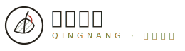

# 解剖圖鑑／博物學（Naturalist Botanical Plates — 本草圖鑑版本）

> 本 SKILL 定義一整套視覺語言。任何 AI 只要讀完，就能替**任意產業**做出風格一致的網站——風格不綁定「中醫」這個題材。青囊中醫 QINGNANG 只是它的一次示範。你可以拿它做草本保養、有機農產、香草茶、植物園、獨立藥妝或任何講究「草木、慢、可信」的品牌。

---

## 一、設計哲學

博物學圖鑑風（naturalist plate）的核心是**溫、慢、可信**：像一本被翻舊的本草手冊。四個支柱：

1. **紙先於色**：底是溫暖的米白紙感（含極淡顆粒），不是純白也不是漸層；顏色都來自草木與大地。
2. **雕版而非扁平**：插畫用交叉排線（hatching）做出銅版／木刻的手感，拒絕 AI 感的柔和漸層與描邊貼圖。
3. **目錄即門面（toc-first）**：首頁不是大標 hero，而是一份**真正好用的索引**——讓人一進來就能從最常被翻到的條目開始讀。
4. **留白有節制**：不是空曠的極簡，而是像古籍版心，字與線密度講究疏密。

去AI化重點：**用紙感、雕版排線、目錄式資訊結構承擔識別性**，而不是靠置中大標＋圓角卡片。

## 二、色彩系統

| 角色 | Hex | 用途 | 大約比例 |
| --- | --- | --- | --- |
| 紙白 Paper | `#F3EEE1` | 頁面主底 | 44% |
| 次紙 Paper2 | `#EDE6D5` | 側欄、區塊底、表頭 | 20% |
| 墨黑 Ink | `#26221B`（偏暖黑） | 文字、描邊、標題 | 18% |
| 草綠 Herb | `#5C6B4A` | 排線、標籤、次要文字 | 8% |
| 赭黃 Ochre | `#A9772E` | 編號、英數標籤、點綴 | 5% |
| 朱砂 Cinnabar | `#B23A2E` | 重點、current、印章紅 | 3% |
| 艾灰綠 Sage | `#BFC3A8` | 表格 on 格、圓環、留白色塊 | 2% |

原則：**大地與草木色為主，朱砂只做點睛**（像古書的硃批）；一律實心，禁止任何漸層與彩色陰影。分隔線用細髮線 `#C8BEA8`。

## 三、字體系統

- **標題／襯線**：`Noto Serif TC`（400/500/700/900）——大標用 900、章節標 700，帶 1px 字距，是本草古籍的「明體」骨。
- **內文／無襯線**：`Noto Sans TC`（300/400/500）——內文 400、line-height 1.85，安靜好讀。
- **編號／標籤／英數**：`DM Mono`（400/500）——條目編號、eyebrow、拼音、資訊列，字距拉開 1–5px，帶檔案感。
- 疏密對比是關鍵：**明體大標＋mono 小標籤＋sans 內文**三者並置。
- 字級：巨標 `clamp(28px,4.6vw,52px)`／章節標 22–24px／條目標 19–21px／內文 15–16px／標籤 10–13px。
- 可用「壹貳參肆」漢字數字做步驟編號，強化古籍感。

## 四、版面與網格

- **side-rail 側欄**：左側 236px 常駐側欄（logo＋脈息圓環＋垂直導覽＋地址資訊），`position:sticky;height:100vh`；主內容在右欄。行動裝置（≤860px）側欄轉為頂部橫向列。
- **toc-first 首頁**：首屏是簡短導言＋一份**索引**（entry 逐條：編號／標題＋拼音／說明／排線小圖），下方接常用本草、引言、就診資訊。索引要「真的能用」，不是裝飾清單。
- 內容區用 `8vw` 側邊留白，最大寬約 1000px，維持古籍版心的舒展。
- 分隔用細髮線與 2px 章節主線；章節標題下一條 `border-bottom:2px solid ink`。
- 不對稱：側欄＋單欄長文，條目用 `grid-template-columns:64px 1fr auto`（編號／內文／小圖）。

## 五、元件配方

- **側欄導覽 rail nav**：明體字項目，`border-left:2px solid transparent`；current 左邊線染朱砂、底換紙白、字重 700；hover 時 `padding-left` 微增（16px）滑入感。附英文 mono 小標。
- **索引條目 entry**：三欄 grid，編號 mono 赭黃、標題明體 700（hover 轉朱砂）、右側交叉排線小圖；hover 整條換次紙底。
- **本草卡 herb**：置中，排線 SVG＋明體品名＋mono 拼音＋草綠用途，四欄網格。
- **表格（門診時間表）**：`border-collapse`，細髮線格線，表頭 mono、次紙底；有診格用 sage 底、休診格淡化。
- **引言 pull**：明體大字，`border-left:3px solid cinnabar`，古籍硃批感；cite 用 mono 赭黃。
- **步驟 step**：漢字數字（壹貳參肆）大字 sage 色＋標題＋說明。
- **footer**：次紙底、細髮線上緣、mono 免責小字。
- 全站**無圓角、零投影**；紙張顆粒用 `feTurbulence` SVG 固定鋪底 opacity .5。

## 六、動效規則

| 動效 | 觸發 | 參數 | 說明 |
| --- | --- | --- | --- |
| **本草索引停序逐味揭示** | IntersectionObserver（threshold .2） | 每條 `opacity 0→1`+`translateY(10px)→0`，.6s ease；依 data-i 以 `(i-1)*140ms` 逐條延遲 | 目錄像被逐味翻開，停頓有序 |
| **脈息呼吸圓環** | 常駐（側欄） | SVG circle `r 6→30`，`breathe` 10s ease-in-out infinite；標「吸四停四吐六」 | 引導呼吸節律、當作 loading/呼吸節拍 |
| 側欄 hover 滑入 | hover nav | `padding-left` +4px、背景漸現，.25s | 安靜回饋 |
| 交叉排線描繪 | 靜態插畫 | hatching pattern 填充 | 雕版質感 |

**動效簽名（本站獨有）**：本草索引停序逐味揭示 ＋ 脈息呼吸圓環 ＋ 交叉排線本草描繪，三者合一。
`prefers-reduced-motion:reduce` 時：關閉所有 animation/transition、索引條目直接顯示、呼吸圓環靜止。

## 七、插畫與圖像風格（illust：hatching 交叉排線雕版）

- 全部用**原創 inline SVG＋交叉排線 pattern** 填充：以 `<pattern patternTransform="rotate(30~50)">` 內含平行線，做出銅版／木刻的排線陰影。
- 藥草（當歸、黃耆、陳皮、紅棗、甘草）、器物（陶罐、銀針）皆以細墨線輪廓＋排線塊面組成。
- 朱砂與赭黃排線可交替，做出「套色雕版」的層次。
- 禁止：柔和漸層、寫實照片、單純細線幾何線描（thin-lineart）、emoji。排線是本風格的識別核心。

## 八、Logo 與 Favicon

- **Logo**：左側圓形徽記（青囊）內含一株排線草木＋朱砂新芽；右側 `Noto Serif TC 700` 中文字標＋mono 拼音副標。
- **Favicon**：inline SVG data URI——紙白底＋墨線圓＋草綠葉線刻＋朱砂莖，32×32。

## 九、Do & Don't

**Do**：溫暖紙感底、草木大地色、交叉排線雕版插畫、明體×mono×sans 疏密、toc-first 好用目錄、side-rail 側欄、朱砂點睛、細髮線、留白節制、（醫療/敏感題材）虛構示意與免責聲明。
**Don't**：❌ 紫藍漸層 hero ❌ 置中大標＋三張圓角卡片 ❌ emoji icon ❌ 模糊陰影／rounded-2xl ❌ Lorem ipsum 與 AI 腔 ❌ 跑馬燈反射式套用 ❌ 純白冷底與高飽和霓虹 ❌ 柔和漸層插畫。

## 十、頁面骨架範例

```html
<div class="shell">           <!-- grid: 236px 側欄 + 1fr 內容 -->
  <aside class="rail">
    <div class="brand"></div>
    <svg class="pulsering">…脈息呼吸圓環…</svg>
    <nav>
      <a aria-current="page">本草索引<span class="en">INDEX</span></a>
      <a href="page2.html">內頁<span class="en">…</span></a>
    </nav>
    <div class="info">地址／電話／時間</div>
  </aside>

  <div class="content">
    <section class="intro"><p class="kicker">…</p><h1>明體大標</h1></section>
    <!-- toc-first：首頁即好用目錄 -->
    <section class="toc">
      <div class="hd"><h2>本草索引</h2></div>
      <article class="entry" data-i="1">
        <span class="no">01</span>
        <div class="body"><h3>條目<span class="han">PINYIN</span></h3><p>說明</p></div>
        <svg class="leaf"><!-- 交叉排線插畫 --></svg>
      </article>
    </section>
  </div>
</div>
```

CSS 關鍵：`grid-template-columns:236px 1fr`；紙顆粒 `body::before` 固定 feTurbulence；排線 `<pattern>` 內平行線；條目 reveal 用 `(i-1)*140ms` 逐條延遲；呼吸圓環 `@keyframes breathe{45%{r:30}}` 10s infinite；全站 `border-radius:0`、無 box-shadow。
