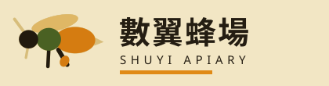

# 中世紀現代．減形平塗（Mid-Century Modern / Minimal Realism）

繁體中文規格書。讀完這份文件，你應該能在任何產業上重現這套視覺語言，而不需要看過本站的 Demo。

---

## 一、設計哲學

這不是「扁平插畫風」，是一九五〇至七〇年代美國中世紀現代（Mid-Century Modern）平面設計裡最硬的那一支：**Charley Harper 稱之為 minimal realism 的減形法**，加上 **Alexander Girard 為 Herman Miller 做的織品與型錄**所定下的色域紀律。

Harper 自己講得最清楚：「我不試著把每樣東西都放進去；我試著把每樣東西都拿掉。」以及那句被引用最多的——「**我從不數翅膀上的羽毛，我只數翅膀。**」他畫鳥不畫羽毛、畫蟲不畫絨毛，用圓規、直尺與雲形板把一隻生物切成幾塊平塗的幾何，塊與塊直接咬合，中間沒有一條輪廓線。

因此這個風格的核心動作是**減法**，不是加法。它的判準也不是「好不好看」，而是：

> **拿掉這一片之後，外形有沒有變？沒有變，那它就是羽毛，該拿掉。**

三條由此長出來的紀律：

1. **形狀是被減出來的。** 一張圖從十幾片開始，減到剩下的每一片都不可拿掉為止。剩下幾片，就是這張圖的難度。
2. **輪廓是神聖的，內部是自由的。** 內部細節（複眼、腹紋、葉脈、翼斑）不影響外形，隨時可以割捨；一旦動到邊界，這張圖就不再是這個東西。
3. **顏色是油墨，不是光。** 這是絹印的世界：有限的幾塊版、平塗、疊印處自然生出第三色。沒有漸層、沒有陰影、沒有發光、沒有模糊。

**做這個風格最常見的失敗**是把它做成「可愛的向量插畫」——圓角、柔和粉彩、加描邊、加投影、加漸層。那些每一項都是這個風格的反面。它應該是硬的、平的、有點嚴肅的；它出自一個拿圓規畫鳥的人。

---

## 二、本風格的 5 個不可省略特徵

以下五項，每一項都是「拿掉它就不是這個風格了」。全部都必須在畫面上看得見。

### 特徵 1｜無描邊、共邊的平塗形

**沒有輪廓線。** 兩塊顏色直接相鄰，邊界就是兩者的交界；不留白縫、不加描邊、不加陰影。形狀之間的關係靠**咬合**表達，不靠線條分隔。

```css
/* 所有插圖形狀：只有填色，沒有描邊 */
.fig ellipse, .fig rect, .fig polygon { stroke: none; }
/* 唯一例外：以 stroke 當「膠囊形」用時，線寬即該形的粗細 */
.fig line { fill: none; stroke-linecap: round; }
/* 全站零圓角、零陰影、零模糊 */
* { border-radius: 0; box-shadow: none; filter: none; }
```

```html
<!-- 一隻由五片組成的蜂：頭、胸、腹、翅、足。沒有一條輪廓線。 -->
<svg viewBox="0 0 240 200">
  <ellipse cx="118" cy="68" rx="54" ry="17" transform="rotate(-14 118 68)" fill="#EBCB84"/>
  <line x1="126" y1="128" x2="146" y2="162" stroke="#241D12" stroke-width="10" stroke-linecap="round"/>
  <ellipse cx="164" cy="106" rx="46" ry="30" fill="#E08A16"/>
  <ellipse cx="104" cy="104" rx="28" ry="26" fill="#4E6B2E"/>
  <ellipse cx="58"  cy="104" rx="22" ry="21" fill="#241D12"/>
</svg>
```

### 特徵 2｜每張圖都是可減的（minimal realism）

圖不是「畫」出來的，是**由解析原語組裝**出來的：橢圓、矩形、三角形、膠囊（線＋圓端），四種就夠。每一張圖必須通過減形測試——**減到七片以內、外形保留 ≥95%**。做不到，代表你畫的是插畫，不是這個風格。

原語資料結構（可直接沿用）：

```js
// 一片形 = 一個解析形狀 + 一塊墨版編號
{ id:'abdo', n:'腹', i:1, k:'ell', x:164, y:106, rx:46, ry:30 }   // 橢圓
{ id:'bd1',  n:'腹紋', i:4, k:'rect', x:150, y:106, w:13, h:50 }   // 矩形（可帶 rot）
{ id:'stng', n:'螫針', i:4, k:'tri',  pts:[208,100,228,110,208,118] }
{ id:'legH', n:'後足', i:4, k:'cap',  x1:126, y1:128, x2:146, y2:162, r:5 }
```

輪廓保留率＝把「保留的形」與「全部的形」各自光柵化成 120×100 的位元遮罩後取 IoU：

```js
function iou(a,b){let n=0,u=0;for(let i=0;i<a.length;i++){const p=a[i],q=b[i];
  if(p&&q)n++; if(p||q)u++;} return u?n/u:1;}
```

判準的實務意義：**內部形的 IoU 恆為 1.0000（免費），邊界形一動就掉 5–20%。** 這條數字上的落差，就是這個風格的全部祕密。

### 特徵 3｜五塊墨版與 multiply 疊印生成的第三色

一張圖最多四塊版，全站不超過五塊墨＋一塊地色。**重疊處必須真的變暗**——這是絹印半透明油墨的物理，不可以用預先調好的第三色去假裝。

```css
:root{
  --paper:#F2E6C4; /* 蜂蠟米：地色，零紋理 */
  --wax:  #E3D2A0; /* 蠟：被減掉的地方露出來的那一層 */
  --w:#EBCB84;  /* 麥黃 */
  --o:#E08A16;  /* 金盞橘 */
  --g:#4E6B2E;  /* 橄欖 */
  --r:#B33F27;  /* 磚紅 */
  --t:#2E6B72;  /* 鴨青：只給連結與量測用的介面元素 */
  --k:#241D12;  /* 近黑 */
}
.fig{ isolation:isolate; }          /* 疊印只在圖的範圍內發生 */
.fig .ik{ mix-blend-mode:multiply; }/* 每一片墨都會壓到底下那片 */
```

面積配比（大約值，抓這個比例就對了）：地色 36%、金盞橘 17%、橄欖 16%、麥黃 12%、磚紅 11%、近黑 6%、鴨青 2%。**鴨青永遠是最少的那一塊**，它不是品牌色，它是「工具的顏色」。

### 特徵 4｜滿版水平色帶構成的版面

沒有卡片牆、沒有置中三欄、沒有留白包圍的內容區塊。版面是**一條一條橫貫視窗的實色帶**，帶與帶之間硬碰硬，一條帶就是一個色域。內容在帶裡靠 2–3px 的實線分格，不靠陰影或圓角。

```css
.band{ padding: clamp(30px,5vw,64px) 0; }        /* 帶：滿版，無邊界 */
.band.dark { background:var(--g); color:var(--paper); }
.band.brick{ background:var(--r); color:var(--paper); }
.hdr{ display:flex; align-items:baseline; gap:14px;
      border-bottom:3px solid var(--k); padding-bottom:8px; }  /* 硬線，不是底色 */
.readout{ display:grid; grid-template-columns:1fr 1fr; gap:2px;
          background:var(--k); border:3px solid var(--k); }     /* 溝縫＝底色透出來 */
.readout > div{ background:var(--paper); padding:10px 12px; }
```

### 特徵 5｜幾何無襯線 ＋ 極寬字距的小型大寫標籤

字體只有兩支：一支幾何無襯線（Futura 血緣，此處用 **Jost**）負責所有拉丁字、數字與標籤；一支中文黑體負責內文。**唯一的裝飾性排版是那些字距 0.18–0.22em 的小型大寫標籤**——它們是機場標示與型錄的語彙，不是裝飾線條。

```css
.lab{ font-family:"Jost",sans-serif; font-size:11px;
      letter-spacing:.22em; text-transform:uppercase; font-weight:500; }
.num{ font-family:"Jost",sans-serif; font-variant-numeric:tabular-nums; }
h1,h2{ font-family:"Jost","Noto Sans TC",sans-serif; font-weight:600;
       letter-spacing:.01em; line-height:1.12; }  /* 標題不加粗到 800，600 就夠 */
```

---

## 三、色彩系統

| 色票 | Hex | 用途 | 比例 |
|---|---|---|---|
| 蜂蠟米 paper | `#F2E6C4` | 全站地色。**零紙紋、零顆粒、零漸層**——它是一塊平的暖白油墨，不是紙 | 36% |
| 蠟 wax | `#E3D2A0` | 只有一個用途：被減掉的形底下露出來的那一層。不可挪作他用 | 4% |
| 麥黃 | `#EBCB84` | 第一塊版：翅、花瓣、淺色量體；也用作淺色帶底 | 12% |
| 金盞橘 | `#E08A16` | 第二塊版：主要強調、腹、花心、現用態、導覽頂線 | 17% |
| 橄欖 | `#4E6B2E` | 第三塊版：葉、枝、胸；也是深色帶底之一 | 16% |
| 磚紅 | `#B33F27` | 第四塊版：警示、拒絕、路線、虛構聲明帶 | 11% |
| 近黑 | `#241D12` | 第五塊版：正文、輪廓量體、導覽底、footer。**不是 #000** | 6% |
| 鴨青 | `#2E6B72` | 連結、focus ring、被選中的量測工具。永遠 ≤3% | 2% |

**硬規則**

- 地色不得鋪任何紋理、noise、纖維或漸層。這是本風格與「米白紙感」流派的分野：那邊賣的是紙的材質，這邊賣的是油墨的平。
- 兩塊色之間永不加白線、黑線、陰影或間距。
- 疊印以外，不得出現任何色票以外的顏色（灰階也不行——用近黑的透明度或直接用近黑）。
- 深色帶（橄欖／磚紅／鴨青／近黑）上的文字一律用 paper 色，不用純白。

---

## 四、字體系統

**來源**：Google Fonts。

```html
<link href="https://fonts.googleapis.com/css2?family=Jost:wght@300;400;500;600;700&family=Noto+Sans+TC:wght@400;500;700&display=swap" rel="stylesheet">
```

- **Jost**（Futura 血緣的幾何無襯線）：所有拉丁字、全部數字、標籤、標題。
- **Noto Sans TC**：中文內文與中文標題。

| 角色 | 字級 | 字重 | 行高 | 字距 |
|---|---|---|---|---|
| 頁面主標 h1 | `clamp(24px,3.6vw,34px)` | 600 | 1.12 | .01em |
| 區塊標 h2 | `clamp(22px,3.4vw,32px)` | 600 | 1.12 | .01em |
| 讀數大字 | `clamp(30px,5vw,44px)` | 600 | 1 | 0 |
| 內文 | 16px（次要 14.5px） | 400 | 1.75 | 0 |
| 小型大寫標籤 `.lab` | 11px | 500 | — | **.22em** |
| 表頭 th | 11px | 500 | — | .16em |
| 註記 `.note` | 13px | 400 | 1.7 | 0 |

**禁止**：字重 800/900 的巨型標題、斜體、字體陰影、任何襯線體、任何手寫體。標題最大也只到 34px——本風格的層級來自**顏色與色帶**，不來自字級。

---

## 五、版面與網格

- 內容寬度上限 `1180px`，左右內距 `clamp(18px,4vw,56px)`。
- **無圓角、無陰影、無外框光暈。** 邊界一律 2px 或 3px 實線。
- **溝縫即底色**：格狀元件用 `background:var(--k)` 加 `gap:2–3px`，讓底色從縫裡透出來當分隔線，不要畫 border。
- 版面沒有透視、沒有 z 軸；元素靠遮擋與大小表達層次。
- **不對稱**：主要區塊採 `1.15fr / .85fr` 之類的非對稱二欄，不要 1:1。
- **型錄網格用 subgrid**（見第十二章）：卡片內的「品名／編號／說明／價」四行必須跨卡對齊到同一條基線，即使圖版高矮不一。

```css
.cat{ display:grid; grid-template-columns:repeat(auto-fill,minmax(228px,1fr));
      gap:3px; background:var(--k); border:3px solid var(--k); }
.card{ grid-row:span 5; grid-template-rows:subgrid; display:grid;
       background:var(--paper); padding:12px; }
@supports not (grid-template-rows:subgrid){
  .card{ grid-row:auto; grid-template-rows:auto auto auto auto auto; }
  .card .cfig{ min-height:150px; } .card .cds{ min-height:66px; }
}
```

---

## 六、元件配方

### 導覽（reduced-form 減形態）

四頁＝四枚小圖記。**現用頁那一枚被減到最少片數，其餘三枚維持全形。** 現用態不是高亮、不是底線、不是反白——是它比別人簡單。

```css
.nav{ background:var(--k); border-top:3px solid var(--o); }
.nav a{ display:flex; align-items:center; gap:9px; padding:9px 18px 9px 14px;
        color:var(--paper); text-decoration:none; border-right:1px solid #3a3123; }
.nav a svg *{ fill:var(--w); stroke:var(--w); }
.nav a[aria-current=page]{ background:var(--o); color:var(--k); }
.nav a[aria-current=page] svg *{ fill:var(--k); stroke:var(--k); }
```

### 按鈕

```css
.btn{ font:500 14px/1 "Jost","Noto Sans TC",sans-serif; letter-spacing:.08em;
      padding:12px 18px; border:3px solid var(--k); background:var(--k); color:var(--paper); }
.btn:hover{ background:var(--o); color:var(--k); border-color:var(--o); }
.btn.gh{ background:transparent; color:var(--k); }
.btn:focus-visible{ outline:3px solid var(--t); outline-offset:2px; }
```

### 讀數盤（兩格數字）

```css
.readout{ display:grid; grid-template-columns:1fr 1fr; gap:2px;
          background:var(--k); border:3px solid var(--k); }
.readout > div{ background:var(--paper); padding:10px 12px; }
.readout .v{ font:600 clamp(30px,5vw,44px)/1 "Jost",sans-serif; font-variant-numeric:tabular-nums; }
.readout .k{ font-size:11px; letter-spacing:.18em; text-transform:uppercase; color:#5d5240; }
.readout.ok .v{ color:var(--g); } .readout.bad .v{ color:var(--r); }
```

### 卡片（型錄）

不要圓角卡片。卡片＝格子裡的一塊地色，靠 gap 的底色分隔；分行用 `border-top:2px solid` 而非底色塊。

### 表單

```css
.field input,.field select,.field textarea{
  font:400 15px/1.5 "Noto Sans TC",sans-serif; padding:9px 11px;
  border:2px solid var(--k); background:var(--paper); color:var(--k); border-radius:0; width:100%; }
.field input:focus{ outline:3px solid var(--t); outline-offset:1px; }
.err{ color:var(--r); font-size:13px; }
```

錯誤訊息用**完整句子講理由**，不是「必填」「格式錯誤」。

### Footer

近黑底、蠟色字、金盞橘的小型大寫欄標；四欄自動排列；底部再壓一條磚紅色的聲明帶。

---

## 七、動效規則

四種性質不同、觸發源不同的動態，缺一不可。全部都要有 `prefers-reduced-motion` 降級，且降級後資訊零損失。

| 種類 | 名稱 | 觸發 | 參數 | 降級 |
|---|---|---|---|---|
| ambient 環境 | 蜂道 fly-through | 無，持續 | `translateX` 橫越刊頭，26–41s，`steps(60)`；翅膀另以 `steps(2)`、0.12s 拍動 | 動畫停用，蜂停在定點（刊頭構圖不變） |
| input 輸入 | 墨版提亮 | hover／focus 單一形 | `filter:brightness(1.14)`，即時（<16ms） | 保留（非動畫，是狀態） |
| transition 轉場 | 落版 plate-on | `IntersectionObserver` 進入視窗 | `clip-path:inset(0 0 100% → 0)`，520ms，`steps(4)` | 不觀察、不加 pending，內容直接是最終狀態 |
| **signature 簽名** | **失版顯蠟 wax-through** | 拿掉／印回一片 | 240ms，`steps(3)`，opacity 1→0（印回為 0→1） | 動畫停用，瞬間切換；蠟色區域照樣正確 |

**簽名動效的定義**：畫面底下永遠壓著一層「全形的蠟版」——原圖每一片都在，但全部塗成蠟色。你保留的形以真墨印在它上面。因此**你失去的東西是被畫出來的，不是被算出來的**：那塊露出來的蠟色面積，就是分數本身。減形時墨以三格機械式的跳格褪成蠟色（不是補間淡出——絹印機不會淡入淡出）。

```css
.fig .wx{ fill:var(--wax); stroke:var(--wax); }        /* 蠟版：恆存 */
.fig .ik{ mix-blend-mode:multiply; }                   /* 墨版：印在蠟上 */
.fig .ik.off{ opacity:0; animation:waxout .24s steps(3) both; }
.fig .ik.inn{ animation:inkin .24s steps(3) both; }
@keyframes waxout{ from{opacity:1} to{opacity:0} }
@keyframes inkin { from{opacity:0} to{opacity:1} }
@media (prefers-reduced-motion:reduce){
  .fig .ik.off,.fig .ik.inn{ animation:none; }
  .ncell,.ncell.pending,.ncell.ink{ animation:none; clip-path:none; }
  .fly,.wingflap{ animation:none; }
}
```

**禁止**：淡入式滾動揭示、視差、數字滾動計數、按壓硬陰影位移、`stroke-dashoffset` 描繪、跑馬燈。理由一致——這些都是「線在動」或「東西在飄」，本風格的畫面是印上去的，它只會**跳格出現**。

---

## 八、插畫與圖像風格（reducible-shape 可減形構成）

**全站不得有任何外部圖片。** 所有圖像——插圖、配置圖、logo、favicon、回執印記、型錄縮圖——由同一支引擎輸出，原語只有四種：

| 原語 | SVG 元素 | 點內判定 |
|---|---|---|
| 橢圓 `ell` | `<ellipse>`（可 rotate） | 旋轉回正後 `(u²+v²)≤1` |
| 矩形 `rect` | `<rect>`（可 rotate） | 旋轉回正後 `|dx|≤w/2 且 |dy|≤h/2` |
| 三角 `tri` | `<polygon>` | 三次外積同號 |
| 膠囊 `cap` | `<line stroke-linecap="round">` | 到線段距離 ≤ r |

**兩條硬規則**

1. **每一片必須被歸類成「內部」或「邊界」。** 內部片（複眼、腹紋、葉脈、翼斑、漆點）完全落在其他片的聯集內，移除後 IoU 恰為 1.0000；邊界片一移除就掉分。設計一張圖時，內部片與邊界片的數量比抓 **1:1** 左右最好玩。
2. **每一張圖都要能通過七片測試。** 貼上去之前先跑一次窮舉：若不存在「≤7 片且 IoU≥0.95」的解，這張圖畫得太散，重畫。

**明文禁用**：描外形的輪廓線、`feTurbulence` 手抖濾鏡、半調網點、漸層網格、寫實描繪、任何 emoji 當 icon。

---

## 九、Logo 與 Favicon

**Logo**：一枚減到最少片數的主題生物（本站是七片的蜂）＋中文字標＋極寬字距的英文副標＋一條金盞橘的實色底線。生物必須是**這套引擎的輸出**，不是另外畫的——logo 是這個風格的證明題。

**Favicon**：inline SVG data URI，32×32，只用三片形（頭／腹／翅），蜂蠟米底。不畫細節，不畫外框。

```html
<link rel="icon" href="data:image/svg+xml,%3Csvg xmlns='http://www.w3.org/2000/svg' viewBox='0 0 32 32'%3E%3Crect width='32' height='32' fill='%23F2E6C4'/%3E%3Cellipse cx='11' cy='18' rx='7' ry='6' fill='%23241D12'/%3E%3Cellipse cx='23' cy='19' rx='8' ry='6.5' fill='%23E08A16'/%3E%3Cellipse cx='17' cy='9' rx='11' ry='3.4' fill='%23EBCB84' transform='rotate(-12 17 9)'/%3E%3C/svg%3E">
```

---

## 十、Do & Don't

**Do**

- 先把圖減到不能再減，再開始排版。
- 讓兩塊顏色直接咬在一起。
- 用滿版色帶切分內容，讓顏色承擔層級。
- 數字一律 tabular-nums，標籤一律 0.22em 字距。
- 文案講具體的事：幾框、幾箱、幾天、幾片、多少錢。

**Don't**

- ❌ 描邊。任何形上的 stroke（除了當作膠囊形的那一根）都是錯的。
- ❌ 圓角、投影、模糊、玻璃、漸層、發光。
- ❌ 粉彩化。本風格的色是飽和的土色，不是柔和的莫蘭迪。
- ❌ 置中大標＋副標＋兩顆按鈕＋三張圓角卡片。
- ❌ 紫藍漸層 hero、Lorem ipsum、emoji icon、「EST. 19xx」徽章、「把 X 變成 Y」句式標題。
- ❌ 把它做成兒童繪本。可愛是副作用，不是目的；這個風格的骨子裡是製圖工具與印刷成本。
- ❌ 在地色上鋪紙紋。那是別的流派。

---

## 十一、頁面骨架範例

```html
<!doctype html><html lang="zh-Hant"><head>
<meta charset="utf-8"><meta name="viewport" content="width=device-width,initial-scale=1">
<title>頁名｜品牌</title>
<link rel="icon" href="data:image/svg+xml,…">
<link href="https://fonts.googleapis.com/css2?family=Jost:wght@300;400;500;600;700&family=Noto+Sans+TC:wght@400;500;700&display=swap" rel="stylesheet">
<style>/* 見第三、四、五章 */</style></head><body>

<header class="mast"><div class="flyzone" aria-hidden="true"><!-- ambient --></div>
  <div class="wrap"><span class="nm">品牌名</span>
  <span class="meta">BRAND EN　地址　電話　負責人</span></div>
</header>

<nav class="nav" aria-label="主導覽"><div class="wrap"><ul>
  <li><a href="a.html" aria-current="page"><svg viewBox="0 0 28 28"><!-- 減形版 --></svg><span>甲頁</span></a></li>
  <li><a href="b.html"><svg viewBox="0 0 28 28"><!-- 全形版 --></svg><span>乙頁</span></a></li>
</ul><p class="navnote">現用頁的那一枚圖記，被減到只剩最少的片數。</p></div></nav>

<main>
  <section class="band"><div class="wrap">
    <div class="hdr"><h2>區塊標</h2><span class="en">SECTION LABEL</span></div>
    <!-- 內容：非對稱二欄或滿版格 -->
  </div></section>

  <section class="band" style="background:var(--g);color:var(--paper)"><div class="wrap">
    <!-- 深色帶：整條橫貫，不留邊 -->
  </div></section>
</main>

<footer class="foot"><div class="wrap">
  <div><h3>欄標</h3>…</div>
</div><div class="fic"><div class="wrap">聲明帶</div></div></footer>
</body></html>
```

---

## 十二、技術實作與相容性

本站的三項核心技術，各承載一個不可省略特徵；支援度皆於 2026-08-30 查證 MDN 與 caniuse／web-features。

### (1) CSS Grid `subgrid`（C 版面與樣式層）

**承載特徵 4 的「型錄共用基線」。** 二十四張卡片的圖版高矮不一，但「品名／編號／說明／工錢」四行必須跨卡落在同一條基線上——這是型錄與 Herman Miller 產品目錄的紀律。用固定高度硬撐會在字數變動時破功；只有讓子格繼承父格的列軌才能真正對齊。

- **支援現況**：Firefox 71（2019）最早，Safari 16.0（2022-09），Chrome/Edge 117（2023-09-12），Opera 103、Samsung Internet 24。web-features 標示 **Baseline Widely available（2026-03-15 起）**，全球覆蓋 >92%。查證來源：caniuse `css-subgrid`、`mdn-css_properties_grid-template-rows_subgrid`、web-platform-dx `features/subgrid`。
- **Fallback 具體行為**：`@supports not (grid-template-rows:subgrid)` 時卡片改回自身列軌，並對圖版與說明段落給 `min-height`。四行內容全部仍在、順序不變、可讀性不變，只是跨卡對齊由「絕對齊」退為「近似齊」。**資訊零損失。**

### (2) `mix-blend-mode: multiply`（A 渲染層）

**承載特徵 3 的疊印第三色。** 絹印的油墨是半透明的，兩塊版重疊處必然變暗；用預調的第三色去假裝，換一組配色就得重調全部。乘法混色讓「第三色」永遠是前兩色的函數。

- **支援現況**：MDN 標示 **Baseline Widely available**，2020 年起跨瀏覽器，caniuse 全球覆蓋約 96%。
- **實作要點**：必須在圖的容器上加 `isolation:isolate`，否則墨會穿透去乘到頁面底層的色帶上，深色帶上的插圖會整片變黑。
- **Fallback**：不支援時 `mix-blend-mode` 被忽略，每一片就是它自己的實色平塗——那仍然是一張完全合格的本風格插圖，只是少了疊印的第三色。**資訊零損失。**

### (3) `IntersectionObserver`（D 輸入與感測層）

**承載 transition 動效「落版 plate-on」。** 蜜源帶的五格必須在捲到時才逐格「印上去」；用捲動事件監聽會在每一幀讀 `getBoundingClientRect`，造成 layout thrashing。

- **支援現況**：MDN 標示 **Baseline Widely available**，Chrome 51、Firefox 55、Safari 12.1（2019-03）起跨瀏覽器。
- **Fallback**：`if('IntersectionObserver' in window)` 為否時，完全不加 `.pending` 類，五格一開始就是最終狀態。另外，`prefers-reduced-motion:reduce` 時同樣直接跳過整段觀察。**資訊零損失。**

### 減形評分引擎（純 JavaScript，無瀏覽器 API 依賴）

刻意**不用** Canvas／`getImageData` 做輪廓比對：每一片形在載入時光柵化成一支 `Uint8Array(120×100)` 位元遮罩並快取，之後每次操作只做位元 OR 與計數。

- 六張圖共 92 片形，全部遮罩約 1.1 MB 記憶體、建置成本一次性；實測建立單張圖（16 片）的遮罩 <8 ms，之後每次減形重算 IoU 為 12,000×n 次整數運算，遠低於一幀 16.7 ms。
- 沒有瀏覽器 API 依賴，故沒有相容性缺口；關閉 JavaScript 時圖以全形靜態 SVG 呈現（伺服端就以同一支引擎輸出），四頁全部資訊皆為可選取的一般 HTML 文字。

### 效能預算實測（2026-08-30）

| 頁 | 單頁大小（含全部 inline 資源） | 預算 |
|---|---|---|
| `index.html` | 40.2 KB | ≤350 KB ✓ |
| `chang.html` | 24.9 KB | ✓ |
| `tu.html` | 70.5 KB（24 張 inline SVG） | ✓ |
| `ding.html` | 33.6 KB | ✓ |

首屏 JavaScript 執行（遮罩建置＋首次評分）實測 <20 ms，低於 100 ms 門檻。動效全部走 `opacity` 與 `clip-path`／`transform`，不觸發 layout。外部資源僅 Google Fonts 兩支字體，零外部圖片、零外部音檔、零 JavaScript 函式庫。

---

## 十三、參照與血緣

- **Charley Harper**（1922–2007），minimal realism。原話：「我不試著把每樣東西都放進去；我試著把每樣東西都拿掉」、「我從不數翅膀上的羽毛，我只數翅膀」。他以圓規、直尺與雲形板作圖，為辛辛那提動物園、美國國家公園與 Ford Times 大量繪製自然題材。
- **Alexander Girard**（1907–1993），1952–1973 年主持 Herman Miller 織品部門，設計逾三百款織品；1961 年於紐約規劃 Textiles and Objects 店舖，把民藝與現代設計並置。他的色域紀律——高飽和土色、平塗、無漸層——是本風格配色的直接來源。
- **Josef Albers**、**Saul Bass** 的剪紙式片頭、**Mary Blair** 的平塗色域，屬同一世代的旁支參照。
- **製作技術限制**：絹印一色一版，版數即成本；120 目網印得出的最細筆畫約 2 公釐，再細就糊。這個限制才是「形要少、要大、要平」的真正原因。

### 與參照的差異點（網頁化）

參照皆為單向印刷品：減形是設計師在畫桌上完成、觀眾只看到結果。本規格把該流派的**本體動作（減）做成可被使用者當場執行的東西**，並把「什麼可以拿掉」從畫家的直覺寫成一條可驗算的量（輪廓 IoU）。另加兩條參照裡沒有的網頁紀律：所有長文為可選取的一般 HTML 文字且對比 ≥7:1；所有圖像在無 JavaScript 時仍以同一支引擎輸出成靜態 SVG。
