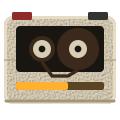

# 卡帶未來主義 Cassette Futurism

> 示範站：雙面社 SIANG-BIN（語學教材錄音帶出版社）
> 流派來源：1975–1992 年的類比機構器材——Nagra 與 Tandberg 的攜行機、Sony TC 系列卡座、蘇聯與東德的量測機殼、《異形》(1979) Nostromo 的艙內介面、語言實驗室的教師控制檯。1990 年代後期被回溯命名為 Cassette Futurism：一種「未來是米黃色的、會發出咔聲、而且只有一小塊會亮」的想像。
> 注意分界：本流派**不是**復古終端機，也不是 Y2K。終端機講的是**螢幕裡面**（磷光、掃描線、字元格）；Y2K 講的是**鉻與銀**。卡帶未來主義講的是**螢幕外面那一塊塑膠**——螢幕在這裡只是一個很小的琥珀色窗口，而且它被一大片不發光的注塑件包著。

---

## 一、設計哲學

**東西是被模具做出來的，不是被畫出來的。**

這條哲學決定了本流派全部的形式規則。一個注塑件會有：固定的脫模方向、拔模斜度、一條分模線、幾個埋頭螺絲柱、以及一面為了脫模好看而做的皮紋。它不會有：漸層、發光、模糊陰影、玻璃感、任何方向不一致的高光。因此本流派的介面不是「平面設計」，是**工業設計的正投影**。

第二條：**功能一定有一個實體位置。**沒有隱藏選單、沒有右鍵、沒有長按。要做一件事就要有一顆鍵，鍵上要有字，字要用絲印印上去；如果出廠時沒想到這個功能，就貼一條壓印膠帶。介面的醜陋處正是它的誠實處。

第三條：**光是稀有的。**1983 年一顆 LED 要錢，一塊螢光顯示器更貴，所以整台機器只有一個小窗會亮。搬到網頁上就是一條硬規則：**全頁發光的面積不得超過 5%**，而且發光的只能是「正在告訴你狀態的那一個東西」。其餘一律是死的塑膠。安靜、無光、可讀。

第四條（本站特有、可選但強烈建議）：**媒介是線性的。**卡帶沒有目錄，只有位置。如果你的內容允許，讓使用者用 PLAY／FF／REW 走過去，而不是給他一個選單。示範站的首頁就是這樣做的：十則事實錄在一卷 C-90 的 A 面上，同一時間只看得到一則。

---

## 二、色彩系統

| 用途 | 色碼 | 佔比 | 說明 |
|---|---|---|---|
| 米黃殼 putty | `#D8CDB5` | ~34% | 唯一的大面積底。它是 ABS 本色加一點點鈦白，**不是米白紙**——它有重量、有皮紋、會反射一點點光 |
| 殼的亮階 | `#E6DCC6` | ~8% | 只出現在朝上的邊（拔模斜度的頂面）與凸起的鍵帽 |
| 殼的暗階 | `#C0B496` | ~10% | 凹進去的面、面板底、次級區塊 |
| 殼的影階 | `#A2957A` | ~6% | 朝下的邊、分模線的上唇、模刻字的本體 |
| 炭灰面板 | `#33332F` | ~14% | 貼在殼上的第二種料（消光烤漆鐵板或深色 ABS）。規矩：深色面板一定是**另一個零件**，不是同一塊料變深 |
| 面板暗/亮 | `#232320` / `#46463F` | ~4% | 面板自己的拔模 |
| 琥珀顯示 | `#FFB02E` | **≤5%（硬上限）** | 全站唯一發光的東西 |
| 未點亮的段 | `#5A4423` | ~2% | 顯示器裡沒亮的那些段。它必須存在——七段顯示器的未點亮段本來就看得見 |
| 橘紅動作鍵 | `#C64A25` | ~5% | 只給 REC 與不可逆動作。不是強調色，是警告色 |
| 壓印膠帶 | `#8E2B2B` + `#F2EDE2` | ~3% | Dymo 帶與它的壓白字 |
| 墨 | `#23211C` / `#5B5445` | ~9% | 全部正文與次級文字 |
| 就緒燈綠 | `#7FA86B` | ≤1% | 只做「正在跑／通過」一件事 |

**硬規則**

- 零純白（最亮 `#E6DCC6`）、零純黑（最暗 `#232320`）。
- 零色彩漸層。唯一合法的 `linear-gradient` 是分模線那兩個像素的硬停點。
- 零 `filter: blur`、零模糊陰影。陰影一律是**硬邊實色偏移**（`2px 3px 0`）。
- **唯一的例外：光可以有半徑，影不可以。**琥珀顯示窗的 `text-shadow:0 0 7px` 與燈的 `box-shadow:0 0 7px` 是光暈，合法；任何一個用來表示「離開表面」的落影，模糊半徑必須是 0。
- 零金屬、零鉻、零銀拉絲——一有金屬它就變成 Y2K。
- 零玻璃擬態、零半透明面板。塑膠是不透明的。
- 發光只准出現在顯示窗與指示燈，且總面積 ≤5%。**殼不會發光。**
- 對比：正文 `#23211C` 對 `#D8CDB5` 為 10.9:1；琥珀 `#FFB02E` 對顯示窗底 `#1A1A17` 為 9.6:1。琥珀**不准**坐在米黃殼上（只有 1.5:1）。

```css
:root{
  --putty:#D8CDB5; --putty-hi:#E6DCC6; --putty-lo:#C0B496; --putty-deep:#A2957A;
  --panel:#33332F; --panel-lo:#232320; --panel-hi:#46463F;
  --amber:#FFB02E; --amber-dim:#5A4423;
  --rec:#C64A25; --dymo:#8E2B2B; --dymo-ink:#F2EDE2;
  --ink:#23211C; --ink-2:#5B5445; --lamp:#7FA86B;
}
```

---

## 三、字體系統

三套，各有各的工作，不得互換。

| 角色 | 字體 | 用在哪 | 規格 |
|---|---|---|---|
| 面板字 | **Michroma**（Eurostile／Microgramma 的方圓血脈） | 絲印legend、模刻字、鍵帽、計數器標籤、頁碼 | 一律大寫、`letter-spacing:.14–.22em`、`font-size:.54–.66rem`、`font-weight:400`。**永遠不拿來排長文** |
| 數字與介面 | **Saira** | 計數器、時間、價格、表格數字、Dymo 帶 | `font-variant-numeric:tabular-nums`，字重 400/500/600 |
| 正文 | **Noto Sans TC** | 全部中文內文 | 400/500，`line-height:1.78`，最大 66ch |

字級階（1.22rem → 1.02 → 0.96 → 0.86 → 0.74 → 0.62 → 0.54）。跨度刻意小：機器面板上的字本來就只有兩三種大小，不會有 4rem 的巨型標題。**本流派沒有大標 hero。**

```css
.silk{ font-family:"Michroma",sans-serif; text-transform:uppercase;
       letter-spacing:.16em; font-size:.62rem; color:var(--ink-2); line-height:1.5 }
```

---

## 四、版面與網格

- **模組**：一切以「面板」為單位。頁面 = 一疊面板，每一塊面板是一個獨立的注塑件，面板之間有 10–18px 的真實縫隙（不是 margin，是兩個零件之間合不攏的那一條）。
- **對齊**：嚴格正交，零旋轉——**只有 Dymo 膠帶可以歪**（±0.5°～0.7°），因為它是人手貼的。
- 容器 `max-width:1080px`，內距 20px。長文 66ch。
- **留白很少**。機器面板上沒有空地，空地代表這裡本來要裝東西但省掉了。密度偏高是對的。
- 網格：導覽固定四格 `repeat(4,1fr)`；卡片列 3 欄；工序列 7 欄（手機降到 2 欄）。
- **不對稱來自功能而不是構圖**：卡座首屏是 1.32fr（帶倉）: 1fr（顯示與計數器），因為帶倉本來就比較大。

---

## 五、元件配方

### 5.1 殼 `.shell`

```css
.shell{
  background:var(--putty); position:relative;
  border-radius:14px; corner-shape:superellipse(2.2);
  box-shadow:
    inset 0 1px 0 var(--putty-hi),      /* 朝上的拔模面亮 */
    inset 0 -1px 0 var(--putty-deep),   /* 朝下的暗 */
    inset 1px 0 0 var(--putty-hi),
    inset -1px 0 0 var(--putty-deep),
    2px 3px 0 rgba(35,33,28,.22);       /* 硬邊落影，永不 blur */
}
.pl::after{ /* 分模線 */
  content:""; position:absolute; left:0; right:0; top:var(--pl,calc(100% - 9px));
  height:2px; opacity:.55; pointer-events:none;
  background:linear-gradient(180deg,var(--putty-deep) 0 1px,var(--putty-hi) 1px 2px);
}
```

### 5.2 凹面 `.recess`（刻進去的：亮在下、暗在上，與凸面相反）

```css
.recess{ background:var(--putty-lo); border-radius:9px; corner-shape:superellipse(2.2);
  box-shadow: inset 0 2px 0 var(--putty-deep), inset 0 -1px 0 var(--putty-hi) }
```

### 5.3 機械鍵 `.key`

```css
.key{
  appearance:none;border:0;cursor:pointer;font:inherit;
  background:var(--putty-hi); color:var(--ink); padding:14px 8px 15px; min-width:56px;
  border-radius:5px; corner-shape:superellipse(2.4);
  font-family:"Michroma",sans-serif; font-size:.56rem; letter-spacing:.1em;
  box-shadow: inset 0 2px 0 #F1E9D6, inset 0 -3px 0 var(--putty-deep),
              0 3px 0 var(--putty-deep),          /* ← 這 3px 就是鍵程 */
              2px 4px 0 rgba(35,33,28,.2);
  transition:transform 70ms linear, box-shadow 70ms linear;
}
.key:active,.key[data-down="1"]{
  transform:translateY(3px);
  box-shadow: inset 0 2px 0 #F1E9D6, inset 0 -1px 0 var(--putty-deep),
              0 0 0 var(--putty-deep), 1px 1px 0 rgba(35,33,28,.2);
}
.key.rec{ background:var(--rec); color:#FFF1E4;
  box-shadow: inset 0 2px 0 #E0714C, inset 0 -3px 0 #8E3116, 0 3px 0 #8E3116, 2px 4px 0 rgba(35,33,28,.2) }
```
鍵**鎖住**時不要 `disabled` 加灰——真的機器上鎖住的鍵是按得下去的，只是不會動作，旁邊會有一行紅字說為什麼。

### 5.4 導覽（示範站用「斷舌」語意，可換）

四格等寬，每格是一只卡帶殼；未選的殼上有完好的防錄舌，現用頁那一只的**舌被折斷了**，殼上留一個透光的方口。

```css
nav.tabs a .tab{ position:absolute; left:11px; top:0; width:15px; height:7px;
  background:var(--putty-hi); box-shadow:inset 0 -1px 0 var(--putty-deep); border-radius:0 0 2px 2px }
nav.tabs a[aria-current="page"] .tab{ background:var(--panel-lo); border-radius:0;
  box-shadow:inset 0 2px 0 var(--putty-deep), inset 1px 0 0 var(--putty-deep), inset -1px 0 0 var(--putty-hi) }
```
**無障礙**：折沒折斷對輔助科技不可見，所以現用項一定同時帶 `aria-current="page"`。

### 5.5 顯示窗（全站唯一發光處）

```css
.disp{ background:#1A1A17; border-radius:5px; corner-shape:superellipse(2.2);
  box-shadow:inset 0 3px 0 #0E0E0C, inset 0 -1px 0 #4A4A42, 0 0 0 3px var(--putty-deep);
  padding:13px 15px 15px }
.disp h3{ color:var(--amber); text-shadow:0 0 7px rgba(255,176,46,.45) }
```

### 5.6 Dymo 壓印膠帶

```css
.dymo{ display:inline-block; background:var(--dymo); color:var(--dymo-ink);
  font-family:"Saira",sans-serif; font-weight:600; letter-spacing:.22em; font-size:.68rem;
  text-transform:uppercase; padding:.22em .7em .3em; border-radius:2px;
  text-shadow:0 1px 0 rgba(0,0,0,.45); transform:rotate(-.5deg);
  box-shadow:inset 0 1px 0 rgba(255,255,255,.22), inset 0 -1px 0 rgba(0,0,0,.35),
             1px 1px 0 rgba(35,33,28,.25) }
```

### 5.7 表格與 footer

表格底 `--putty`，表頭底 `--putty-lo`、表頭字用 `.silk`，列線 1px `--putty-deep`。Footer 上緣 2px 實線 `--putty-deep`，無圓角，左列文字導覽。

---

## 六、動效規則（四種，缺一不可）

| 種類 | 做什麼 | duration / easing |
|---|---|---|
| **ambient 環境** | 顯示窗的燈以 2.6s `ease-in-out` 極輕微呼吸（`box-shadow` 外光暈 12px↔20px）。帶在跑時兩個盤持續反向轉動 | 2.6s infinite |
| **input-driven 輸入** | 鍵沉 3px、立影歸零；量表寬度 120ms linear；拖曳換面點即時重算 | 70–120ms `linear`，延遲 <100ms |
| **transition 轉場** | 帶倉：離站時 `rotateX(-18deg)` 彈開並淡出 200ms，到站時從 `-16deg` 闔回 260ms | 200／260ms `cubic-bezier(.2,.7,.3,1)` |
| **signature 簽名** | **等線速度雙盤**：兩盤半徑由帶長守恆解出，角速度 ω = v／r，所以收帶盤越轉越慢；三位數機械計數器接在收帶盤上，因此**它的跳字速率一直在變**。這是全館唯一 | rAF，`transform:rotate()` |

```css
@keyframes bay-open{ to{ transform:perspective(900px) rotateX(-18deg) translateY(-10px); opacity:0 } }
@keyframes bay-shut{ from{ transform:perspective(900px) rotateX(-16deg) translateY(-8px); opacity:.55 } to{ transform:none; opacity:1 } }
```

**禁止**：淡入捲動揭示、視差、彈跳 easing（`cubic-bezier` 的 y 值不得 >1——塑膠不會 Q 彈）、任何超過 300ms 的過場。機器的反應是快而硬的。

**`prefers-reduced-motion` 降級（四種都要，且資訊零損失）**：呼吸停、盤不轉但**半徑仍然正確**（因為半徑是資訊不是動畫）、帶倉不動、AMS 選曲改為瞬間到位、計數器直接顯示數字。

```css
@media (prefers-reduced-motion:reduce){
  .bay{animation:none}
  *,*::before,*::after{animation-duration:.001ms !important;animation-iteration-count:1 !important;transition-duration:.001ms !important}
}
```

---

## 七、插畫與圖像風格：moulded-relief 注塑浮雕構成

全站零外部圖片、零照片、零 `` 點陣圖。每一個圖像都是「一塊被模具做出來的面」，由三個原語產生，**不允許第四種**：

1. **每一個形都要宣告它是凸的還是凹的。**凸＝朝上的邊亮、朝下的邊暗；凹＝相反。沒有第三種狀態，也不存在「浮在空中」的形。
2. **光只有一盞，固定在左上 135°，而且它不是畫上去的。**皮紋與模刻字的明暗全部由同一個 3×3 捲積核（`divisor="1"`）從高度圖算出來。判準：全站找不到任何一條手寫的 `linearGradient` 當高光。
3. **顏色只能來自「這塊料本身是什麼色」。**同一塊料上不准出現第二個顏色的漸層；要分零件就換料（米黃 ABS／炭灰面板／磁帶褐 `#3B2A1B`）。

人與物一律以正面或正上方的正投影呈現，零透視、零陰影投射（除了 `2px 3px 0` 的硬落影）。

**明文禁用**：照片、半調網點、細線幾何線描、任何做舊／掃描濾鏡、扁平化單色圖示、金屬漸層、任何發光（顯示窗除外）、任何模糊陰影、任何斜線紋理貼圖。

---

## 八、Logo 與 Favicon

**Logo**：一只正面的卡帶殼。**左盤小、右盤大**——這一卷已經放了一半，收帶盤越捲越粗。這是本流派的識別動作：把一個會隨時間改變的物理量凍結在標誌裡。下緣一條琥珀帶位線，填到約 47%。殼身走 `#mould` 濾鏡（見下章），所以連標誌上都有皮紋。

**Favicon**：同一只殼縮到 32×32，兩盤等大（這個尺寸下半徑差看不出來，硬做只會糊），底下一條 14×3 的琥珀塊。以 inline SVG data URI 寫在 `<head>`，不外連檔案。

```html
<link rel="icon" href="data:image/svg+xml,%3Csvg xmlns='http://www.w3.org/2000/svg' viewBox='0 0 32 32'%3E%3Crect width='32' height='32' rx='3' fill='%23D8CDB5'/%3E%3Crect x='3.5' y='8' width='25' height='16' rx='2' fill='%2333332F'/%3E%3Ccircle cx='11' cy='16' r='3.6' fill='%23D8CDB5'/%3E%3Ccircle cx='21' cy='16' r='3.6' fill='%23D8CDB5'/%3E%3Crect x='9' y='25' width='14' height='3' fill='%23FFB02E'/%3E%3C/svg%3E">
```

---

## 九、本風格的 5 個不可省略特徵

> 這一章是本規格書的核心。以下五項，**拿掉任何一項，做出來的就不是卡帶未來主義**。

### 特徵 1 ── 注塑殼：拔模、分模線、皮紋，三者同時在場

一塊塑膠面不是一個色塊。它必須同時有：**朝上的邊亮／朝下的邊暗**（拔模斜度）、**一條固定高度的分模線**、以及**一層算出來的消光皮紋**。只有第一項是常見的擬物寫法；第二與第三項是本流派的身分證。

```css
.shell{ background:#D8CDB5; position:relative; border-radius:14px; corner-shape:superellipse(2.2);
  box-shadow: inset 0 1px 0 #E6DCC6, inset 0 -1px 0 #A2957A,
              inset 1px 0 0 #E6DCC6, inset -1px 0 0 #A2957A, 2px 3px 0 rgba(35,33,28,.22) }
.shell::after{ content:""; position:absolute; left:0; right:0; top:calc(100% - 9px); height:2px;
  background:linear-gradient(180deg,#A2957A 0 1px,#E6DCC6 1px 2px); opacity:.55 }
```

皮紋（SVG 濾鏡，套在 SVG 的殼面 `<rect>` 上）：

```xml
<filter id="mould" x="0%" y="0%" width="100%" height="100%" color-interpolation-filters="sRGB">
  <feTurbulence type="fractalNoise" baseFrequency="0.74 0.74" numOctaves="1" seed="476" result="n"/>
  <feColorMatrix in="n" type="matrix"
    values=".34 .34 .34 0 0  .34 .34 .34 0 0  .34 .34 .34 0 0  0 0 0 0 1" result="h"/>
  <feConvolveMatrix in="h" order="3" kernelMatrix="-2 -1 0 -1 1 1 0 1 2"
    divisor="1" preserveAlpha="true" result="e"/>
  <feColorMatrix in="e" type="matrix"
    values=".30 0 0 0 .79  0 .30 0 0 .79  0 0 .30 0 .79  0 0 0 0 1" result="g"/>
  <feComposite in="g" in2="SourceGraphic" operator="in" result="grain"/>
  <feBlend in="SourceGraphic" in2="grain" mode="multiply"/>
</filter>
```
`divisor="1"` 是必要條件：這個核的係數和恰好為 1，所以平坦處的亮度不被改變，只有高度變化的地方才生出明暗。第二個 `feColorMatrix` 把結果壓成 `0.3×in + 0.79`，確保 multiply 回去時只掉約 6% 亮度而不是一半。

### 特徵 2 ── 方圓角：superellipse，不是 border-radius

Eurostile 的字腔、ABS 模具的倒角、卡帶殼的四角，是**同一個形**：超橢圓。一般的圓角在轉角處曲率突變，超橢圓不會——這正是「工業感」與「網頁感」的分水嶺。

```css
.shell{ border-radius:14px; corner-shape:superellipse(2.2) }
.key  { border-radius:5px;  corner-shape:superellipse(2.4) }
```
`border-radius` 必須先寫，因為它同時是不支援環境的降級值。**不要**用 `<svg clip-path>` 去假裝——那會把 `overflow`、`outline` 與 focus ring 一起裁掉。

### 特徵 3 ── 字只有三種存在方式：絲印、模刻、壓印

沒有第四種。這條規則一旦破了，畫面立刻退回成「一般的 UI」。

```css
/* 絲印：印在表面，平的，只有油墨厚度 */
.silk{ font-family:"Michroma",sans-serif; text-transform:uppercase;
       letter-spacing:.16em; font-size:.62rem; color:#5B5445 }
/* 壓印膠帶：出廠時沒想到的東西 */
.dymo{ background:#8E2B2B; color:#F2EDE2; font-family:"Saira",sans-serif; font-weight:600;
       letter-spacing:.22em; font-size:.68rem; text-transform:uppercase;
       padding:.22em .7em .3em; border-radius:2px; transform:rotate(-.5deg);
       text-shadow:0 1px 0 rgba(0,0,0,.45);
       box-shadow:inset 0 1px 0 rgba(255,255,255,.22), inset 0 -1px 0 rgba(0,0,0,.35), 1px 1px 0 rgba(35,33,28,.25) }
```
模刻（刻進殼裡的字）同樣由捲積核打光，不寫 `text-shadow`：

```xml
<filter id="engrave" x="-25%" y="-25%" width="150%" height="150%" color-interpolation-filters="sRGB">
  <feGaussianBlur in="SourceAlpha" stdDeviation="1.1" result="b"/>
  <feColorMatrix in="b" type="matrix"
    values="0 0 0 .92 .05  0 0 0 .92 .05  0 0 0 .92 .05  0 0 0 0 1" result="h"/>
  <feConvolveMatrix in="h" order="3" kernelMatrix="-2 -1 0 -1 1 1 0 1 2"
    divisor="1" preserveAlpha="true" result="e"/>
  <feComposite in="e" in2="SourceAlpha" operator="in" result="lit"/>
  <feBlend in="SourceGraphic" in2="lit" mode="multiply"/>
</filter>
<text filter="url(#engrave)" font-family="Michroma, sans-serif" font-size="19"
      letter-spacing="4.2" fill="#A2957A">SIANG-BIN</text>
```

### 特徵 4 ── 機械鍵：3px 的實體鍵程，而且陰影永遠不模糊

`0 3px 0` 是鍵帽與殼之間的那一段空氣。按下去時 `translateY(3px)` 把它吃掉，立影歸零。整個過程 70ms `linear`——不是 `ease`，機械件沒有加速度曲線。配方見 §5.3。

**驗收**：把頁面截圖轉成灰階，每一顆鍵都還看得出它是凸的；任何一處 `blur-radius > 0` 的陰影都是違規。

### 特徵 5 ── 唯一的光：琥珀顯示窗，面積 ≤5%，永遠坐在凹陷裡

發光的東西必須被一個近黑的凹窗包住，凹窗外再包一圈 3px 的米黃斜邊（那是面板上為它挖的孔）。這一圈斜邊是關鍵：沒有它，琥珀就變成一個浮在背景上的色塊，整個流派就垮了。

```css
.disp{ background:#1A1A17; border-radius:5px; corner-shape:superellipse(2.2);
  box-shadow: inset 0 3px 0 #0E0E0C,        /* 孔的內壁 */
              inset 0 -1px 0 #4A4A42,
              0 0 0 3px #A2957A;            /* 面板上挖的孔的斜邊 */
  padding:13px 15px 15px }
.disp h3{ color:#FFB02E; text-shadow:0 0 7px rgba(255,176,46,.45) }
.lamp.on{ background:#FFB02E; box-shadow:0 0 7px rgba(255,176,46,.8) }
```
未點亮的段用 `#5A4423`，**一定要畫出來**——真的顯示器上你看得見沒亮的那幾段。

---

## 十、Do & Don't

**Do**

- 每一塊面都想好它是凸的還是凹的，再決定陰影方向。
- 面板之間留出「兩個零件合不攏」的那條縫。
- 功能沒地方放就貼一條 Dymo，歪一點沒關係。
- 資訊密一點。機器面板上沒有空地。
- 顯示窗裡把沒亮的段也畫出來。
- 鎖住的鍵讓它按得下去，旁邊用紅字說明為什麼。

**Don't**

- ✗ 紫藍漸層 hero、置中大標＋副標＋兩顆按鈕＋三張圓角卡片（通用去 AI 化禁令）
- ✗ emoji 當 icon（icon 一律自繪 SVG）
- ✗ Lorem ipsum、AI 腔文案、`EST. 19xx` 徽章
- ✗ 任何 `blur` 的陰影、任何玻璃擬態、任何 `backdrop-filter`
- ✗ **鉻、銀拉絲、金屬漸層**——那是 Y2K，不是本流派
- ✗ **磷光綠、掃描線、CRT 曲面**——那是復古終端機，不是本流派
- ✗ 殼發光、背景發光、卡片發光
- ✗ 巨型標題。本流派沒有 hero，最大的字是 1.22rem
- ✗ 彈跳 easing、300ms 以上的過場、淡入捲動揭示
- ✗ 把琥珀色拿去當文字色放在米黃殼上（對比 1.5:1）

---

## 十一、頁面骨架範例

```html
<!DOCTYPE html>
<html lang="zh-Hant">
<head>
<meta charset="utf-8"><meta name="viewport" content="width=device-width,initial-scale=1">
<title>面板名｜商號</title>
<link rel="icon" href="data:image/svg+xml,...">
<link href="https://fonts.googleapis.com/css2?family=Michroma&family=Saira:wght@400;500;600&family=Noto+Sans+TC:wght@400;500;700&display=swap" rel="stylesheet">
<style>/* §2 色票 + §5 元件 全部 inline */</style>
</head>
<body>
<svg width="0" height="0" aria-hidden="true" style="position:absolute"><defs>
  <!-- §9 的 #mould 與 #engrave 兩支濾鏡放這裡，全站共用 -->
</defs></svg>

<div class="wrap">
  <header class="mast">
    
    <div><h1>商號</h1><div class="sub">一行地址與創立年</div></div>
    <span class="dymo" style="margin-left:auto">一個規格值</span>
  </header>

  <nav class="tabs" aria-label="主導覽">
    <a href="a.html" aria-current="page"><span class="tab"></span><span class="zh">面板一</span><span class="en">PANEL ONE</span></a>
    <!-- 共四格 -->
  </nav>

  <main class="bay">
    <section class="deck shell pl" style="--pl:calc(100% - 13px)">
      <div class="top">
        <svg viewBox="0 0 250 26" width="196" height="21" aria-label="商號">
          <text x="0" y="20" filter="url(#engrave)" font-family="Michroma, sans-serif"
                font-size="19" letter-spacing="4.2" fill="#A2957A">SIANG-BIN</text>
        </svg>
        <span class="silk">MODEL / 規格 / 一行絲印</span>
      </div>
      <div class="bayrow">
        <div class="recess"><!-- 主視覺：一件 SVG 的器物，殼面走 url(#mould) --></div>
        <div class="disp"><!-- 唯一發光處 --></div>
      </div>
      <div class="keys">
        <button class="key" type="button"><span class="gl">▶</span>PLAY</button>
        <button class="key rec" type="button"><span class="gl">●</span>REC</button>
      </div>
    </section>

    <section>
      <h2>一個不超過 1.22rem 的標題</h2>
      <p class="lede">正文。密一點。</p>
      <table>…</table>   <!-- 表頭字用 .silk -->
    </section>
  </main>

  <footer>…</footer>
</div>
</body></html>
```

---

## 十二、技術實作與相容性

本站宣告三項核心技術，分屬三個不同層。

### 12.1 `corner-shape` / `superellipse()`（C 版面與樣式層）

- **承載**：特徵 2。全站每一個注塑件的方圓角。
- **支援現況（2026-09 查證）**：Chromium（Chrome／Edge）139 起支援，2025 年隨 Blink 出貨；Firefox 與 Safari 目前無公開時程。全球覆蓋率約 67%（2026 年年中統計）。
  查證來源：MDN `corner-shape` 與 `superellipse()` 條目、Chrome Platform Status feature 5357329815699456、Chrome for Developers〈The corner cases of implementing CSS corner-shape in Blink〉、Squircle.js〈Squircles in CSS: corner-shape, superellipse() and Browser Support (2026)〉。
- **不支援時的具體行為**：`corner-shape` 是漸進增強屬性，不認得就整條宣告被丟棄，**留下先寫的 `border-radius`**。結果是一般圓角：轉角曲率略圓、所有間距／陰影／字級／對比／可點區域完全不變，資訊零損失。實測 Firefox 下四頁全部可用。
- **不要**改用 `clip-path` 模擬：會連同 `outline` 與 focus ring 一起裁掉，破壞鍵盤操作。

### 12.2 SVG `feConvolveMatrix` 3×3 浮雕捲積核（A 渲染層）

- **承載**：特徵 1 的皮紋與特徵 3 的模刻字。全站沒有一條手寫的高光漸層。
- **支援現況（2026-09 查證）**：`feConvolveMatrix` 為 SVG 1.1 濾鏡基元，Chrome／Edge／Firefox／Safari 全部支援（MDN 標示為 Baseline · widely available）。已知差異：Safari 對大面積濾鏡的重繪成本較高。
- **因應**：全站濾鏡對象一律限制在小 bbox（最大 348×192，最小 68×48）、`numOctaves="1"`、且**完全靜態**——沒有任何一個濾鏡參數綁在動畫或捲動上，所以只在首次繪製時算一次。
- **不支援時的具體行為**：`filter` 屬性被忽略，面退回純平色。殼仍然是米黃、拔模與分模線仍在（那兩者是 CSS `box-shadow`，不是濾鏡），只是少了皮紋顆粒。資訊零損失。
- **`divisor="1"` 是硬條件**：本核係數和為 `-2-1+0-1+1+1+0+1+2 = 1`。若 divisor 不等於係數和，平坦區會整片變亮或變暗，皮紋就變成一層髒霧。

### 12.3 等線速度雙盤解算器（E 資料與生成層，自寫，無相依）

- **承載**：簽名動效、機械計數器、首頁的帶位索引、排帶檯的分秒↔公分換算。全站每一個「多長」與「多久」都由這一支算出來，沒有第二個來源。
- **式子**（帶長守恆，一圈厚 `t` 的帶佔的環面積等於帶長乘帶厚）：

```js
var V = 4.76, R0 = 1.10, TH = 0.0012;          // cm/s, 輪轂半徑 cm, 帶厚 cm
function rad(len){ return Math.sqrt(R0*R0 + len*TH/Math.PI) }   // 帶長 → 盤半徑
function revs(len){ return (rad(len) - R0) / TH }               // 帶長 → 圈數（閉式解）
var omega = V / rad(len);                                        // 角速度 rad/s
```
`revs()` 的閉式解來自 `dx/(2πr) = dr/t`：每繞一圈，半徑就長厚一個帶厚。所以圈數 =（現在的半徑 − 輪轂半徑）÷ 帶厚，不需要積分。機械計數器接在收帶盤上，這也是為什麼**真實卡座的計數器不是等速跳的**。
- **實測**：C-90 單面帶長 12 852 cm，滿盤半徑 2.474 cm，滿盤 1 145 圈——與實物規格相符。解算器十萬次呼叫 5.1 ms（Node 22），**單次約 0.05 µs**，對 60fps 的預算（16.7 ms）完全不構成負擔。

### 12.4 效能預算實測

| 頁 | 單檔大小（已含全部 inline CSS/JS/SVG） | 外部資源 |
|---|---|---|
| `index.html` | 32.2 KB | Google Fonts 一支 |
| `mulu.html` | 42.9 KB | 同上 |
| `atai.html` | 24.1 KB | 同上 |
| `paitai.html` | 27.8 KB | 同上 |
| `assets/logo.svg` | 2.1 KB | — |

四頁皆遠低於 350 KB 上限。零外部圖片、零外部音檔、零 JS 函式庫。

**首屏 JS**：`index.html` 的初始工作是一次 `paint()`——六個 SVG 屬性寫入、三個計數器字輪、一次文字替換，不讀取任何 layout 屬性；`paitai.html` 的 `render()` 同理。兩者都遠在 100 ms 內。

**60fps**：走帶迴圈每幀只寫入 `circle@r`（4 次）、`path@d`（1 次）、`g@transform`（2 次）與三個 `transform` 字輪。**沒有任何一次讀取 `offsetWidth`／`getBoundingClientRect`**，因此不存在 layout thrashing；盤的轉動走 `transform`，在合成層上。停帶（`speed === 0`）時迴圈不做任何 DOM 寫入。

---

*本規格書隨示範站「雙面社 SIANG-BIN」一併交付。站上的社號、人名、價目、電話與地址皆為虛構；風格規則可直接套用到任何產業。*
