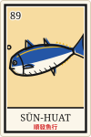

# 墨西哥樂得利牌 Lotería Mexicana ‧ 套色卡牌

## 0. 血緣與定位

- **流派**：墨西哥樂得利（lotería）卡牌圖像。型錄「在地與文化視覺」2026-10-11 新增條目，全館第 1 站（sun-huat）。非自創。
- **年代與地域**：叫牌遊戲 18 世紀中由義大利經西班牙傳入新西班牙（文獻記 1768 或 1769 年）；1887 年法國商人 Clemente Jacques 在墨西哥城自家印刷廠整理出 54 張固定牌組（El Gallo、La Dama、El Catrín、La Sirena…），隨軍需品與罐頭廣告流通，此後所有樂得利牌幾乎都是這副牌的變奏；「Don Clemente Gallo」版約 1913 年定型。José Guadalupe Posada 亦畫過一副。
- **為什麼長成這樣**：它是給市集、軍營與家庭桌邊用的**便宜量產品**。所以：一色一版的平版套色、沒有中間調；版與版靠人工對位、永遠差一兩根頭髮；圖像必須在一張桌子外就認得出來，所以只有一個主角、一個底色、粗黑輪廓；牌名用冠詞＋名詞的大寫（EL／LA），因為叫牌人要喊；叫牌人不唸名字唸詩，所以每張牌都帶一句謎語。
- **外部參照**：Wikipedia〈Lotería〉；INAH 策展人 José Enrique Ortiz 對 Clemente Jacques 的說明（azteca jalisco 轉述）；Teresa Villegas〈History of La Lotería〉；Baruch College〈Baraja de Lotería〉專題；Google Doodle〈Lotería〉2019 互動版。
- **與館內近親的分界**：墨西哥 Papel Picado（wusepeng：鏤空紙旗、負空間）；墨西哥 68（同心線條識別）；普普 Lichtenstein（sim-siann：網點、放大格）；嶺南／月份牌（擦筆漸層美人）。本流派**零網點、零漸層、零鏤空**，識別性來自「卡片構造＋套色錯版＋豆子」。

## 1. 設計哲學

一張牌就是一個角色。畫面上只能有一個主角、一個顏色的地、一條粗黑線把它圈起來，然後用最大的字喊出它的名字。所有「精緻」都是敵人：漸層會讓它像海報、陰影會讓它像插畫、對得太準會讓它像電腦。好的樂得利頁面看起來像**一疊被很多人摸過的便宜紙牌攤在桌上**——而且你想伸手拿一顆豆子放上去。

## 2. 本風格的 5 個不可省略特徵

### ① 卡片構造：白邊＋粗黑框＋左上號碼＋底部冠詞大寫名

拿掉任何一項它就只是「一張插圖」。比例固定 2:3；白邊約 5%；黑框 2.4/100；圖區與名牌之間一條黑線；名牌白底。

```html
<svg viewBox="0 0 100 150">
  <rect x=".5" y=".5" width="99" height="149" rx="3" fill="#FBF6EA"/>
  <rect x="8" y="8" width="84" height="110" fill="#9FD0EA"/><!-- 底色版 -->
  <!-- art here -->
  <rect x="5.5" y="5.5" width="89" height="139" fill="none" stroke="#151515" stroke-width="2.4"/>
  <path d="M8,118H92" stroke="#151515" stroke-width="1.6"/>
  <text x="11" y="21" font-family="Bevan" font-size="11" stroke="#FBF6EA" stroke-width="2.6" paint-order="stroke">14</text>
  <text x="50" y="132.5" text-anchor="middle" font-family="Bevan" font-size="10.6">EL ATÚN</text>
  <text x="50" y="141.5" text-anchor="middle" font-family="Noto Serif TC" font-weight="900" font-size="6.6" fill="#D52B2B">黃鰭鮪</text>
</svg>
```

### ② 套色平版：一色一版、零漸層、彩色版與黑線版錯位

彩色版整組平移 `(+1.9, −1.4)`（viewBox 單位，約卡寬 1.9%），黑線版最後壓、位置正確。錯位全站共用一組值——它是「同一台機器印的」證據，不是隨機抖動。

```css
.naipe .pl > g{transform:translate(1.9px,-1.4px)}         /* 彩色版 */
.hov:hover .naipe .pl > g{transform:translate(4.6px,-3.6px)} /* 摸一下就更歪 */
.chromo{position:relative}
.chromo::before{content:attr(data-t);position:absolute;inset:0;color:#F2B91C;
  transform:translate(1.9px,-1.4px);z-index:-1}            /* 標題也錯版 */
```

### ③ 單一原型主角＋一色地＋天真粗線與短排線陰影

主角置中、佔圖區寬 80–95%；地永遠一個淺色（淺藍 #9FD0EA、米黃 #F7DCA0、淺粉 #F6BDC6、淺綠 #BEDDB2 輪替）；黑線 1.7–2.4；陰影只用 5–7 條平行短斜線（不是灰色）。

```svg
<g fill="none" stroke="#151515" stroke-width="1.7" stroke-linecap="round" stroke-linejoin="round">
  <path d="M-30,6l-2.2,-3.6M-24,7l-2.2,-3.8M-18,7.5l-2.2,-4" stroke-width=".9"/><!-- 排線陰影 -->
</g>
```

### ④ 4×4 牌板（tabla）與豆子記號

頁面的主結構是 4×4 的牌板，外框一色厚紙板（本站綠 #3E9B5C）＋黑框＋硬投影；記號是**豆子**而不是勾勾或高亮。

```css
.tabla{display:grid;grid-template-columns:repeat(4,1fr);gap:8px;
  background:#3E9B5C;border:3px solid #151515;padding:14px;box-shadow:7px 7px 0 #151515}
.frijol{position:absolute;width:30%;transform:translate(-50%,-50%) rotate(var(--r))}
```
```svg
<svg viewBox="0 0 30 20"><path d="M3,10C2,3 10,1 15,4C19,6 21,2 26,4C30,7 29,16 22,17C15,18 4,18 3,10Z"
  fill="#A4643A" stroke="#151515" stroke-width="1.6"/><circle cx="9" cy="9" r="1.4" fill="#5b2f17"/></svg>
```

### ⑤ 叫牌詩橫幅：唸詩不唸名

每張牌帶一句押韻謎語；畫面上以**黃底黑框、兩端燕尾的布條**呈現，Spanish 牌名以 ¡…! 小字壓在上方。開喊必說 *¡Corre y se va!*，贏家喊 *¡Lotería!*。

```css
.verso-banda{background:#F2B91C;border:3px solid #151515;padding:10px 14px;font-weight:900;position:relative}
.verso-banda::before,.verso-banda::after{content:"";position:absolute;top:8px;bottom:-10px;width:22px;
  background:#EC7B2C;border:3px solid #151515;z-index:-1}
.verso-banda::before{left:-16px;clip-path:polygon(0 0,100% 0,100% 100%,0 100%,40% 50%)}
.verso-banda::after{right:-16px;clip-path:polygon(0 0,100% 0,60% 50%,100% 100%,0 100%)}
```

## 3. 色彩系統（一墨一版）

| 角色 | hex | 用途 | 比例 |
|---|---|---|---|
| 牛皮紙板 kraft | #E2CFA6 | 頁面地（桌面／牌盒） | 40% |
| 牌紙 papel | #FBF6EA | 卡片、面板 | 25% |
| 墨黑 key | #151515 | 黑線版、框、字 | 12% |
| 鎘紅 rojo | #D52B2B | 主按鈕、中文牌名、牌背菱格 | 6% |
| 鉻黃 amarillo | #F2B91C | 標題錯版、橫幅、號碼格 | 6% |
| 群青 azul | #2456A6 | 魚背、focus | 4% |
| 綠 verde | #3E9B5C | 牌板框 | 3% |
| 粉 rosa #EF93A3／橙 naranja #EC7B2C | — | 次要色版 | 各 ≤2% |
| 淺底四色 | #9FD0EA #F7DCA0 #F6BDC6 #BEDDB2 | 只當牌的地 | — |

規則：任何色塊都是平塗；淺色是**另一塊淺色版**，不是 opacity；不得出現漸層、模糊陰影、紫藍。

## 4. 字體系統

- **Bevan**（Google Fonts）：所有西文大寫牌名、號碼、標籤。粗 slab，近似 19 世紀木刻海報字。字距 +0.02em。
- **Noto Serif TC 900**：中文標題與牌名；**400** 內文。
- **Libre Caslon Text Italic**：西班牙文詩句、*¡Corre y se va!*。
- 字級：H1 西文 64/46px、中文 22px；牌名 = 卡寬 10.6%；內文 15–16px／1.7。

## 5. 版面與網格

- 首頁＝牌板＋叫牌桌兩欄（1.05fr／1fr），≤980px 疊成一欄。
- 卡片網格：8 欄（≥1100）→6→4→2（≤560）。卡片列可交錯 ±1.5° 旋轉，像攤在桌上。
- 所有面板：3px 黑框＋7px 硬投影（手機 4px）。不用圓角（卡片 3/100 例外）。

## 6. 元件配方

- **導覽 mazo（牌堆）**：左下固定 4 張小牌（每頁一張，號碼 1–4），扇形 ±9° 疊放，現用頁上提 14px、轉正；hover／focus 整副攤開。≤560px 變底部黑條 4 格。
- **按鈕**：Bevan、黃底黑框 3px、4px 硬投影；主要動作紅底白字。按下位移 3px。
- **牌（可翻）**：`perspective` ＋ 兩面 `backface-visibility:hidden`，背面是淡紅菱格＋詩＋價錢。
- **頁尾**：4 欄黑框表格（地址／時間／電話／牌堆）。

## 7. 動效規則（四種全有，皆有 reduced-motion 降級）

| 類型 | 做法 | 時間 | 降級 |
|---|---|---|---|
| ambient 環境 | 每張魚牌的尾鰭 `skewY` 擺動（transform-box: fill-box、origin 0% 50%），各張週期不同 | 1.7–3.4s ease-in-out ∞ | 靜止 |
| input 輸入 | 游標／focus 到牌上：彩色版錯位從 1.9 拉到 4.6（.16s 回彈）；點牌放豆子：豆子從上方翻落 | .16s / .5s cubic-bezier(.3,1.7,.6,1) | 直接定位 |
| transition 轉場 | 換頁時整頁像一張牌翻過去露出牌背（rotateY 90→0），新頁從牌背翻開 | .38s 蓋 / .46s 開 | 直接換頁 |
| signature 簽名 | **叫牌翻牌＋詩句同步**：新牌從牌堆位置 rotateY(−180°) 翻出，同時 Web Speech 唸詩，`boundary` 事件逐字點亮橫幅；上一張以 FLIP 縮進「已叫」列 | .62s 翻 / .42s FLIP | 直接換牌、詩一次顯示 |

## 8. 插畫與圖像風格：chromo-plate-card 套色分版牌

全部牌面由程式生成：魚以「基因」參數（體型指數 a/b、尾形 fork/lunate/round、背鰭位置、斑紋 bars/spots/lines/wave、色版）生成；非魚物件以圓、橢圓、路徑原語手寫。**每一張都拆成兩組：彩色版（無線、只有填色）與黑線版（只有線、無填色）**，彩色版整組錯位。這保證「套不準」是結構而不是濾鏡。

## 9. Logo 與 Favicon

Logo 本身就是一張樂得利牌：號碼 89（1989 開業）、黃地、鮪魚、名牌「SŪN-HUAT／順發魚行」。Favicon：20×30 迷你牌、黃地藍魚、紅名牌條。

## 10. Do & Don't

- Do：每張牌一個主角；冠詞大寫；錯版固定一組值；豆子當記號；詩比名字重要。
- Do：讓卡片排列有一點點歪，像被手放下。
- Don't：漸層、網點、模糊陰影、玻璃、圓角卡片、紫藍。
- Don't：直接臨摹 Don Clemente 原牌的畫面（El Gallo、El Catrín 等仍屬商業牌組設計）——用同一套構造畫你自己的 32 張。
- Don't：emoji icon、Lorem ipsum、EST. 徽章。

## 11. 頁面骨架範例

```html
<header class="cabeza"><a class="marca" href="index.html"><b>LOTERÍA DEL MAR</b></a>
  <div class="lema"><i>¡Corre y se va!</i> …</div><div class="num">TABLA No.<b>07</b></div></header>
<main class="mesa">
  <section class="tabla-marco"><div class="tabla"><!-- 16 × <button class="celda hov"><svg class="naipe">…</svg></button> --></div></section>
  <section class="griton">
    <div class="carta"><div class="cara frente"></div><div class="cara dorso"><!-- 牌背 --></div></div>
    <p class="verso-banda"><span class="vn">¡EL ATÚN!</span>黑潮邊頂一尾烏…</p>
    <ol class="cantadas"></ol>
    <button class="btn">¡Corre y se va!</button><button class="btn rojo">¡LOTERÍA!</button>
  </section>
</main>
<nav class="mazo"><!-- 4 張頁面牌 --></nav>
```

## 12. 技術實作與相容性

### 12.1 決定性牌組生成器（E 資料與生成層）
- FNV-1a 雜湊＋xorshift32：`bySeed(n)` 同號碼永遠發同一張牌板（`?t=12` 可分享）；兩位對手牌板用 n+31、n+57。
- 魚類生成：18 點側輪廓 profile `t^a(1−t)^b` → Catmull-Rom 轉三次貝茲；鰭與斑紋錨在輪廓上。32 張牌在 Node 與瀏覽器跑**同一份** deck.js：建置期預先輸出 SVG（無 JS 也看得到全部牌），執行期重發牌板。
- 實測（Node 22 V8）：重新生成 16 張牌板 ≈1.8ms；32 張全牌 SVG ≈104KB。

### 12.2 Web Speech API 語音叫牌（D 輸入與感測層）
- `speechSynthesis.speak()` 兩段 utterance：西文牌名用 es-MX／es 聲音，詩句用 zh-TW／zh 聲音；`boundary` 事件的 `charIndex` 逐字點亮橫幅。
- 查證：MDN〈SpeechSynthesisUtterance: boundary event〉標示 Baseline Widely available；但**是否觸發 boundary 依聲音而定**（部分雲端聲音不送），故 `onstart` 同時啟動 170ms/字的計時掃描，收到第一個 boundary 就交棒。
- Fallback：無 `speechSynthesis` → 核取方塊停用，改 110ms/字文字掃描；任何情況 9 秒安全計時強制進入下一張。必須由「開叫」按鈕的使用者手勢啟動。

### 12.3 CSS 3D 翻牌＋FLIP（B 動效與時間軸層）
- 翻牌：`perspective`、`transform-style:preserve-3d`、`backface-visibility:hidden`（含 `-webkit-` 前綴給 Safari）——caniuse transforms3d 全主流支援。
- FLIP：量測舊牌位置 → 新縮圖套反向 transform → 下一個 rAF 清除，`.42s` 縮進「已叫」列。
- 換頁：`sessionStorage` 旗標＋`<head>` 內同步腳本先蓋牌背，避免閃白；1.4s CSS 自動失效保險，JS 失敗也不會卡住畫面。
- reduced-motion：全部改瞬間；資訊（叫過哪些牌、詩全文）零損失。

### 12.4 效能預算
| 頁 | 大小（含 inline 全部資源） |
|---|---|
| index.html | ≈161KB |
| baraja.html | ≈185KB |
| griton.html | ≈60KB |
| visita.html | ≈59KB |

首屏 JS：發牌 ≈2ms（Node 實測）；動畫僅 transform/opacity，無 layout thrashing（FLIP 每張只量測一次）。
