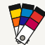

# 專色配方色票 Spot-colour Formula Guide — 銅版白與索引黑

> 從未看過 Demo 的 AI，讀完本文件應能做出風格一致的新網站。範例站：十份調色所 TEN PARTS（臺北赤峰街的指甲油調色所，虛構）。

## 設計哲學

一九五六年，Lawrence Herbert 進入紐約的 M & J Levine Advertising 當調色員，那家印刷公司替化妝品廠印顏色卡。一九六二年他買下公司改名 Pantone，一九六三年推出 Pantone Matching System：把印刷廠要備的顏料減到**十罐左右的基底油墨**，所有顏色都用這幾罐「照份數」調出來，每一色一個號碼，做成用鉚釘串起來的長條扇頁。它解決的是一個溝通問題——設計師說「那種橘」，印刷廠聽不懂；說「號碼幾號」，全世界調出來都一樣。

所以這個風格的一切都從「**顏色必須能被準確複述**」長出來：

- 顏色只用號碼叫，不取名字；
- 每一片是平的、不透光澤、不帶漸層的色塊，因為它是被刷出來的樣片，不是插畫；
- 一條七階，由淺到深，因為同一組顏料只差「加了多少透明白」；
- 配方印在色塊旁邊，因為色票真正的使用者是調色的人；
- 同一個配方要在兩種紙上各印一次，因為紙會改變顏色——**表面是系統的一部分**。

網頁照搬這些限制：畫面上的主角是一片一片編了號的色，文字退到白色註記帶裡，版面是長條、欄與鉚釘，而不是卡片、陰影與大標題。

**語氣**：像調色員講話——短、具體、有數字、有單位。不說「夢幻」「質感」「療癒色系」；說「暖紅 6 份、寶石紅 2 份、透明底 8 份」。

## 本風格的 5 個不可省略特徵

拿掉任何一項，它就只是「很多色塊的網站」，不再是配方色票。

### 1　晶片：平色矩形＋紙白註記帶，號碼在帶上

每一個顏色是一塊**零漸層、零陰影、零圓角、零光澤反光**的矩形，下面接一條白色註記帶，帶與色之間一條 1px 墨線；號碼（粗）與後綴寫在帶上。色塊裡永遠不放字。

```css
.chip{display:block;background:#fff;color:#151515;text-decoration:none}
.chip .c{display:block;aspect-ratio:1/.78;background:var(--g)}          /* flat, nothing else */
.chip .cap{display:block;padding:5px 7px 7px;border-top:1px solid #151515;background:#fff}
.chip .cap b{font:700 13px/1.2 "Inter Tight",sans-serif;font-feature-settings:"tnum" 1}
```

### 2　扇頁：一條七階由淺到深，黑索引帶在頂，鉚釘孔在底，多條以同一鉚釘為軸展成扇

長條比例約 1:4.6；頂端一條黑底白字的索引帶（條號＋兩罐基底名）；七片由淺到深；底端一格留白，中間一個圓孔。多條疊在一起時**只有一個旋轉中心**——就是那顆鉚釘。本站整扇 12 條的角度全部來自一個 `@property` 註冊的角度 `--fan`：

```css
@property --fan{syntax:'<angle>';inherits:true;initial-value:0deg}
@property --br {syntax:'<angle>';inherits:true;initial-value:0deg}
.fan{--open:66deg;position:relative;aspect-ratio:1/.95;container-type:inline-size;
     transition:--fan 1.5s cubic-bezier(.16,.84,.24,1)}
.fan.open{--fan:var(--open)}
.strip{--rot:calc((var(--fan) + var(--br)) * var(--i) / 11 - 10deg);   /* --i = 0…11 */
  position:absolute;left:16cqw;bottom:6cqw;width:17cqw;height:78cqw;
  transform-origin:50% calc(100% - 4.5cqw);                               /* = rivet */
  transform:rotate(var(--rot)) translateY(var(--lift))}
```

```html
<div class="strip" style="--i:2"><span class="tab"><b>03</b><em>WARM · RUBINE</em></span>
  <!-- 7 × .fc chips --><span class="hole"></span></div>
<span class="rivet"></span>
```

### 3　號碼即名字；新怪誕無襯線、小字、靠左

色只用系統編號指稱（本站：`2` 系列＋兩位條號＋一位階號，後綴 G／M，例 `2034 G`）。不取「玫瑰霧」這種名字。字體是 Helvetica 系的新怪誕無襯線（本站用 Google Fonts **Inter Tight** 400–800 配 **Noto Sans TC**），數字一律 tabular figures；全站最大的字不超過 26px——**本風格沒有大標題**，最大的東西是色。

```css
:root{--sans:"Inter Tight","Noto Sans TC",system-ui,sans-serif}
.num,.cap b,.tab{font-family:var(--sans);font-feature-settings:"tnum" 1}
h1{font-size:clamp(17px,1.8vw,24px);font-weight:700}      /* never a hero */
.kicker{font:700 11px/1 var(--sans);letter-spacing:.2em;text-transform:uppercase}
```

### 4　配方行：每一片下面印份數配方，而且畫面上的顏色就是由它算出來的

每一片註記帶上三行：兩罐基底各幾份、透明底幾份。本站把這三個數字放在 CSS 自訂屬性裡，**色塊的顏色用巢狀 `color-mix()` 由它們即時算出、配方文字用 CSS counter 由同一組變數印出**——全站晶片沒有一個寫死的色值。改份數，顏色與文字一起變。

```css
.chip{ /* inline: --a:var(--WR);--b:var(--RB);--pa:6;--pb:2;--pw:8 */
  --mix:color-mix(in oklab, var(--a) calc(var(--pa) / (var(--pa) + var(--pb)) * 100%), var(--b));
  --share:calc((var(--pa) + var(--pb)) / (var(--pa) + var(--pb) + var(--pw)) * 100%);
  --g:color-mix(in oklab, var(--mix) var(--share), var(--sub, #F6F5F1));}
.f{white-space:pre;counter-reset:pa var(--pa) pb var(--pb) pw var(--pw);font:400 10.5px/1.45 var(--sans)}
.f::before{content:attr(data-a) " " counter(pa) "\A" attr(data-b) " " counter(pb) "\A" "透明底 " counter(pw)}
```

注意：`calc()` 要自己把百分比正規化到總和 100%——`color-mix()` 兩個百分比加起來不足 100% 時，結果會被乘上 alpha（MDN）。

### 5　同一配方、兩種表面，並排

色票冊要在銅版紙（Coated）與非塗佈紙（Uncoated）上各印一次；**配方相同、後綴不同**。網頁版把「紙」做成一個變數：換表面時不換配方，只換 `--sub`（承印物）並在上面以 `mix-blend-mode:multiply` 疊一層紙纖維。本站的對應是指甲油的亮面頂油 G 與霧面頂油 M，並提供 G｜M 左右各半的並排模式。

```css
.chip{--mm:color-mix(in oklab, color-mix(in oklab, var(--mix) var(--share), #E7E3D8) 88%, #6F6B63)}
.c .m{position:absolute;inset:0 0 0 auto;width:0;background:var(--mm);transition:width .26s cubic-bezier(.6,0,.2,1)}
.c .m::after{content:"";position:absolute;inset:0;mix-blend-mode:multiply;opacity:.55;
  background:url("data:image/svg+xml,…feTurbulence baseFrequency='.9 .06'…")}  /* paper fibre */
.mode-m .c .m{width:100%} .mode-split .c .m{width:50%}
.suf::before{content:" G"} .mode-m .suf::before{content:" M"} .mode-split .suf::before{content:" G/M"}
```

## 色彩系統

介面本身只有三色，其餘的「色」全部是被編號的內容。

| 角色 | hex | 用途 | 比例 |
|---|---|---|---|
| 銅版白 paper | `#F6F5F1` | 頁面底、G 表面的承印物 | ≈45% |
| 註記白 | `#FFFFFF` | 晶片註記帶、長條、表格底 | ≈15% |
| 索引黑 ink | `#151515` | 1px 墨線、索引帶、正文 | ≈12% |
| 非塗佈米灰 matte | `#E7E3D8` | M 表面的承印物 | 依模式 |
| 灰化 dull | `#6F6B63` | M 表面的吸墨灰化（12%） | — |
| 次要字 mute | `#5C5A55` | 配方、註解 | — |
| 鉚釘 | `#9A968D`／`#D9D6CE` | 只用在鉚釘 | 極少 |

**十罐基底**（本站）：檸黃 `#FFD100`／橙 `#FF6B10`／暖紅 `#E4322B`／寶石紅 `#C4004D`／玫紅 `#D8008F`／紫 `#4B1E9B`／反射藍 `#1B1A93`／製程藍 `#0083C8`／綠 `#00A381`／黑 `#262320`，外加**透明底**（= 承印物本身）。
規則：任何一色都只能由兩罐基底＋透明底組成；**不准用白色調淡**——要淡只加透明底；不准有第十一罐。每條兩罐的份數和固定為 8，七階透明底份數 40／24／14／8／4／2／0。

## 字體系統

- **Inter Tight**（Google Fonts）400／500／600／700／800：號碼、索引帶、kicker、價格。一律 `font-feature-settings:"tnum" 1`。
- **Noto Sans TC** 400／500／700：中文正文與標題。
- 字級 scale：9.5（色票配方）／10.5／11（kicker、索引帶）／12.5／13.5（正文小）／15（正文）／17–24（h1，全站唯一）／26（試色台號碼，全站最大字）。
- 行高：正文 1.6、配方 1.45、號碼 1.2。索引帶字距 .1–.2em。
- 全部靠左。唯一置中的是鉚釘。

## 版面與網格

- **零旋轉的欄**＋**唯一允許旋轉的扇**：除扇頁外，所有元素 0°；扇頁的角度只能從鉚釘算。
- 線：全站只有 1px `#151515` 實線與 1px `#BDBAB2` 細分隔線；虛線只用在「空的釘位」與地圖路徑。
- 長條與晶片沒有外距陰影、沒有圓角；色票網格 `repeat(auto-fill,minmax(150px,1fr))`，條與條之間 14px、列距 26px。
- 首頁：左 1.25fr 扇、右 1fr 店家資訊長條（資訊本身也排成一條七片的色票）。
- 留白：區塊之間 48–56px；區塊內部 12–18px。邊界 `clamp(14px,4vw,48px)`。
- ≤560px：色票兩欄；扇等比縮小（`cqw` 單位），導覽四條平分寬度。

## 元件配方

**導覽「抽出的那一條」**：四條迷你長條（黑索引帶＋一片色＋中文頁名），現用頁的那條色片從 18px 拉長到 46px 並在下方長出鉚釘孔；hover 時整條往下抽 5px（`@property --lift` 90ms）。

```css
nav.pull a{display:flex;flex-direction:column;width:74px;background:#fff;border:1px solid #151515;border-top:0;
  transform:translateY(var(--lift));transition:--lift .09s linear}
nav.pull a:hover{--lift:5px}
nav.pull a .t{background:#151515;color:#fff;font:700 10px/1 var(--sans);letter-spacing:.14em;padding:6px}
nav.pull a .sw{display:flex;flex:none;height:18px}
nav.pull a[aria-current=page] .sw{height:46px}
```

**按鈕**：白底、1px 墨框、零圓角；選中＝反成黑底白字（`aria-pressed=true`）。分段控制是幾個按鈕共用一個外框，中間 1px 墨線分隔。

**色票卡（長條）**：`.gs` = 黑索引帶 → 7 × `.chip` → 34px 高的鉚釘孔格。hover 一片：只把註記帶反成黑底白字，色塊不動。

**資訊條**：`grid-template-columns:88px 1fr`，左格是一片色、右格是註記帶，右上角一個四位數序號（0001–0007），下緣一行「色 2034 G」註明這片色是哪一號。

**表單／選擇**：膚色也是晶片（SK01–SK08）；下拉選單 1px 墨框白底。

**調色單（結果）**：黑索引帶標題＋表格（號碼／配方／容量／價格），每列 1px 墨線，合計靠右、tabular figures。

**Footer**：四欄，每欄一個 11px 英文大寫字距標籤＋兩行中文。

## 動效規則

四種都要有，且都有 `prefers-reduced-motion` 降級（直接落在終態，資訊零損失）。

| 類型 | 做法 | 觸發 | duration／easing |
|---|---|---|---|
| **簽名 signature**：扇開 | 12 條的角度都由同一個註冊角度 `--fan` 推導，載入後從 0° 過渡到 66° | 載入（雙 rAF 後加 `.open`） | 1.5s `cubic-bezier(.16,.84,.24,1)` |
| **環境 ambient**：扇在手上呼吸 | `@keyframes` 讓 `--br` 在 0°↔−3° 之間來回，整扇微微收放 | 開扇後持續 | 9s ease-in-out infinite，延遲 1.7s |
| **輸入 input**：抬起那一條 | 游標相對鉚釘的角度 `atan2` 換算條號，那一條 `--lift:-3.5cqw`；點選 `-6cqw`＋外框；方向鍵可操作 | pointermove／click／keydown | 80ms linear |
| **轉場 transition**：上墨 | 進頁時每片色以 `clip-path:inset(0 0 100% 0)→inset(0)` 由上往下刷滿，延遲＝階×42ms＋條×22ms；試色台換色時五個指甲由下往上刷（`inset(100% 0 0 0)→inset(0)`，每指 55ms）；G→M 以寬度 0→100% 的推移換面 | 載入／換色／換面 | .38s／.36s／.26s |

禁止：淡入、彈跳、視差、跑馬燈、色塊的 hover 放大或陰影。色票是紙，紙不會發光也不會浮起來——**唯一會動的是「翻」與「刷」這兩個手上的動作**。

## 插畫與圖像風格

本風格**沒有插畫**。所有圖像由平色矩形組成：晶片、長條、手指（圓頂矩形）、指甲（唯一允許的圓角，因為它是物件形狀不是介面裝飾）、地圖（街道是灰色長條、店是一片帶註記帶的晶片、捷運出口是黑底白字方塊）。零漸層、零陰影、零照片、零外部圖片。唯一的「質地」是 M 表面上以 `feTurbulence` 生成、`multiply` 疊上的紙纖維。高光（亮面指甲）是一條平的白色膠囊，不透明度 .62，不是漸層。

## Logo 與 Favicon 設計指南

- Logo：三條迷你色票長條（黑索引帶＋兩片色）以一顆灰色鉚釘為軸展成扇，−14°／10°／34°。不用字母組合、不用圓形徽章。
- Favicon：一片晶片——色塊（暖紅）＋白色註記帶＋一條黑色短橫代表號碼。inline SVG data URI。

## Do & Don't

**Do**
- 每一色都有號碼；號碼永不重用。
- 配方與色放在一起，並讓色由配方算出。
- 同一配方給兩種表面，並能並排看。
- 在頁面上寫明「螢幕色為近似值，定色以實物為準」——這是色票冊的真實慣例。

**Don't**
- 不取色名、不寫「夢幻粉」。
- 不做大標 hero、不做置中三卡片、不用 emoji 當 icon、不用紫藍漸層。
- 晶片不圓角、不加陰影、不放字在色塊裡、不做 hover 放大。
- 不用白色把顏色調淡；不加第十一罐。
- 不寫「EST. 19xx」徽章、不寫「在快節奏的世界裡」。
- 不把 Pantone 的商標或號碼當成自己的（本站使用自編的 2xxx 系列）。

## 頁面骨架範例

```html
<header class="top">
  <a class="brand" href="index.html"><span>十份調色所<small>TEN PARTS</small></span></a>
  <nav class="pull" aria-label="主導覽">
    <a href="index.html" aria-current="page"><span class="t">FAN</span><span class="sw fc" style="--a:var(--RFB);--b:var(--V);--pa:6;--pb:2;--pw:4"><span class="c" style="height:100%"></span></span><span class="l">扇</span></a>
    <!-- …three more… -->
  </nav>
</header>
<main>
  <section class="guide">
    <article class="gs" id="s-3">
      <div class="gtab"><span>03</span><em>Warm Red 6<br>Rubine 2</em></div>
      <a class="chip" href="try.html?c=2034" style="--a:var(--WR);--b:var(--RB);--pa:6;--pb:2;--pw:8;--fb:#f39b93">
        <span class="c"><i class="m"></i></span>
        <span class="cap"><b>2034<span class="suf"></span></b><span class="f" data-a="暖紅" data-b="寶石紅"></span></span>
      </a>
      <!-- 6 more chips -->
      <div class="gh"><span></span></div>
    </article>
  </section>
</main>
```

## 技術實作與相容性

本站三項核心技術（ledger `tech` 欄）：

1. **巢狀 `color-mix(in oklab, …)`＋`calc()` 正規化百分比**（C 版面與樣式層）——承載特徵 4「配方即顏色」與特徵 5 的 M 表面。
   - 支援：MDN 標為 Baseline Widely available，「自 2023 年 5 月起各瀏覽器皆可用」。MDN 同頁明載：兩個百分比總和不為 100% 時會被正規化，**總和小於 100% 時結果會被乘上 alpha**——所以本站一律用 `calc(a / (a + b) * 100%)` 自己正規化。`calc()` 中以無單位 `var()` 相除的寫法，已在建站時用 `@asamuzakjp/css-color`（jsdom 採用的 CSS 色彩解析器）實測解出 `#eb631d`（暖紅 12：檸黃 4）與 `#f6af90`（再加透明底 16）。
   - Fallback：`@supports (background:color-mix(in oklab, red calc(1 / 2 * 100%), blue))` 才啟用計算色；否則每片使用建置時預先算好的 `--fb`／`--fbm` hex（同一公式離線算出），畫面相同、只是微調份數時色塊不會跟著變（配方文字仍會變）。
   - 來源：MDN〈color-mix()〉https://developer.mozilla.org/en-US/docs/Web/CSS/Reference/Values/color_value/color-mix
2. **`@property` 註冊型別化自訂屬性（`<angle>` 的 `--fan`／`--br`、`<length>` 的 `--lift`）**（B 動效與時間軸層）——承載特徵 2 的扇開簽名、呼吸 ambient 與抬起 input。未註冊的自訂屬性無法補間，註冊後 12 條長條的 transform 由同一個被過渡的角度推導，不需要 12 組 keyframes。
   - 支援：web.dev〈@property: Next-gen CSS variables now with universal browser support〉——2024-07 成為 Baseline（Chrome/Edge 85+、Safari 16.4+、Firefox 128+）。
   - Fallback：不支援時 `--fan` 直接是 66°，扇以展開狀態靜態顯示，抬起與選取仍以 class 生效（只是無補間）。無 JS 時 `<html>` 保留 `nojs`，扇同樣直接展開。
3. **`mix-blend-mode:multiply` 疊印紙纖維**（A 渲染層）——承載特徵 5：M 表面的「墨被紙吃進去」。纖維是 data URI SVG `feTurbulence`（`baseFrequency='.9 .06'` 做出橫向纖維），以 multiply 疊在色上，只會讓色變暗、不會變亮，和墨滲入非塗佈紙的方向一致。
   - 支援：MDN〈mix-blend-mode〉Baseline Widely available，自 2020-01 起。
   - Fallback：不支援時纖維層以 .55 不透明度正常疊加，仍呈現霧面感。

輔助技術（非核心）：container query 單位 `cqw` 讓扇等比縮放；CSS counters＋`attr()` 印配方；`URLSearchParams`＋`history.replaceState` 讓試色狀態可分享（`?sk=3&c=2034Ga1&p=2051M,2127G`）。

**效能預算**：index 57.5 KB／deck 48.9 KB／try 51.0 KB／kitchen 20.4 KB（全部 inline，遠低於 350 KB）。首屏 JS 只有事件綁定與一次 xorshift 抽四片（無迴圈渲染、無 canvas）；動畫全部是 transform／clip-path／自訂屬性補間，不觸發版面重排。**誠實註記**：建站沙盒為 arm64 且無可用 Chromium，本輪未能實測 fps 與首屏 JS 毫秒數；功能流程以 jsdom 實跑（選條→選階→微調→換膚色→換面→釘三色→開單→網址還原）驗證無錯誤。
