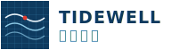

# 瑞士藍晒工程風 Swiss Blueprint

把瑞士國際主義的網格秩序，與工程藍晒圖（blueprint）的冷色技術製圖語彙結合。適合海洋／環境／科研型組織、資料密集的非營利、工程與測量事務所——任何想用「可被讀懂的圖」建立可信度的品牌。

## 設計哲學

- **量測感先於美感**：每個版面都像一張製圖，資訊帶座標、比例、圖號（FIG. XX）。設計不是裝飾資料，設計就是資料本身。
- **冷靜、不喊口號**：文案克制、精確，用數字與剖面圖說話。避免情緒動員式的環保文案。
- **秩序中的一點紅**：整體冷藍，唯一暖色（信號紅）只用在關鍵標記（潮線點、圖釘、行動按鈕）。

## 色彩系統

| 色票 | HEX | 用途 | 比例 |
|---|---|---|---|
| 深海軍藍 navy | `#0E3A5F` | 側欄、藍晒圖底、主色 | 30% |
| 更深藍 deep | `#0A2436` | hero／footer／頁首深底 | 15% |
| 天青 cyan | `#4FA9D8` | 描線、強調邊框、次強調 | 10% |
| 淺天藍 sky | `#8FCBE8` | 藍晒圖細線、輔助文字 | 8% |
| 製圖紙 paper | `#EDF3F7` | 頁面底色（帶網格） | 25% |
| 網格線 line | `#B9D3E4` | 2px／1px 網格 | — |
| 墨黑 ink | `#0A1721` | 內文、2px 實線分格 | 8% |
| 信號紅 red | `#E23B2E` | 唯一暖色：關鍵標記、CTA | 4% |

底色務必疊上淡網格：`background-image:linear-gradient(line 1px,transparent 1px),linear-gradient(90deg,line 1px,transparent 1px);background-size:26px 26px`。

## 字體系統

- **標題**：`Archivo` 900（幾何無襯線，代替 Helvetica 的當代選擇），`letter-spacing:-.01em`，`line-height:1.02`。
- **內文 / 敘事**：`Noto Serif TC` 500/700，`line-height:1.8`——冷版面裡用襯線帶入人味與可讀性。
- **標籤 / 座標 / 數據**：`Space Mono`（等寬），大寫、`letter-spacing:.06–.14em`，承擔所有「儀器讀值」的角色（座標、圖號、規格表）。
- 字級 scale：hero 38–84px、H2 26–46px、內文 16–17px、mono 標籤 10–13px。

## 版面與網格

- **side-rail 導覽**：固定左側 212px 深藍側欄，含字標、mono 大寫選單（附兩位數編號 00/01/02）、底部機構地址。`main{margin-left:212px}`。行動版轉為頂部橫向 strip（`--rail:0`）。
- 全站以 2px 墨黑實線分格（無圓角、無陰影卡片）；統計、規格採等分格線切割。
- 敘事區用「serif 段落 + 藍晒圖卡」雙欄（1.1fr / 1fr）。
- 每張藍晒圖卡：深藍底、2px 邊、右下角 mono 圖號說明（FIG. XX）。

## 元件配方

- **nav（side-rail）**：`a{font-family:Space Mono;text-transform:uppercase;display:flex;justify-content:space-between}`，hover/current 加深底 + cyan 邊框。
- **按鈕 / CTA**：信號紅底、2px 墨邊、mono 大寫、hover 轉深藍；次要 CTA 用紅色底線文字連結。
- **規格表 specs**：`display:grid;grid-template-columns:auto 1fr`，左標籤（navy 大寫 mono）右數值（red 粗體 mono），每列 1px 網格線。
- **表單**：input 2px 墨邊、paper 底、focus 時 cyan 邊 + inset sky 光暈；label 為 mono 大寫小標。
- **footer**：深藍底，三欄 mono 小標 + 冷色連結，底部必附虛構聲明。

## 動效規則

- **潮位波形（signature）**：頁首下方橫條放一條 SVG 正弦波，`scroll` 時以 `requestAnimationFrame` 位移相位、右側 mono 讀出潮高（+1.24 m）。節流：一次 rAF。
- **地圖圖釘連動**：pin `mouseenter`/`click` → 更新讀值面板（座標 + 該樣點數據）+ 高亮 pin（scale 1.35）。
- **剖面圖描繪**：藍晒圖的關鍵線用 `stroke-dasharray/…offset`，IntersectionObserver 進入視窗（threshold .35）後 `offset:0`，1.6s ease 逐線描成。
- 一律提供 `@media(prefers-reduced-motion:reduce){*{animation:none;transition:none}}`；reduce 時波形靜止、剖面圖直接顯示完成態。

## 插畫與圖像風格（blueprint 藍晒圖）

- 全部圖像為 **inline SVG 工程製圖**：深藍底、淡青細網格、白/青描線、紅色關鍵標記點。
- 題材＝技術剖面：潮間帶剖面、樣框配置、附著基結構、打撈航線、沙丘剖面。
- 標註用 mono 小字（高潮線 MHW / 低潮線 MLW / Q1–Q4 / 圖號）。
- 禁止照片、禁止彩色寫實插畫、禁止細線幾何小屋（thin-lineart）。

## Logo 與 Favicon

- 字標：左方深藍方塊內畫「等高線／潮紋」三條曲線 + 一個紅點（潮線點），右方 Archivo 800 英文字標 + Noto Serif TC 中文。
- Favicon：同一組潮紋曲線 + 紅點，inline SVG data URI 寫進 `<head>`。

## Do & Don't

- ✅ 用座標、圖號、比例尺讓資訊看起來「被量過」。
- ✅ 冷藍主調 + 唯一信號紅；serif 內文帶人味。
- ✅ side-rail 導覽，行動版降級為頂 strip。
- ❌ 不用紫藍漸層 hero、不用圓角模糊陰影卡片。
- ❌ 不用 emoji 當 icon（一律 SVG 製圖）、不用 Lorem ipsum、不用照片。
- ❌ 不用情緒勒索式環保口號；用數字說話。
- ⚠ 敏感題材（募款金額、機構資料）務必標示「虛構示意」。

## 頁面骨架範例

```html
<aside class="rail">
  <a class="brand" href="index.html"></a>
  <nav>
    <a href="index.html" aria-current="page"><span>概覽</span><b>00</b></a>
    <a href="projects.html"><span>計畫</span><b>01</b></a>
  </nav>
  <div class="foot">地址 · 電話</div>
</aside>
<main>
  <section class="hero"><!-- map-first：SVG 海岸地圖 + 圖釘 + 讀值面板 --></section>
  <div class="tidebar"><!-- 潮位波形 scroll signature --></div>
  <div class="stats"><!-- 等分格線統計 --></div>
</main>
```

```css
body{background-image:linear-gradient(#B9D3E4 1px,transparent 1px),
  linear-gradient(90deg,#B9D3E4 1px,transparent 1px);background-size:26px 26px}
.bp{background:#0E3A5F;border:2px solid #0A1721;padding:18px} /* 藍晒圖卡 */
```
