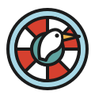

# 清線派 Ligne claire

> 「線就是線。一條線，一種寬，把一切說清楚。」
> 範例站：白鷺渡 Pe̍h-lō͘ Ferries（淡水⇄八里渡輪）

## 1. 設計哲學

清線派（荷 *klare lijn*／法 *ligne claire*）是布魯塞爾漫畫學派的線條傳統。Hergé 自 1929 年在《Le Petit Vingtième》連載起發展出這套畫法，1940–50 年代為 Casterman 彩色重繪舊冊、與 Edgar P. Jacobs、Bob de Moor 等人在 Studios Hergé（1950–）把它定型；名字則晚了將近五十年——荷蘭漫畫家 Joost Swarte 1977 年為鹿特丹〈Kuifje in Rotterdam〉展寫圖錄時才把它叫做 *klare lijn*。隨後 Swarte、Ever Meulen、Yves Chaland、Floc'h、Ted Benoit、Serge Clerc 在 1977–80 年代掀起「新清線」（含 Chaland／Clerc 的「原子風」Atom style）。

它長成這樣是印刷與敘事一起逼出來的：

- **報紙與廉價四色印刷**：細而均勻的黑線在粗糙新聞紙上不會糊；上色由調色師在藍線稿（bleu de coloriage）上一塊一塊填平色，交給製版——所以色是**面**，不是筆觸。
- **可讀性至上**：Hergé 的原則是讀者每一格都要一眼看懂發生什麼。沒有排線、沒有明暗對比、陰影極少，視線不會被質感拖住。
- **人物簡、背景實**：主角是幾筆就能畫出的圓臉點眼，背景卻是照著照片與實地考證的汽車、港口、建築——讀者把自己投射到簡單的臉上，再被精確的世界說服。

**網頁轉譯**：清線派網站是一本「可以操作的漫畫頁」。版面就是分格頁（planche），導覽是旁白框，提示是對白框，插圖是同一個世界在不同時刻、不同取景下的格子。它不是「卡通風」——它的紀律比瑞士國際主義還嚴：只有一種線寬。

## 2. 本風格的 5 個不可省略特徵

### 特徵 1｜形狀語彙：一條線，一種寬——在任何縮放下都一樣

所有物件（人、船、房子、雲、山）都用**同一種寬度**的墨線勾邊，人物與背景不分主次、不做粗細變化、不做排線。網頁上的關鍵是**縮放時線寬不能跟著變**：放大三倍的特寫格與全景格，線要一樣粗。這就是 SVG `vector-effect: non-scaling-stroke` 存在的理由。

```css
/* 整個插畫世界只有這一條規則決定線 */
.w path,.w rect,.w circle,.w ellipse,.w polygon{
  stroke:#1B1B1B; stroke-width:var(--lw,2px);
  vector-effect:non-scaling-stroke;           /* 縮放不改線寬 */
  stroke-linejoin:round; stroke-linecap:round;
}
.w .nl{stroke:none}   /* 只有天空、河面這種「地」不勾邊 */
```

拿掉它：線一變粗細，就成了美式漫畫或插畫風。

### 特徵 2｜色彩規則：平塗，零漸層零排線，影子是一塊平的暗色

每個面一個色，邊界由墨線決定。天空是一塊平的淡青、河是一塊平的青綠。允許的「陰影」只有拱廊開口那種**一塊更暗的平色**，不畫光暈、不畫高光、不加 `box-shadow`。色彩是中高彩度的印刷色：

```css
:root{--sky:#A8D8E6;--river:#5FA3A0;--brick:#C8553D;--ochre:#E8B04A;
      --cap:#FCE38A;--leaf:#6FA552;--red:#D6402F;--navy:#24476E;--skin:#F4CBA2}
/* 禁止：linear-gradient、radial-gradient、filter:blur、文字發光 */
```

### 特徵 3｜字體選擇：手寫感的圓體對白＋粗壯的書名字

對白與旁白用圓頭、筆畫均勻的手寫感字（中文 **Huninn 粉圓**，拉丁字由 Varela Round 改出，正好呼應「均勻線」），置中、逐行平衡；書名用極粗黑體加墨線描邊，像冊封面上的手繪標題。

```css
.bal,.cap{font-family:'Huninn','Noto Sans TC',sans-serif}
.bal{text-align:center;text-wrap:balance}               /* 對白逐行平衡 */
.title{font:900 3.6rem/1.05 'Noto Sans TC';color:#fff;
       -webkit-text-stroke:3px #1B1B1B;paint-order:stroke fill}
.mono{font-family:'Bowlby One SC'}                      /* 數字與英文小標 */
```

### 特徵 4｜版面手法：鬆餅格（gaufrier）分格頁＋白色溝

頁面是一頁漫畫：一層一層的橫排（tier），每格黑框、格與格之間是**等寬白溝**，閱讀順序左到右、上到下。格的比例由內容決定（全景 3:1、特寫 4:3），但同一層等高。

```css
.tier{display:grid;gap:12px;margin-bottom:12px}
.t2{grid-template-columns:repeat(3,1fr)} .t2 .pnl{aspect-ratio:4/3}
.pnl{position:relative;border:2.5px solid #1B1B1B;overflow:hidden;background:var(--sky)}
@media (max-width:560px){.t2{grid-template-columns:1fr}}   /* 手機改為單欄連讀 */
```

### 特徵 5｜裝飾母題：橢圓對白框＋黃色旁白框（récitatif）

這是唯一的「裝飾」，而且全部是功能性的：白底黑框橢圓對白框帶一根尖尾指向說話的人；左上角貼齊格框的黃色方旁白框寫時間地點（「16:20，淡水——」「與此同時，在八里——」）。本站的導覽、標籤、提示全部借用這兩種框。

```html
<div class="pnl">
  <p class="cap">與此同時，在八里——</p>
  <svg class="tail" viewBox="0 0 400 300"><path d="M180 70 Q200 120 230 160 L196 72Z"/></svg>
  <div class="bal" style="left:120px;top:24px">飛起來了！</div>
</div>
<style>
.cap{position:absolute;left:-1px;top:-1px;background:#FCE38A;border:2.5px solid #1B1B1B;padding:3px 10px}
.bal{position:absolute;background:#fff;border:2.5px solid #1B1B1B;border-radius:50%;padding:.7em 1.2em}
.tail path{fill:#fff;stroke:#1B1B1B;stroke-width:2.5px;stroke-linejoin:round}
</style>
```

## 3. 色彩系統

| 色 | Hex | 用途 | 比例 |
|---|---|---|---|
| 墨 | `#1B1B1B` | 唯一線色、內文 | ~8% |
| 冊頁紙 | `#FBF7EC` | 頁面底、空格 | ~30% |
| 天空 | `#A8D8E6` | 天空、格子預設底 | ~22% |
| 河 | `#5FA3A0` | 水面 | ~15% |
| 磚紅 | `#C8553D` | 老街屋 | ~6% |
| 赭黃 | `#E8B04A` | 第二種屋面、強調 | ~4% |
| 旁白黃 | `#FCE38A` | 旁白框、hover、目前頁 | ~4% |
| 船紅 | `#D6402F` | 船帶、行動按鈕、下一班 | ~3% |
| 藏青 | `#24476E` | 船頂、招牌、頁尾 | ~5% |
| 葉綠／山綠 | `#6FA552`／`#8DB59A` | 樹、山 | ~3% |

規則：任何兩個相鄰色面之間一定有墨線；同一物件只用一色（加最多一塊平的暗色）。

## 4. 字體系統

- 對白／旁白／導覽：**Huninn**（Google Fonts，jf open 粉圓 v2.1，OFL）。字級 `clamp(.8rem,1.35vw,1.02rem)`，行高 1.35，置中、`text-wrap:balance`。
- 標題：**Noto Sans TC 900**，白字或紅字＋3px 墨描邊（`paint-order:stroke fill`），行高 1.05。
- 數字與英文小標：**Bowlby One SC**，字距 .04–.12em。
- 內文：Noto Sans TC 500，16px，行高 1.7。
- Scale：12 / 14 / 16 / 20 / 28 / 40 / 62px。

## 5. 版面與網格

- 最大寬 1240px，左右 4vw；格溝 12px（手機 8px）；格框 2.5px（手機 2px）。
- 分格只用 0° 直角，不旋轉、不斜切——清線派的戲劇性在格內，不在格框。
- 每一層（tier）等高；一頁 3–4 層；全景格 3:1、特寫格 4:3、雙格層 3:2＋自由高。
- 旁白框永遠貼齊格的左上角（-1px 疊框）；對白框放在格的上 40%，尾巴指向說話者頭部。
- 文字資訊區也做成「格」：白底黑框、左上角貼旁白框當標題。

## 6. 元件配方

- **導覽（旁白框導覽）**：每個連結是一個方旁白框，`<b>` 頁名＋`<i>` 一句旁白（「稍早，在淡水岸——」）；目前頁黃底並加一顆紅點。
- **按鈕（對白按鈕）**：`border-radius:999px` 白底黑框，hover 變旁白黃；主要行動用船紅底白字。禁止硬陰影位移。
- **卡片＝格**：`.box{border:2.5px solid;background:#fff}` 上面貼 `.cap`。
- **表格**：只有 2px 墨橫線，數字靠右用 Bowlby One SC。
- **表單／分頁籤**：膠囊鈕，選中＝墨底黃字。
- **頁尾**：藏青平塗底、白字、黃色小標，最後一行全大寫字距拉開。

## 7. 動效規則（四種，全部有 reduced-motion 降級）

| 類型 | 本站實作 | 觸發 | duration／easing |
|---|---|---|---|
| ambient | 活的河：兩艘渡輪 48s 一來一回並在河心交會揮手、白鷺俯衝、魚丸拋給狗、單車、風箏、雲與浪 | 載入即跑 | 24s／48s 世界時鐘，linear；船段 ease-in-out |
| input-driven | 取景框：拖曳、雙指、滾輪、方向鍵移動與縮放，viewBox 即時改寫、線寬不變；小地圖紅框同步 | pointer／wheel／key | 0 延遲（同一事件內改 viewBox） |
| transition | 閱讀順序揭幕：每格以 `clip-path: inset()` 由左到右依序打開 | 頁面載入 | .46s，cubic-bezier(.6,0,.3,1)，每格延遲 110ms |
| signature | **凍格**：按「拍！」，取景框內那一瞬間被凍成一格（世界繼續動），閃白後飛進四格條的空位 | 快門 | 閃 260ms ease-out；飛 620ms cubic-bezier(.5,0,.2,1) |

`prefers-reduced-motion: reduce`：世界暫停在第 12 秒（兩船交會、風箏升空），出現「時間 +2 秒」按鈕手動推進——每一件小事、每一句台詞仍可取得；揭幕與飛行取消，直接出現。本站自限：**不用淡入**（清線派的格是切出來的，不是浮現的）。

## 8. 插畫與圖像風格

- 全部 inline SVG，由同一支產生器畫出「一個世界」（2400×800），所有插圖都是它在某時刻、某取景下的一格——首頁五格、船隊兩格、使用者的四格都是同一條河。
- 人物：圓頭、點眼、一筆鼻、簡單髮型；身體是梯形與矩形。背景：老街屋的拱廊、窗框、山牆、直式招牌都要畫出結構。
- 雲是扇貝輪廓的白平塗；浪是幾條短弧線；山只有一兩條結構線。
- 禁止：排線、網點、漸層、紙紋、筆觸抖動、模糊。

## 9. Logo 與 Favicon

救生圈（紅白四段平塗＋墨線）中間一隻白鷺側臉、黃喙點眼；favicon 同構簡化、天空藍底。線寬在 120px 與 64px 下等比（4px／3px），全部平塗。

## 10. Do & Don't

**Do**：一種線寬貫穿全站；格框直角；旁白框寫時間地點；人物簡、背景實；用同一個世界產出所有插圖。

**Don't**：粗細變化的「有表情」線條；排線與網點（那是美式漫畫與普普）；漸層、玻璃、模糊陰影；emoji icon；紫藍漸層 hero；置中大標＋三張圓角卡；把對白框當裝飾亂撒（每個對白框都要有說話的人）；臨摹任何既有漫畫角色——清線派是畫法，不是某部作品。

## 11. 頁面骨架範例

```html
<header class="top">
  <a class="brand" href="index.html"><b>白鷺渡</b></a>
  <ul class="rcnav">
    <li><a href="index.html" aria-current="page"><b>渡船頭</b><i>稍早，在淡水岸——</i></a></li>
    <li><a href="quay.html"><b>取景</b><i>你拿起了相機——</i></a></li>
  </ul>
</header>
<main class="planche">
  <section class="tier t1"><div class="pnl"><svg class="w" viewBox="0 0 2400 800"><g id="world">…</g></svg>
    <p class="cap">16:12，淡水河——下一班 16:20 開往八里。</p></div></section>
  <section class="tier t2">
    <div class="pnl"><svg class="w" viewBox="640 330 300 225"><use href="#world"/></svg><p class="cap">售票亭——</p></div>
    …
  </section>
</main>
```

```js
// 凍格：把活的世界在某一刻、某一取景凍成一格
function freezeClone(svg,vb,t){
  const g=document.getElementById('world').cloneNode(true); g.removeAttribute('id');
  svg.setAttribute('viewBox',vb.join(' ')); svg.appendChild(g);
  g.getAnimations({subtree:true}).forEach(a=>{a.pause(); a.currentTime=t});
}
```

## 12. 技術實作與相容性

### 12.1 SVG `vector-effect: non-scaling-stroke`（A 渲染層）

- **承載**：特徵 1。取景框可從 260 縮到 1000 單位寬（約 3.8 倍），首頁與船票上的格子各有不同縮放，線寬始終是 2px（小地圖 0.8px）。
- **支援**：MDN 標為 Baseline Widely available（CSS 屬性形式自 2020-01 起各瀏覽器可用）；caniuse：Chrome 15+／Firefox 15+／Safari 5.1+。來源：developer.mozilla.org/en-US/docs/Web/SVG/Reference/Attribute/vector-effect、caniuse.com/vector-effect。
- **陷阱（已查證並規避）**：Firefox 127–128 曾把 `<svg>` 巢狀視窗當作宿主座標，巢狀 `<svg>` 內的非縮放線會變粗（Mozilla Connect 討論串，Firefox 129 以 bug 1903546 恢復舊行為）。本站每一格都是**頂層** `<svg>` 直接包 `<g>`，不巢狀 `<svg>`。
- **fallback**：不支援時線寬隨縮放變化（特寫格線變粗），圖仍完整可讀。

### 12.2 Web Animations API：`Element.getAnimations({subtree:true})`＋`Animation.pause()`／`currentTime`（B 動效與時間軸層）

- **承載**：簽名〈凍格〉與全站插圖。世界是一組 CSS @keyframes（24s／48s 兩個週期、所有動畫同刻起跑，故任一動畫的 `currentTime` 就是世界時鐘）；拍照時複製整個世界、對複本的每支動畫 `pause()` 並設 `currentTime=t`，於是一格就是「那一秒」。首頁五格、船隊兩格、船票四格（含跨頁從 sessionStorage 重建）都用同一函式。台詞依 `currentTime % 週期` 落在哪一拍決定（阿伯 0–9 秒在追、9–14 秒錯過、14–24 秒等下一班）。reduced-motion 時以同一 API 把世界停在 12 秒並逐 2 秒推進。
- **支援**：Element.getAnimations() 含 `subtree` 選項，MDN 標為 2020-07 起跨瀏覽器可用：Chrome 84+、Firefox 75+、Safari 13.1+。來源：developer.mozilla.org/docs/Web/API/Element/getAnimations。
- **fallback**：不支援時格子退回 `<use href="#world">`（HTML 內預設內容，無 JS 亦同）——格子仍顯示同一世界，只是不凍結；〈取景〉需要 JS，`<noscript>` 有說明與船班連結。

### 12.3 CSS `text-wrap: balance`（C 版面與樣式層）

- **承載**：特徵 3 與 5。手寫對白在橢圓框裡逐行等長，是清線派字框的樣子；也讓動態放置的對白框寬度可預期，尾巴計算才準。
- **支援**：caniuse：Chrome 114–129 部分、130+ 完整；Firefox 121+；Safari 17.5+。Chromium 限 6 行、Firefox 10 行——對白不會超過。來源：caniuse.com/css-text-wrap-balance。
- **fallback**：一般換行，最後一行可能較短，可讀性不受影響。

### 12.4 效能

- 頁面大小（含 inline 世界 SVG、CSS、JS）：index 57 KB、quay 69 KB、timetable 67 KB，均遠低於 350 KB；世界 SVG 本體約 25 KB、關鍵影格 CSS 約 14 KB。
- 首屏 JS：只做 4–5 次世界複製＋對白定位；建置環境（Node 22＋jsdom，動畫 API 以替身注入）完整跑過首頁、〈取景〉四拍＋印票、船班頁重建船票，零例外；jsdom 量測首屏腳本執行時間：index 61 ms（含 4 次世界複製）、quay 16 ms、timetable 17 ms，皆低於 100 ms 預算（jsdom 的 DOM 通常比瀏覽器慢）。建置環境無真實瀏覽器可量 fps，動畫全部只動 `transform`／`opacity`，不觸發版面重排。
- 偵測取景框內故事每 220ms 一次，只讀 7 個 `getBoundingClientRect`。
