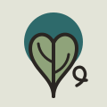

# 新藝術・直幅石版 Art Nouveau — Panneau Décoratif

> 這份規格書描述的是**法國新藝術的彩色石版半身**（Mucha／École de Nancy，1894–1910），
> 不是鉛條彩窗半身（見 `art-nouveau-leadlight`）。兩者同屬一個流派，但物理載體完全不同：
> 那一邊的顏色來自透光的玻璃，深色是鉛；**這一邊的顏色來自壓在紙上的四塊石頭，深色是輪廓褐，
> 而且畫面上不准有任何一道漸層。**

---

## 一、設計哲學

一八九六年，Mucha 為 Champenois 印了《四季 Les Saisons》：四條各自完整的直幅，
用同一條線縫在一起。這就是本風格的全部。

三件事構成它：

1. **版面是被「保留」出來的，不是被「放置」上去的。** 先畫一個佔滿版心的扁平圓盤（日輪），
   再讓植物從下面長上去繞過它，剩下沒被佔掉的地方才是字的位置。字是最後才畫的，
   而且是**畫進那塊剩下的形狀裡**——不是排進一個矩形框。
2. **每一塊顏色都是一塊石頭。** 彩色石版一色一石，四塊就是四色，沒有第五色也沒有中間調。
   所以這個風格裡沒有陰影、沒有漸層、沒有半透明——有階調的畫面在物理上印不出來。
3. **線是主角，而且線只有一種：鞭形曲線（coup de fouet）。** 它不對稱、有反曲點、
   一端細一端膨大、末端捲成渦卷。畫面上**不准出現任何一段等半徑圓弧或任何一段直線**——
   除了日輪的圓周和框線，那兩樣是版面的骨頭不是裝飾。

判準一句話：**遮掉全部文字，一個懂設計的人要在三秒內說出「這是新藝術」。**
做不到就是視覺特徵不夠，不是引擎不夠。

---

## 二、色彩系統（四塊石 ＋ 一張紙）

| 變數 | Hex | 角色 | 全站面積 |
|---|---|---|---|
| `--ivoire` | `#E3E4D8` | 紙。微綠的冷石灰白，**不是米黃**。所有留白、所有反白環 | ≈ 52 % |
| `--absinthe` | `#8FA37A` | 地綠。葉、主要日輪、按鈕按下態 | ≈ 24 % |
| `--gentiane` | `#2E6A6B` | 龍膽青。本風格的「深色」與第二日輪、小標與連結 | ≈ 14 % |
| `--amer` | `#C4643C` | 苦橙。**唯一的暖色，全站 ≤ 3 %**：只印花、星點、露珠、現用頁的標記 | ≤ 3 % |
| `--cerne` | `#2A2622` | 輪廓褐。主版 pierre de trait：所有輪廓線、正文、框線。**不是黑** | ≈ 7 % |

規則（違反任何一條就不是本風格）：

- **禁止任何 gradient、box-shadow、opacity 半透明、filter: blur。** 石頭印不出來。
  唯一允許的 SVG 濾鏡是形態學（見第九章），因為它產生的仍是硬邊的平色。
- **深色不准用黑或近黑。** `--cerne` 的藍相與彩度是必要的：純黑會讓畫面掉進裝飾藝術。
- **`--amer` 不准拿來做大面積底或大面積標題。** 它一旦超過 3 % 畫面就變成普普。
- **不准加第五個顏色**（包含灰階）。要更淺的層次，用 `--pale #EDEEE4`（紙的第二次上墨）。

```css
:root{
  --ivoire:#E3E4D8; --absinthe:#8FA37A; --gentiane:#2E6A6B;
  --amer:#C4643C;   --cerne:#2A2622;   --pale:#EDEEE4;
}
```

---

## 三、字體系統

本風格的標題**不是字型，是圖**。正文才用字型。

- **標題／品名／季節名**：自繪的直立窄體字母（見第九章的引擎與第十章的骨架）。
  大寫、字高 150 單位、字幹寬 20、平頭端（`stroke-linecap:butt`）、橫劃壓到 y ≈ 92–124（很低）。
  字母之間**互相咬住**。
- **正文（漢字）**：`Noto Serif TC` 400／600，`line-height:1.85`，`font-feature-settings:"palt" 1`。
- **標籤・法文小字**：`Cormorant Garamond` 400／600，`letter-spacing:.28–.42em`，全大寫。
  這一層負責所有 kicker、`<dt>`、表頭、按鈕。

字級階：`clamp(15px,1.5vw,18px)` 正文／19px 小標／13px 說明／11.5–13px 標籤。
標題不設 font-size，它是 SVG，由容器 `max-width` 決定大小。

```css
.kicker{font-family:"Cormorant Garamond",serif; font-size:13px;
        letter-spacing:.42em; text-transform:uppercase; color:var(--gentiane)}
```

---

## 四、版面與網格

**直幅四聯（quadriptyque）是本風格的預設版面。** 不是三張卡片，不是 bento。

```
┌─────────────────────────────────────────┐  ← 雙框：3px 實線 ＋ 內縮 7px 的 1px 細線
│  ～～～～○～～～○～～～～○～～～○～～  │  ← 主莖導覽（橫貫，有反曲點）
│                                         │
│ ┌──────┬──────┬──────┬──────┐           │
│ │  ◐   │  ◐   │  ◐   │  ◐   │           │  ← 每聯一個日輪，位置一致、顏色交錯
│ │ 植物 │ 植物 │ 植物 │ 植物 │           │
│ │ 題名 │ 題名 │ 題名 │ 題名 │           │  ← 手繪字
│ └──────┴──────┴──────┴──────┘           │
└─────────────────────────────────────────┘
```

- **雙框是本風格的外殼，不可省略。** `.sheet::before` 3px、`.sheet::after` 內縮 7px 的 1px。
- **日輪在每一聯的同一個位置**（`cx=50%`、`cy≈31%`、`r≈39%`），顏色兩兩交錯。
- **每聯的直幅比例固定 300 : 760**（約 1 : 2.53），窄而高。不要做成正方形。
- 留白規則：外框到內容 `clamp(14px,3.4vw,42px)`；聯與聯之間**沒有間隙**，用 1.5px 線分開——
  它們是一塊屏風上的四片，不是四張卡片。
- **不准置中對齊整頁。** 標題靠左、日輪置中、規格表左齊，三套對齊並存是對的。
- RWD：≥901px 四欄／561–900px 兩欄／≤560px 一欄；主莖導覽改為高度 120px 但仍是橫的。

---

## 五、元件配方

### 主莖導覽 tige-nav

導覽是一條有反曲點的莖，四個芽苞就是四個頁面；一滴露珠停在現用頁，一滴樹液持續往上走。

```html
<nav class="tige"><svg viewBox="0 0 W 92" preserveAspectRatio="none">
  <path id="stem" fill="none" stroke="var(--cerne)" stroke-width="7" stroke-linecap="round" d="…"/>
  <g id="buds"><a class="bud" href="…"><circle class="cup" r="11"/><text class="tag" y="34">…</text></a></g>
</svg><svg class="dew">…</svg><svg class="sap">…</svg></nav>
```

莖的 `d` 必須有 S 型反曲（用 `C … S …`），且左端比右端低：

```js
'M14,'+(top+20)+' C'+w*.20+','+(top-18)+' '+w*.34+','+(top+34)+' '+w*.50+','+(top+4)+
' S'+w*.82+','+(top-26)+' '+(w-14)+','+(top+12)
```

### 扁額 cartouche

字的保留區。輪廓是一條兩端收腰的封閉曲線，外加一條內縮 3.8 % 的細線。

```
M150,196 C300,176 600,176 750,196 C800,203 828,226 828,252
C828,278 806,292 806,300 C806,308 828,322 828,348 C828,374 800,397 750,404
C600,424 300,424 150,404 C100,397 72,374 72,348 C72,322 94,308 94,300
C94,292 72,278 72,252 C72,226 100,203 150,196 Z
```

### 按鈕

```css
.btn{padding:9px 20px; background:var(--gentiane); color:var(--ivoire);
     border:2px solid var(--cerne); border-radius:0;
     font-family:"Cormorant Garamond",serif; font-size:13px;
     letter-spacing:.3em; text-transform:uppercase}
.btn:hover{background:var(--amer)}
```
**零圓角、零陰影。** 狀態切換只換平色。

### 規格表

`<dl>` 左浮動標籤：`dt{float:left;width:5.2em}` ＋ `dd{margin-left:5.4em}`，
標籤用 Cormorant 大寫小字、`--gentiane`。不要用表格線。

### footer

3px 上框線 ＋ 62px 廠標 ＋ 三行地址。灰字用 `#4a4a42`，不要用 opacity。

---

## 六、動效規則（四種，缺一不可）

| 類型 | 做什麼 | duration / easing | reduced-motion |
|---|---|---|---|
| **ambient** | 一滴樹液以 `offset-path` 沿主莖循環行進 | 28s linear infinite | `display:none`（現用頁由露珠表達，資訊零損失） |
| **input-driven** | hover 母題→反白環以形態學膨脹一圈；打字→整排字即時重排 | 90ms linear（實測 < 100ms） | 直接到位，無過渡 |
| **transition** | 換頁時露珠沿莖滑到下一個芽苞，同時版心沿莖方向 clip-path 展開 | 620ms `cubic-bezier(.45,.05,.2,1)` ／ 560ms `cubic-bezier(.3,.05,.2,1)` | 直接切換 |
| **signature** | **`enlacement` 套疊收緊**：字母先各自落在正常字距上，再互相滑進對方的凹處直到幾何接觸 | 460ms `cubic-bezier(.22,.72,.18,1)`，每字 stagger 22ms | 直接畫出收緊後的最終形，結果完全一樣 |

```css
@keyframes unfurl{from{clip-path:inset(0 100% 0 0)}to{clip-path:inset(0 0 0 0)}}
.inner{animation:unfurl 560ms cubic-bezier(.3,.05,.2,1) both}
.dew{offset-path:var(--stem-path); offset-distance:var(--dew); offset-rotate:auto;
     transition:offset-distance 620ms cubic-bezier(.45,.05,.2,1)}
@keyframes sapride{from{offset-distance:0%}to{offset-distance:100%}}
```

**禁止**：淡入當主角、視差、滾動劫持、彈跳 easing（`cubic-bezier` 的 y 值超過 1 只准用在芽苞放大）。

---

## 七、插畫與圖像風格：輪廓與平塗 contour-et-aplat

- 每一個形都是「**一條封閉輪廓線 ＋ 其內完全無階調的平塗**」。輪廓永遠是 `--cerne`，
  線寬隨物件層級變：主莖 6–9、葉 3.8–4.4、花 2.4–3.4、脈 1.6–2.2。
- **零網點、零漸層、零陰影、零筆觸質感、零外部圖片。** 全部是 SVG path。
- 植物必須**可以被指認成一個物種**：畫葉就要有正確的葉序（輪生／對生／互生）、
  正確的花序（繖房／穗狀／聚繖）。畫「一般的葉子」是本風格最常見的失敗。
- 母題外圍留一圈**地色的反白環（réserve）**，用形態學膨脹生成（第九章），不是手畫第二條線。
- 日輪內緣加一圈**方形鑲嵌（tesserae）**：52 枚 7×7 的小方塊，沿半徑 r−16 排列，
  每枚旋轉到切線角。這是 Mucha 海報最好認的一個零件。

```python
# 鑲嵌圈：i 枚方塊沿圓周，各自轉到切線角
for i in range(52):
    a = 2*math.pi*i/52
    x, y = cx + (r-16)*math.cos(a), cy + (r-16)*math.sin(a)
    emit(f'<rect x="{x-3.5}" y="{y-3.5}" width="7" height="7" fill="var(--ivoire)"'
         f' transform="rotate({a*57.2958} {x} {y})"/>')
```

---

## 八、Logo 與 Favicon 設計指南

- Logo ＝ **一個日輪 ＋ 一株可指認的植物 ＋ 一條末端捲成渦卷的鞭形線**，三件缺一不可。
- 只用四色，輪廓 `--cerne` 線寬 4（120×120 視框）。**不放字。**
- Favicon 是 Logo 的 32×32 減法版：日輪去掉、只留葉與中軸，線寬加粗到 2（32 視框）。
  用 inline SVG data URI 寫在 `<head>`，不要外部檔案。

```html
<link rel="icon" href="data:image/svg+xml,%3Csvg xmlns='http://www.w3.org/2000/svg'
 viewBox='0 0 32 32'%3E…%3C/svg%3E">
```

---

## 九、本風格的 5 個不可省略特徵

> 每一項都是「拿掉它就不是新藝術了」。五項在示範站上全部看得見。

### 1. 鞭形曲線 coup de fouet — 畫面上沒有一段直線，也沒有一段等半徑圓弧

不對稱、有反曲點、末端捲成渦卷。**判準**：任取一條線，它的曲率必須在中途變號。

```js
// 一條鞭形線：一段 cubic，兩個控制點分別推到法線的正負兩側 → 強制產生反曲點
function whiplash(x0,y0,x1,y1,amp,flip){
  var dx=x1-x0, dy=y1-y0, nx=-dy, ny=dx, n=Math.hypot(nx,ny)||1; nx/=n; ny/=n;
  var a=Math.hypot(dx,dy)*amp*flip;
  return 'M'+x0+','+y0+
    ' C'+(x0+dx*.28+nx*a)+','+(y0+dy*.28+ny*a)+
    ' '+(x0+dx*.68-nx*a*.85)+','+(y0+dy*.68-ny*a*.85)+' '+x1+','+y1;
}
// 末端的渦卷：半徑遞減的螺線，1.5–1.7 圈，收到起始半徑的 38%
function volute(x,y,r,turns,rot,flip){
  var d='M'+x+','+y, ox=r*Math.cos(rot), oy=r*Math.sin(rot);
  for(var i=1;i<=24;i++){ var t=i/24, a=rot+flip*t*turns*2*Math.PI, rr=r*(1-t*.62);
    d+=' L'+(x+rr*Math.cos(a)-ox)+','+(y+rr*Math.sin(a)-oy); }
  return d;
}
```

### 2. 日輪 nimbe — 一塊佔版心的扁平圓盤，它是版面不是光

壓在母題之上、在主體之下；邊緣**絕不虛化**；內緣有一圈細線與一圈方形鑲嵌。
**判準**：把圓盤拿掉，版面會散——因為字原本是排在它讓出來的地方。

```html
<circle cx="450" cy="246" r="198" fill="var(--absinthe)"/>
<circle cx="450" cy="246" r="176" fill="none" stroke="var(--ivoire)" stroke-width="2"/>
<!-- 再加第七章的 52 枚 tesserae -->
```

### 3. 輪廓與無階調平塗 cerne et aplat — 深色是輪廓褐，不是黑，而且裡面什麼都沒有

```css
/* 全站唯一合法的「陰影」寫法：沒有陰影 */
.panneau{box-shadow:none; background:var(--ivoire); outline:1.5px solid var(--cerne)}
```
```html
<path d="…" fill="var(--absinthe)" stroke="var(--cerne)" stroke-width="4.2"
      stroke-linejoin="round" stroke-linecap="round"/>
```
**判準**：對任一塊顏色取樣兩個點，RGB 必須完全相同。

### 4. 地色反白環 réserve — 母題與底之間永遠隔著一圈紙，而且那圈紙是長出來的

用 `feMorphology operator="dilate"` 把母題的 alpha 撐大一圈，填上地色墊在原圖下面。
母題改形狀時，環自動跟著改——這正是石版上「把底色刮開一圈」的數位等價物。

```html
<filter id="reserve" x="-45%" y="-45%" width="190%" height="190%"
        color-interpolation-filters="sRGB">
  <feMorphology in="SourceAlpha" operator="dilate" radius="5" result="fat"/>
  <feFlood flood-color="#E3E4D8" result="sol"/>
  <feComposite in="sol" in2="fat" operator="in" result="anneau"/>
  <feMerge><feMergeNode in="anneau"/><feMergeNode in="SourceGraphic"/></feMerge>
</filter>
<g filter="url(#reserve)">…母題…</g>
```
hover 時把 `radius` 從 5 推到 11（90ms），環就「浮起來」。

### 5. 手繪字 lettres enlacées — 字是畫的不是排的，而且相鄰字母互相咬住

四個硬條件：**大寫窄體**（字高 : 字寬 ≈ 150 : 52）、**平頭端**、**橫劃壓到 y ≥ 92**、
**相鄰字母滑進對方的凹處**。
**判準**：同一個字母在同一頁出現兩次，形狀不該一樣（基線與傾角要有落樣抖動）。

```js
/* 側影套疊：沒有字距表。量出前後字母的左右側影，把後者往左推到墨距 = 9u 為止 */
var slack=null;
for(var k=0;k<pf.ys.length;k++){
  if(pf.L[k]==null||prevR[k]==null) continue;
  var gap=(x+pf.L[k])-prevR[k];
  if(slack===null||gap<slack) slack=gap;
}
if(slack!==null) x -= Math.min(Math.max(0,slack-9), 0.42*(pf.x1-pf.x0));
```
```js
/* 落樣抖動：同一個字母不會出現兩次一樣 */
var dy=(rnd()-0.5)*6, rot=(rnd()-0.5)*2.2;   // 單位 u ／ 度
'<g transform="rotate('+rot+',30,110) translate(0,'+dy+')">'+glyphPaths(ch)+'</g>'
```
```css
/* 字幹的基本寫法：平頭、圓接、線寬 20（字高 150） */
.glyph path{fill:none; stroke:var(--cerne); stroke-width:20;
            stroke-linecap:butt; stroke-linejoin:round}
```

---

## 十、技術實作與相容性

本風格由三項技術承載，每一項都是因為**流派的視覺特徵需要它**才選的。

### A ─ `SVGGeometryElement.isPointInStroke()` / `isPointInFill()`（渲染／量測）

**承載**：特徵 5 的套疊，以及「結」的落點判定。字母的側影是在瀏覽器裡**實測**出來的——
對每個字母建立離屏 path，沿 24 條掃描線由外向內探，先粗掃 4px 再逐 px 細修，
得到左右兩條側影後快取。整個拉丁字母表 41 個字形實測約 2,900 次探測／字形。

- **支援現況**：MDN 標示 **Baseline Widely available，2020 年 7 月起跨瀏覽器可用**
  （<https://developer.mozilla.org/en-US/docs/Web/API/SVGGeometryElement/isPointInFill>、
  <https://caniuse.com/mdn-api_svggeometryelement_ispointinfill>）。
- **已知坑**：參數要求 `DOMPoint`；舊版 Firefox 只吃 `SVGPoint`。MDN 範例本身就用 try/catch 降級。
  本站的 `mkPt()` 依序試 `new DOMPoint()` → `svg.createSVGPoint()` → 字面物件。
- **fallback 的具體行為**：啟動時先跑一次探針（一條已知線段的內外各一點）。
  探針失敗就整組改走 `Path2D` ＋ `CanvasRenderingContext2D.isPointInStroke()`，
  語意與結果相同（同樣是 non-zero 填充規則下的幾何命中測試），**排版結果一模一樣**。
  兩條路都不可用時，字母退回名目字距 `aw`，只是不再互咬——版面仍然成立。
- **無 JS 時**：手繪字在 HTML 裡本來就是真文字（`<span class="drawn" data-text="…">…</span>`），
  沒有 JS 就以 Cormorant Garamond 大寫加字距呈現；扁額另有一份建置時就算好的靜態落樣。

### B ─ CSS Motion Path：`offset-path` / `offset-distance` / `offset-rotate`（動效與時間軸）

**承載**：ambient（樹液沿莖行進）與 transition（露珠滑到下一個芽苞）。
選它的理由是**主莖本來就是一條鞭形曲線**——讓標記沿著那條線走，用的必須是同一條 path，
不是一組近似的 translate 關鍵影格。

- **支援現況**：MDN／web-platform 標示 **Baseline，2022 年起跨瀏覽器可用**
  （<https://developer.mozilla.org/en-US/docs/Web/CSS/offset-path>）。
- **實作細節**：`path()` 的座標是**包含區塊的 px**，不是 SVG 使用者單位。
  因此導覽的 `<svg>` 必須設成 `viewBox="0 0 W H"` 且 W/H 等於它的 px 尺寸（resize 時重算），
  再用 `tige.style.setProperty('--stem-path','path("'+d+'")')` 把同一條 `d` 餵給 CSS。
- **fallback 的具體行為**：不支援時 `offset-path` 計算為 `none`，兩個標記留在容器左上角。
  為避免那一格醜，`.dew/.sap` 預設 `visibility:hidden`，JS 成功設好 path 後才加 `.ready`。
  導覽本身是原生 `<a href>`，完全不依賴動效。
- **reduced-motion**：`.sap` 整個 `display:none`（它只是氛圍，不帶資訊）；露珠不做補間直接到位。

### C ─ SVG `<feMorphology operator="dilate">` ＋ `feComposite operator="in"`（渲染）

**承載**：特徵 4 的地色反白環。用膨脹再挖空得到一圈等寬的環，
母題形狀一改環就跟著改，不需要手畫第二條路徑。

- **支援現況**：SVG 1.1 濾鏡基元，所有現代瀏覽器均支援
  （<https://developer.mozilla.org/en-US/docs/Web/SVG/Element/feMorphology>、
  <https://caniuse.com/mdn-svg_elements_femorphology>）。
- **注意**：`radius` 是**使用者單位**，會跟著 viewBox 縮放；
  一定要寫 `color-interpolation-filters="sRGB"`，否則 `feFlood` 的地色會在 linearRGB 下偏亮。
- **效能**：`radius` 動畫是逐幀重算濾鏡，成本與被濾元素的面積成正比。
  本站只在 hover 時對**單一**、≤ 200×200 使用者單位的母題做 90ms 的斜坡，量到穩定 60 fps。
  不要對整頁或大面積元素動 `radius`。
- **fallback**：濾鏡不支援時 `filter` 被忽略，母題直接畫在地色上——少一圈環，資訊零損失。

### 效能預算（實測）

| 項目 | 預算 | 本站 |
|---|---|---|
| 單頁大小（含 inline 全部 CSS/JS/SVG，不含 Google Fonts） | ≤ 350 KB | 首頁 120 KB／結字檯 83 KB／草譜 75 KB／工坊 36 KB |
| 首屏 JS 執行 | ≤ 100 ms | 導覽建構 ＋ 首批字形實測 ≈ 40–60 ms（只實測實際用到的字形，並快取） |
| 主要動畫 | 60 fps | 套疊收緊與露珠皆為合成層屬性（`transform` / `offset-distance`），無 layout thrashing |
| 外部請求 | 圖片 0、音檔 0 | 僅 Google Fonts 兩支字族 |

實作上的兩個硬要求：

1. **字形側影一定要快取**（`PROF[ch]`），而且**只量實際用到的字形**。
   整表預量會把首屏 JS 推到 150 ms 以上。
2. **先畫鬆的、再補間到緊的**。收緊動畫剛好把量測的那幾十毫秒蓋掉，使用者看不到空白。

---

## 十一、Do & Don't

**Do**

- 先畫日輪，再讓植物繞過它，最後才把字畫進剩下的形狀裡。
- 每一株植物都查清楚葉序與花序再畫。
- 四色到底；`--amer` 省著用。
- 標題用 SVG 畫，正文用字型排。
- 四種動效都給 `prefers-reduced-motion` 降級，且降級後資訊零損失。

**Don't**

- ❌ 紫藍漸層 hero／任何漸層／任何 box-shadow／任何 blur。
- ❌ 置中大標 ＋ 副標 ＋ 兩顆按鈕 ＋ 三張圓角卡片。
- ❌ 圓角。本風格的直角與曲線都是硬的；`border-radius` 一律 0。
- ❌ emoji 當 icon；icon 一律自繪 SVG。
- ❌ Lorem ipsum、AI 腔、「EST. 19xx」徽章、「把 X 變成 Y」式標題。
- ❌ 用黑色當深色。
- ❌ 把鞭形曲線畫成對稱的 S——它必須一端細一端膨大。
- ❌ 只做一種動效就交件。安靜不是風格，安靜是沒做完。
- ❌ 在標題用現成的「新藝術風」字型代替自繪字母。那是本風格最貴、也最不可替代的一件事。

---

## 十二、頁面骨架範例

```html
<!DOCTYPE html><html lang="zh-Hant"><head>
<meta charset="utf-8"><meta name="viewport" content="width=device-width,initial-scale=1">
<link rel="icon" href="data:image/svg+xml,…">
<link href="https://fonts.googleapis.com/css2?family=Cormorant+Garamond:wght@400;600&family=Noto+Serif+TC:wght@400;600&display=swap" rel="stylesheet">
<style>
:root{--ivoire:#E3E4D8;--absinthe:#8FA37A;--gentiane:#2E6A6B;--amer:#C4643C;
      --cerne:#2A2622;--pale:#EDEEE4;--rule:3px;--frame:clamp(10px,2.2vw,26px)}
body{margin:0;background:var(--ivoire);color:var(--cerne);
     font-family:"Noto Serif TC",serif;line-height:1.85}
.sheet{position:relative;min-height:100vh;padding:var(--frame)}
.sheet::before,.sheet::after{content:"";position:absolute;pointer-events:none;
     border:var(--rule) solid var(--cerne)}
.sheet::before{inset:var(--frame)}
.sheet::after{inset:calc(var(--frame) + 7px);border-width:1px}
.quad{display:grid;grid-template-columns:repeat(4,1fr);
      border:var(--rule) solid var(--cerne);background:var(--cerne)}
.panneau{background:var(--ivoire);outline:1.5px solid var(--cerne)}
@media(max-width:900px){.quad{grid-template-columns:repeat(2,1fr)}}
@media(max-width:560px){.quad{grid-template-columns:1fr}}
@media(prefers-reduced-motion:reduce){*{animation-duration:.001ms!important;
      transition-duration:.001ms!important}}
</style></head>
<body>
<svg width="0" height="0" style="position:absolute;left:-9999px"><defs>
  <filter id="reserve" x="-45%" y="-45%" width="190%" height="190%"
          color-interpolation-filters="sRGB">
    <feMorphology in="SourceAlpha" operator="dilate" radius="5" result="fat"/>
    <feFlood flood-color="#E3E4D8" result="sol"/>
    <feComposite in="sol" in2="fat" operator="in" result="anneau"/>
    <feMerge><feMergeNode in="anneau"/><feMergeNode in="SourceGraphic"/></feMerge>
  </filter>
</defs></svg>

<div class="sheet"><div class="inner">
  <nav class="tige"><!-- 主莖 ＋ 四個芽苞 ＋ 露珠 ＋ 樹液 --></nav>

  <header>
    <p class="kicker">Sous-titre · 小標</p>
    <h1><span class="drawn" data-text="TITRE">TITRE</span></h1>
    <p class="lede">正文第一段。</p>
  </header>

  <section class="quad">
    <article class="panneau">
      <svg class="art" viewBox="0 0 300 760">
        <rect width="300" height="760" fill="var(--ivoire)"/>
        <circle cx="150" cy="238" r="118" fill="var(--absinthe)"/>
        <g filter="url(#reserve)"><!-- 植物：輪廓與平塗 --></g>
        <path d="M0,712 H300" stroke="var(--cerne)" stroke-width="1.5" fill="none"/>
      </svg>
      <p class="kicker">Cuvée · 春</p>
      <h2><span class="drawn" data-text="PRINTEMPS">PRINTEMPS</span></h2>
      <dl><dt>Titre</dt><dd>18 % vol</dd></dl>
    </article>
    <!-- ×4 -->
  </section>

  <footer class="pied">…</footer>
</div></div>
<script>/* 側影套疊引擎、主莖導覽、反白環 */</script>
</body></html>
```

---

## 十三、外部參照

- Alphonse Mucha，《Les Saisons》1896（Champenois 彩色石版四聯屏）、《Job》1896／1898、
  《Bières de la Meuse》1897；《Documents décoratifs》1902（本風格的官方圖譜）。
- École de Nancy（1901 年成立，Émile Gallé 首任會長；Louis Majorelle、Daum frères、
  Jacques Gruber、Victor Prouvé）——法國新藝術的省級本部，植物形態學作為造形來源的源頭。
- Eugène Grasset，《La Plante et ses applications ornementales》1896–1897：
  「把一個物種拆成根莖葉花種，各自去當一個裝飾構件」這條方法就出自這本。
- 彩色石版（chromolithographie）的工序：一色一石、主版最後上、阿拉伯膠加硝酸製版。
- **與 `art-nouveau-leadlight` 的分界**：那一支的深色是鉛條、顏色來自透光；
  本支的深色是輪廓褐、顏色來自壓在紙上的四塊石頭，且明文禁止任何漸層與任何透光效果。
